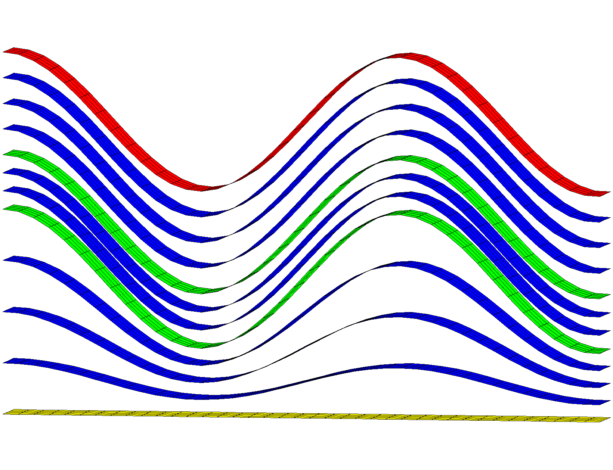

# Example: 3D connect/noadd for non-convex boundary 

**`connect / noadd`** with input points from a hex mesh created with **`stack/layers`**. This example has a non-convex boundary and bad elements are created connecting across the outside boundary. This fix uses **`interpolate/map`** from the hex mesh to the tet mesh to tag and remove bad tets connecting outside the boundary.

 [Step 1. Create surfaces](#step-1-create-surfaces)

 [Step 2. Stack surfaces into hex mesh](#step-2-stack-hex-mesh)

 [Step 3. Connect points into tetrahedral mesh](#step-3-connect)

 [Step 4. Interpolate hex colors to tet mesh](#step-4-interpolate)

 [Step 5. Remove Outside Tets from the mesh](#step-5-remove-outside-tets)

 

### LaGriT input command file with all steps: [wave_connect_interpolate.in.txt](output/wave_connect_interpolate.in.txt)

### LaGriT output report for all steps: [wave_connect_interpolate.out.txt](output/wave_connect_interpolate.out.txt)

 

## Step 1 Create Surfaces

### Commands to create quad surface 
<pre>
* Define variables for spacing

* spacing near .25
define / XMAX / 9.5 
define / YMAX / 1. 
define / NX / 40
define / NY / 5

*-------------------------------------------------
* Create the quad mesh with wave as top surface
* Use x coordinates to compute z based on cos()
* z(i)=cos(x(i))

cmo / create / mosurf / / / quad
quadxy/NX NY/0. 0. 0./ XMAX 0. 0./ &
       XMAX YMAX 0./0. YMAX 0./ 1 1 1
createpts/brick/xyz/NX,NY,1/1 0 0 / connect
cmo / setatt / mosurf / imt / 1 0 0 / 1
cmo / setatt / mosurf / itetclr / 1 0 0 / 1
resetpts / itp

cmo / printatt / mosurf / -xyz- / minmax
math/cos/mosurf/zic/1,0,0/mosurf/xic
cmo / printatt / mosurf / -xyz- / minmax

dump / surf_wave.inp / mosurf
dump / surf_wave.gmv / mosurf

</pre>

<pre class="lg-output">
QUADXY GENERATED POINTS         1 TO       200                                
createpts/brick/xyz/NX,NY,1/1 0 0/connect                                       
          Number of nodes:         200                                          
          Number of elements:         156                                       
          Number of negative volume elements:           0                       
          Total volume:     0.950000000000E+01                                  
 
math/cos/mosurf/zic/1,0,0/mosurf/xic                                            
cmo/printatt/mosurf/-xyz-/minmax                                                

ATTRIBUTE NAME              MIN               MAX         DIFFERENCE    LENGTH  
 xic                0.000000000E+00  9.500000000E+00 9.500000000E+00       200  
 yic                0.000000000E+00  1.000000000E+00 1.000000000E+00       200  
 zic               -9.996856634E-01  1.000000000E+00 1.999685663E+00       200  
</pre>

### Commands to make surfaces for stacking
<pre>
* make layers for for input into stack
* translate surfaces for vertical spacing

define ZBOT 0.
define S1 2.
define S2 .8
define S3 1.5

cmo select mosurf
trans /1,0,0/ 0. 0. 0./ 0. 0. S1
dump / surf_wave_low.inp / mosurf

trans /1,0,0/ 0. 0. 0./ 0. 0. S2
dump / surf_wave_high.inp / mosurf

trans /1,0,0/ 0. 0. 0./ 0. 0. S3
dump / surf_wave_top.inp / mosurf

cmo/setatt/mosurf/ zic/ ZBOT
dump / surf_flat_bot.inp / mosurf
</pre>

### Output quad surfaces

Created quad surface with z(i)=cos(x(i))
 
This surface is used as template to create additional surfaces.
 

 

## Step 2 Stack Hex Mesh

### Commands to stack layers into a hex mesh

<pre>
*-------------------------------------------------
* MAKE HEX for POINT DISTRIBUTION and INTERPOLATE
* Stack from bottom to top and add refine layers
cmo/create/mo_stack
stack/layers/avs/ &
  surf_flat_bot.inp 1 &
  surf_wave_low.inp  2 3 &
  surf_wave_high.inp 3 2 &
  surf_wave_top.inp  3 3

* fill stacked quad surfaces with hex elements
stack/fill/mohex / mo_stack
cmo select mohex
resetpts itp

* write information about this mesh object
cmo/printatt/mohex/-xyz- minmax
quality

* check hex volumes
cmo/addatt/mohex/volume hex_vol
cmo/printatt/mohex/hex_vol minmax
eltset/ ebad / hex_vol/le 0.

dump hex_stack.inp mohex
dump hex_stack.gmv mohex
</pre>

### Output stacked hex mesh

The **`stack/layers`** command is used to stack layers and create refined layers.
For this example there are top and bottom layers plus 2 internal layers to seperate materials.
The vertical spacing between these input layers are refined proportionally by adding refine layers.
- Bottom (yellow), internal interfaces (green), top (red)
- Blue surfaces are the added proportional layers.

<pre class="lg-output">
         surface name  layer color type llcorner  zic                           
    surf_flat_bot.inp     1    1   -1         1)   0.000000E+00                 
               refine     2    1    2       201)   7.500000E-01                 
               refine     3    1    2       401)   1.500000E+00                 
               refine     4    1    2       601)   2.250000E+00                 
    surf_wave_low.inp     5    2    0       801)   3.000000E+00                 
               refine     6    2    2      1001)   3.266667E+00                 
               refine     7    2    2      1201)   3.533333E+00                 
   surf_wave_high.inp     8    3    0      1401)   3.800000E+00                 
               refine     9    3    2      1601)   4.175000E+00                 
               refine    10    3    2      1801)   4.550000E+00                 
               refine    11    3    2      2001)   4.925000E+00                 
    surf_wave_top.inp    12    3   -2      2201)   5.300000E+00                 
 
Elements per layer:        156  stacked total:           1872                   
Nodes    per layer:        200  stacked total:           2400                   
No Truncating layer specified.                                                  
files read:         4  from total:         4                                    
</pre>

The stacked layers are connected into hex elements. The **`quality`** and **`cmo/addatt/cmo/volume`** commands are used to check that volumes are positive.

<pre class="lg-output">
ATTRIBUTE NAME              MIN               MAX         DIFFERENCE    LENGTH  
 hex_vol            1.535352422E-02  4.552152812E-02 3.016800390E-02      1716  
 
eltset/ebad/hex_vol/le 0.                                                       
THE ELTSET ebad                             HAS          0 ELEMENTS            
</pre>

## Step 3 Connect

Copy the hex points into a new mesh object and connect into tetrahedrals.

### Commands to connect

<pre>
# CONNECT POINTS INTO TET MESH
# copy points from hex mesh into new mesh object
# connect points with no geometry and single material
# no new points will be added

cmo/create/motet
copypts/motet/mohex

# remove duplicate points
# set some defaults for the connect routine
filter/1,0,0 ; rmpoint/compress

# Initialize to single material and no boundaries
cmo / setatt / motet / imt / 1 0 0 / 1
cmo / setatt / motet / itp / 1 0 0 / 0

# connect input points and do not add points
# material interface detection is turned off 
connect / noadd

quality
</pre>

### Output Connected Tet Mesh

The boundary of this point distribution is non-convex and connections are made across the outside boundary.
This is easy to see visually, the quality command also indicates elements with high aspect ratios.

<pre class="lg-output">
connect/noadd                                                                   
 Coordinates of enclosing tetrahedron are:                                      
          -0.19000D+02   -0.75000D+00   -0.39750D+01                            
           0.47500D+01   -0.75000D+00    0.22525D+02                            
           0.28500D+02   -0.75000D+00   -0.39750D+01                            
           0.47500D+01    0.42500D+01    0.26500D+01                            
 The mesh is now complete!           

quality    
epsilonl, epsilonaspect:   2.4256785E-12  1.4272489E-35   
--------------------------------------------             
elements with aspect ratio < .01:                   14  
elements with aspect ratio b/w .01 and .02:         22 
elements with aspect ratio b/w .02 and .05:         85   
elements with aspect ratio b/w .05 and .1 :        115  
elements with aspect ratio b/w .1  and .2 :        124 
elements with aspect ratio b/w .2  and .5 :         95
elements with aspect ratio b/w .5  and 1. :      10201    
min aspect ratio =  0.3892E-02  max aspect ratio =  0.8161E+00
 
epsilonvol:   1.1179946E-11                                  
---------------------------------------                     
element volumes b/w  0.5908E-03 and  0.1359E-02:        24 
element volumes b/w  0.1359E-02 and  0.3125E-02:      3660
element volumes b/w  0.3125E-02 and  0.7186E-02:      5952   
element volumes b/w  0.7186E-02 and  0.1653E-01:       840  
element volumes b/w  0.1653E-01 and  0.3800E-01:       180 
min volume =   5.9078890E-04  max volume =   3.8004389E-02
-----------------------------------------------------------    
     10656 total elements evaluated.                                 
</pre>

## Step 4 Interpolate

### Commands to interpolate hex materials to tet materials

The hex mesh with 3 materials can be interpolated on to the tet mesh to find elements outside the mesh.
The outside elements are tagged within the command so they can be identified and removed.

<pre>
* INTERPOLATE HEX to TET
* interpolate hex materials on to tet mesh elements
* this will tag tets outside boundary with value 5
* valid imt and itetclr values are int values gt 0
interpolate/map/motet itetclr/1,0,0/mohex itetclr/ 5

dump/tet_connect_color.inp/motet
dump/tet_connect_color.gmv/motet

cmo/printatt/mohex/ itetclr minmax
cmo/printatt/motet/ itetclr minmax
</pre>

### Output Colored Tet Mesh

The tet mesh now has the 3 materials interpolated from the hex mesh. The elements outside the source hex mesh have been tagged (red).

<pre class="lg-output">
interpolate/map/motet itetclr/1,0,0/mohex itetclr/5          
elements in indexed set  =      10656                            
 
INTRP METHOD:        map   FUNCTION:       user                   
      TIEBREAKER:     maxtie   FLAG:       user  0.500000000000E+01

Total Source Elements:                    1716                      
Total Sink   Centroids:                  10656                       
 
WARNING: Sink points not inside source grid:                      360 
Outside sink points flagged with value:                          5.00  
 
interpolate/map done.                                                   
</pre>

## Step 5 Remove Outside Tets

The tagged elements are removed and the final mesh files written. The mesh statistics are reported and checked for possible issues before being used by a modeling application.

### Commands to remove tets
<pre>
* remove bad tets crossing non-convex boundary
* set interface and boundary nodes with itp values
cmo/select/motet
rmmat/ 5
rmpoint/compress
resetpts/itp

* get mesh quality statistics
cmo/addatt/motet/volume/tet_vol
cmo/addatt/motet/voronoi_volume/vor_vol
cmo/printatt/motet/tet_vol/minmax
cmo/printatt/motet/vor_vol/minmax
quality

* write AVS and GMV mesh file formats
dump/tet_connect.inp/motet
dump/tet_connect.gmv/motet

* write minmax of all mesh attributes
cmo/printatt/motet/ -all- minmax

* Exit
finish
</pre>

### Output Final Colored Tet Mesh

<pre class="lg-output">
rmmat/5                                                                         
 RMMAT DUDDED          0 POINTS: FLAGGED        360 ELEMENTS                    
 rmpoint/compress                                                                
         0 points removed and        360 elements removed.                      

RMPOINT: new point count is         2400                                        
RMPOINT: new element count is      10296       

ATTRIBUTE NAME         MIN               MAX         DIFFERENCE    LENGTH  
 tet_vol       2.538190758E-03  8.066814185E-03 5.528623427E-03     10296  
 vor_vol       1.908426385E-03  4.559428664E-02 4.368586025E-02      2400  
 
quality                                                                         
epsilonl, epsilonaspect:   2.4256785E-12  1.4272489E-35                
--------------------------------------------                          
elements with aspect ratio < .01:                    0               
elements with aspect ratio b/w .01 and .02:          0              
elements with aspect ratio b/w .02 and .05:          0             
elements with aspect ratio b/w .05 and .1 :          0            
elements with aspect ratio b/w .1  and .2 :          0           
elements with aspect ratio b/w .2  and .5 :         95                          
elements with aspect ratio b/w .5  and 1. :      10201          
min aspect ratio =  0.3637E+00  max aspect ratio =  0.8161E+00 
 
epsilonvol:   1.1179946E-11                                   
---------------------------------------                     
element volumes b/w  0.2538E-02 and  0.3199E-02:      3720 
element volumes b/w  0.3199E-02 and  0.4031E-02:      4224
element volumes b/w  0.4031E-02 and  0.5080E-02:       516 
element volumes b/w  0.5080E-02 and  0.6401E-02:       636 
element volumes b/w  0.6401E-02 and  0.8067E-02:      1200 
min volume =   2.5381908E-03  max volume =   8.0668142E-03 
-----------------------------------------------------------
     10296 total elements evaluated.                      
</pre>

END Example
