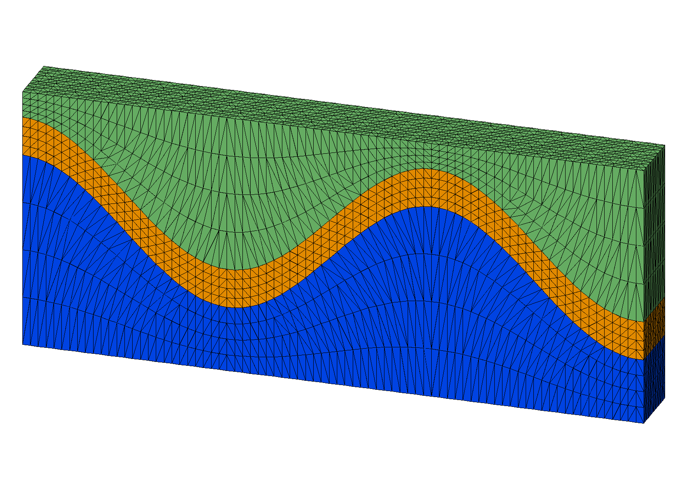
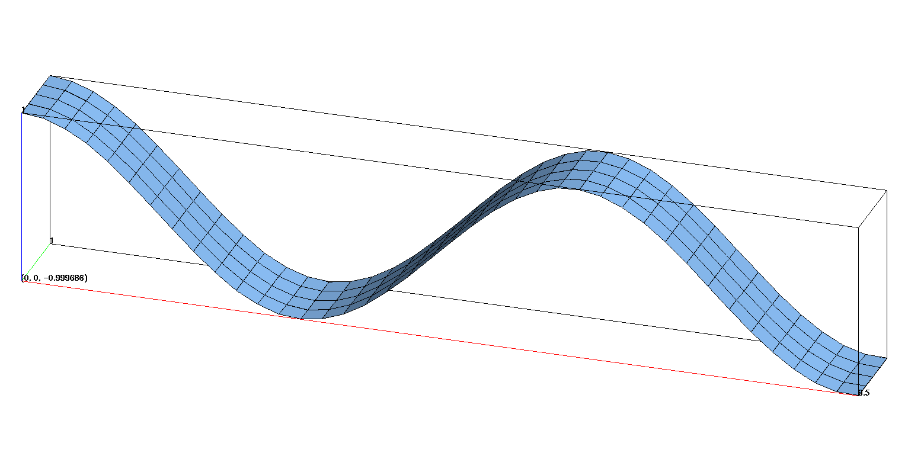
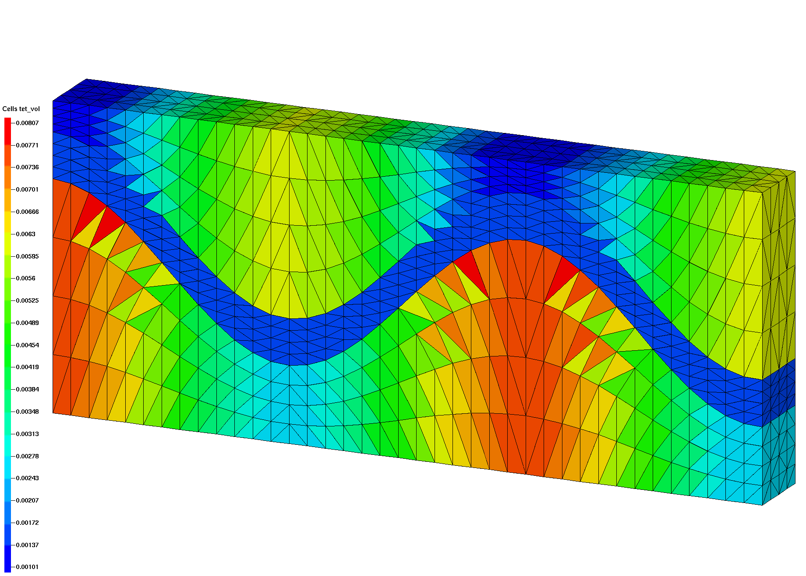
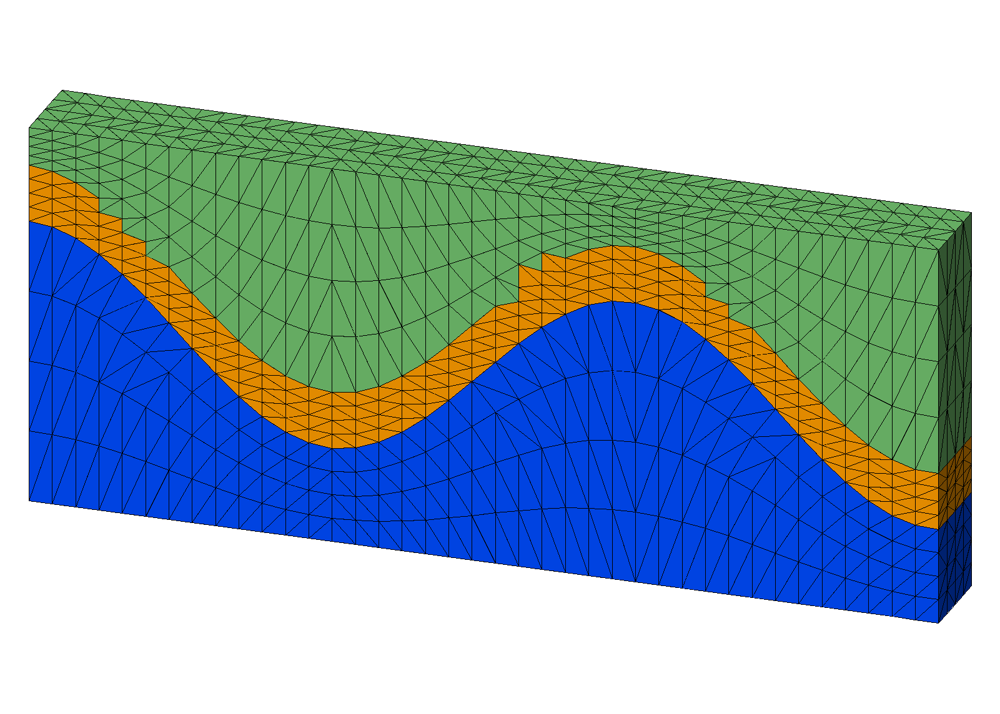

# Example: 3D connect with sloped interfaces 

**`connect`** with input points from a convex hex mesh created with **`stack/layers`**. 
This example has a thin layer formed from sloped internal interfaces. Bad elements are created across the internal interfaces resulting in "popped" tets.  

This example is fixed with resolution that improves the height to width ratio of the mesh spacing.

 [Step 1. Create surfaces](#step-1-create-surfaces)

 [Step 2. Stack surfaces into hex mesh](#step-2-stack-hex-mesh)

 [Step 3. Connect points into tetrahedral mesh](#step-3-connect)

 [Step 4. Interpolate hex colors to tet mesh](#step-4-interpolate)

 

### LaGriT input command file with all steps: [wave_connect_highres.in.txt](output/wave_connect_highres.in.txt)

### LaGriT output report for all steps: [wave_connect_highres.out.txt](output/wave_connect_highres.out.txt)

 

## Step 1 Create Surfaces

Use the **define** command to set parameters for mesh resolution and file names. Here the resolution is redefined by setting the define variables to new values. The first set are those associated with hex.gmv and tet.gmv. The second set doubles the resolution and assigns new file names hex2.gmv and tet2.gmv. 

This example takes advantage of the **define** command to run variations on the mesh using a single input file. Notice the first set of defined variables are for the coarse mesh, the second set overwrites the first set to create a mesh with added refinement and new file names.LaGriT is run first with the coarser mesh, then re-run with the modified values that fix the popped tets at the interface.

### Commands to create quad surfaces 
<pre>
# Use x coordinates to compute z based on cos()
# z(i)=cos(x(i))

# EDIT Variables to define resolution and file names

# spacing near .25 horizontal
define / XMAX / 9.5 
define / YMAX / 1. 
define / NX / 40
define / NY / 5

define HEX_MESH hex.gmv
define TET_MESH tet.gmv

# MODIFY Variables to fix popped tets on interface
# ADD resolution so height to width ratio is near 1 to 2 
# spacing near .125 horizontal
define / NX / 80
define / NY / 10
define HEX_MESH hex2.gmv
define TET_MESH tet2.gmv

# Create the quad surface with wave topology
cmo / create / mosurf / / / quad
quadxy /NX NY/0. 0. 0./ XMAX 0. 0./XMAX YMAX 0./0. YMAX 0./ 1 1 1
createpts/brick/xyz/NX,NY,1/1 0 0 / connect
cmo / setatt / mosurf / imt / 1 0 0 / 1
cmo / setatt / mosurf / itetclr / 1 0 0 / 1
resetpts / itp

cmo / printatt / mosurf / -xyz- / minmax
math/cos/mosurf/zic/1,0,0/mosurf/xic
cmo / printatt / mosurf / -xyz- / minmax
dump / surf_wave.inp / mosurf

#-------------------------------------------------
# make surfaces for stack input files using the quad surface 

# Make top and bottom surfaces flat
define ZBOT 0.
define ZTOP 4.

# translate surfaces for vertical thickness
define S1 2.
define S2 .6 
define S3 1.5 

cmo select mosurf
trans /1,0,0/ 0. 0. 0./ 0. 0. S1 
dump / surf_wave_low.inp / mosurf

trans /1,0,0/ 0. 0. 0./ 0. 0. S2 
dump / surf_wave_high.inp / mosurf

cmo/setatt/mosurf/ zic/ ZBOT 
dump / surf_flat_bot.inp / mosurf

cmo/setatt/mosurf/ zic/ ZTOP 
dump / surf_flat_top.inp / mosurf
</pre>

### Commands to make surfaces for stacking

Use the quad surface to assign Z values for layers to stack.
The top and bottom of this mesh will be flat. There are 2 wave surfaces being used as internal interfaces for the middle material given a thickness of .6 using the translate command.

<pre>
# Make top and bottom surfaces flat
define ZBOT 0.
define ZTOP 4.

# translate surfaces for vertical thickness
define S1 2.
define S2 .6 

cmo select mosurf
trans /1,0,0/ 0. 0. 0./ 0. 0. S1 
dump / surf_wave_low.inp / mosurf

trans /1,0,0/ 0. 0. 0./ 0. 0. S2 
dump / surf_wave_high.inp / mosurf

cmo/setatt/mosurf/ zic/ ZBOT 
dump / surf_flat_bot.inp / mosurf

cmo/setatt/mosurf/ zic/ ZTOP 
dump / surf_flat_top.inp / mosurf
</pre>

### Output quad surfaces

Created quad surface with z(i)=cos(x(i))
 
This surface is used as template to create additional surfaces.
 

 

## Step 2 Stack Hex Mesh

The **`stack/layers`** command reads the four surfaces that were created. Material ids are assigned and refinement layers created between input surfaces that will detirmine vertical resolution.

### Commands to stack layers into a hex mesh

<pre>
# Stack layers from bottom to top 
# Define material id and add refine layers

cmo/create/mo_stack
stack/layers/avs/ &
  surf_flat_bot.inp 1 &
  surf_wave_low.inp  2 3 &
  surf_wave_high.inp 3 3 &
  surf_flat_top.inp  3 3 

dump gmv tmp_stack_layers.gmv mo_stack

# connect statcked surfaces into 3D elements
stack/fill/mohex / mo_stack
resetpts/itp

# write information about this mesh object
cmo/printatt/mohex/-xyz- minmax
quality

# check hex volumes
cmo/addatt/mohex/volume hex_vol
cmo/printatt/mohex/hex_vol minmax
eltset/ ebad / hex_vol/le 0.
dump HEX_MESH mohex
</pre>

### Output stacked hex mesh

For this example there are flat top and bottom layers plus 2 internal layers to seperate materials.
The vertical spacing between these input layers are refined proportionally by adding refine layers.
- Bottom (yellow), internal interfaces (green), top (red)
- Blue surfaces are the added proportional layers.

<pre class="lg-output">
 
         surface name  layer color type llcorner  zic         
    surf_flat_bot.inp     1    1   -1         1)   0.000000E+00
               refine     2    1    2       801)   7.500000E-01 
               refine     3    1    2      1601)   1.500000E+00
               refine     4    1    2      2401)   2.250000E+00 
    surf_wave_low.inp     5    2    0      3201)   3.000000E+00
               refine     6    2    2      4001)   3.150000E+00 
               refine     7    2    2      4801)   3.300000E+00  
               refine     8    2    2      5601)   3.450000E+00
   surf_wave_high.inp     9    3    0      6401)   3.600000E+00 
               refine    10    3    2      7201)   3.700000E+00  
               refine    11    3    2      8001)   3.800000E+00
               refine    12    3    2      8801)   3.900000E+00 
    surf_flat_top.inp    13    3   -2      9601)   4.000000E+00  
 
Elements per layer:        711  stacked total:           9243     
Nodes    per layer:        800  stacked total:          10400      
No Truncating layer specified.                                      
 
files read:         4  from total:         4                         
</pre>

The stacked layers are connected into hex elements. Note the vertical resolution for the coarse and the high resolution 2nd mesh are the same. Only the horizontal spacing has changed. 
The **`quality`** and **`cmo/addatt/cmo/volume`** commands are used to check that volumes are positive.

<a href="output/wave_intrf_hex.png" > Hex Mesh Coarse XY  </a>
<a href="output/wave_intrf_hex2.png" >Hex Mesh Refine XY  </a>

## Step 3 Connect

Copy the hex points into a new mesh object and connect into tetrahedrals.

### Commands to connect

<pre>
cmo/create/motet
copypts/motet/mohex

# set some defaults for the connect routine
filter / 1 0 0
rmpoint / compress
cmo / setatt / motet / imt / 1 0 0 / 1
cmo / setatt / motet / itp / 1 0 0 / 0

# connect and ignore interface materials
connect/ noadd

</pre>

### Output Connected Tet Mesh

The internal interfaces are steep slopes, if the width to height ratio is too large, connect may form connections across the interface resulting in "popped" tets.  This is easy to see visually by selecting materials, or by displaying the tet volumes as shown in these images.
 

<a href="output/wave_intrf_tet_vol.png">Coarse  </a>
<a href="output/wave_intrf_tet2_vol.png">Added resolution  </a>

These images show tet volumes colored by added attribute *tet_vol* with element volumes.
It is easy to see where tets in the coarser mesh cross the material interface and are not conforming with the input surface as shown in the higher resolution mesh on the right.

## Step 4 Interpolate

### Commands to interpolate hex materials to tet materials

The hex mesh with 3 materials can be interpolated on to the tet mesh.

<pre>
# interpolate element materials from hex mesh
interpolate/map/motet itetclr/1,0,0/mohex itetclr
resetpts / itp

# report mesh quality and check for neg ccoefs
quality
cmo/addatt/motet/volume/tet_vol
cmo/addatt/motet/voronoi_volume/vor_vol
cmo/printatt/motet/tet_vol/minmax
cmo/printatt/motet/vor_vol/minmax
dump TET_MESH motet

finish
</pre>

### Output Colored Tet Mesh

The tet mesh now has the 3 materials interpolated from the hex mesh. The refined mesh has internal interfaces conforming to the input surfaces. 

<a href="output/wave_tet_popped.png">Tet Mesh  </a>
<a href="output/wave_tet_popped_explode.png">Tet Mesh Explode  </a>

These images show results from the coarse mesh with connections crossing the material interface.

<a href="output/wave_tet_highres.png">Tet 2 Mesh  </a>
<a href="output/wave_tet_highres_explode.png">Tet 2 Mesh Explode  </a>

These images show results from the higher resolution mesh with connections conforming to the material interface.

