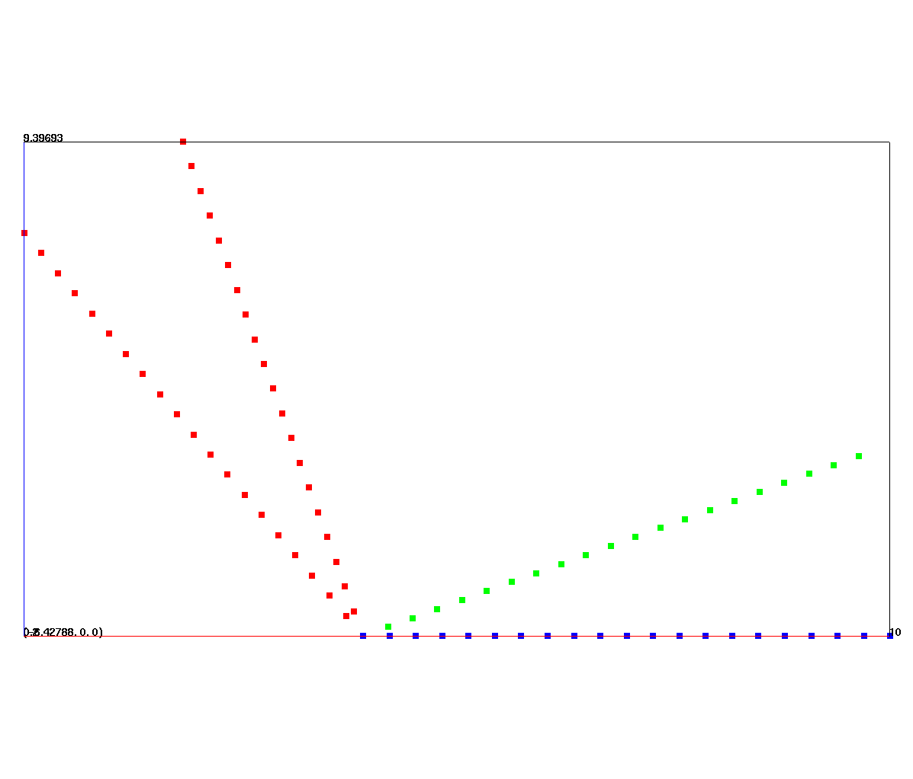

# ROTATELN

----------------------

Rotates a point distribution about a line. 


## SYNTAX

<pre>
<b>rotateln</b>/ifirst,ilast,istride/[<b>no</b>]<b>copy</b> / x1,y1,z1/x2,y2,z2/ theta/xcen,ycen,zcen/
</pre>


`ifirst,ilast,istride` is the node range selected by node numbers or pset,get,pname.


**`nocopy`** keeps only the rotated points, the node count does not change.


**`copy`** keeps a copy of the original unrotated points, as well as the rotated points.
The new points will have the rotated coordinate values but no other mesh attributes will be set for these points.


`x1,y1,z1 / x2,y2,z2` are the end points of the rotation line and  must extend beyond the boundaries of the selected point set.


`theta` in degrees is the angle of rotation whose positive direction is determined by the right-hand-rule, that is, if the thumb of your right hand points in the direction of the line (1 to 2), then your fingers will curl in the direction of rotation.


`xcen,ycen,zcen` is the point where the line can be shifted to before rotation takes place.

 

## EXAMPLES


```
define / SIZE / 10.0
cmo / create / mo01 / / / hex
createpts / xyz / 2, 2, 10 / 0, 0, 0 / SIZE, SIZE, SIZE / 1 1 1
rotateln / 1 0 0 / nocopy / 0 0 0 / 0 0 5 / 90 / 0, 0, 0
```
Create a cube of points and rotate it 90 degrees about the z-axis.

```
createpts/brick/xyz/NX NY NZ /X0 Y0 Z0 / X1 Y1 Z1 /1,1,1 
cmo/setatt/mohex imt 1

# Define Degree of rotation around line along y axis
# Color each set after it is rotated

define ROTDEG 20.
rotateln/1,0,0/copy/ 0. 500. 0./ 0. -1. 0. /  ROTDEG 
pset/ prot1 / seq /0,0,0/
cmo/setatt/mohex/imt/pset,get,prot1 2

define ROTDEG 110.
rotateln/1,0,0/copy/ 0. 500. 0./ 0. -1. 0. /  ROTDEG 
pset/ prot2 / seq /0,0,0/
cmo/setatt/mohex/imt/pset,get,prot2 3
```
Rotate points using copy to keep each rotation. Blue is the original set of points laying flat along the X axis. 
Green  is the second rotation of 20 degress. 
Red is the third rotation of 110 degrees which includes both the original and second rotations.

<a href="../demos/output/test_rotateln_example.png"> </a>


## DEMOS

Demo of rotated cylinder in a box: [ROTATELN](../demos/main_rotateln.md)
