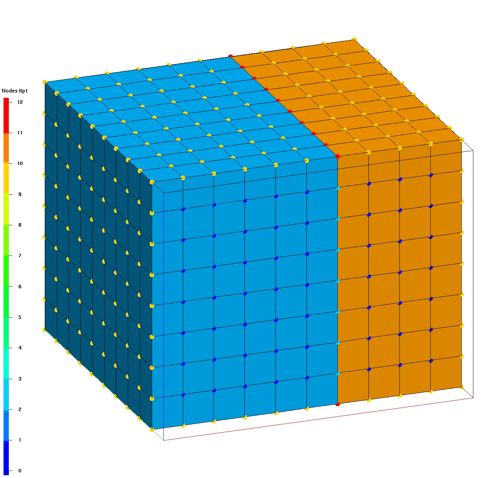
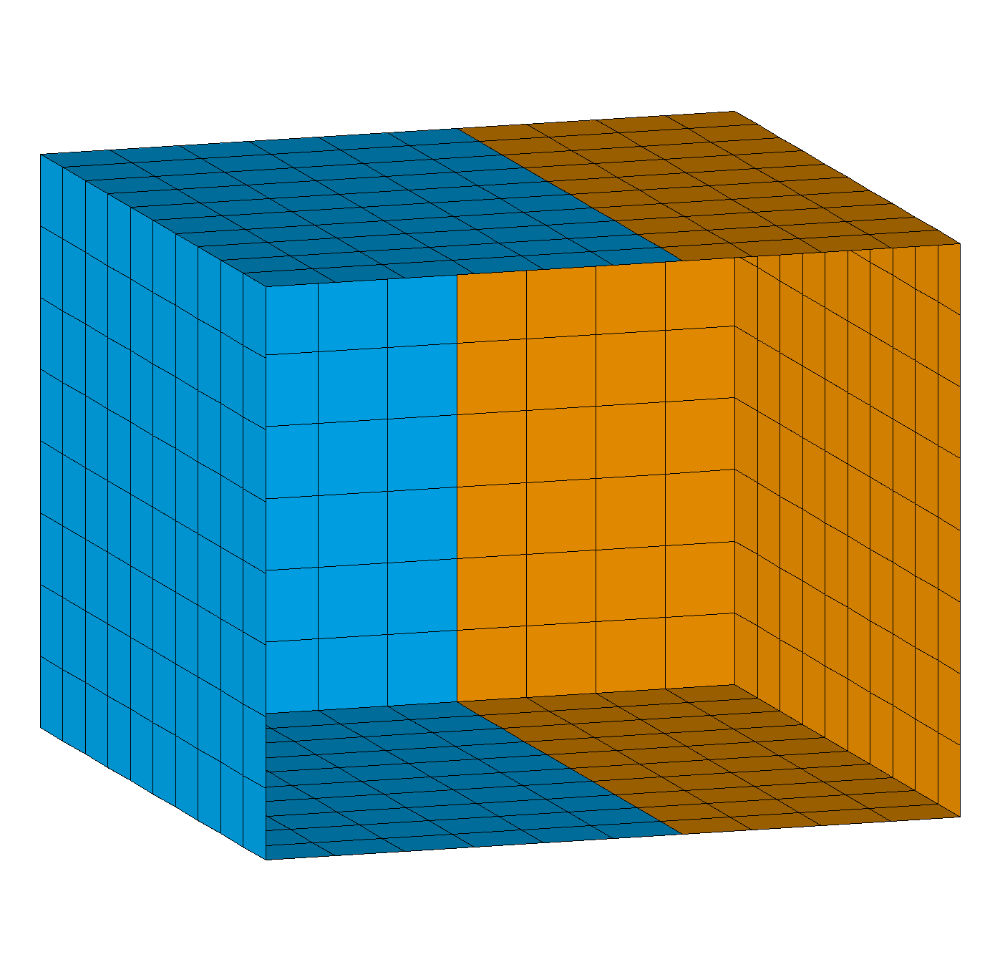

# EXTRACT / SURFMESH


  This routine extracts the boundary of a mesh. If the original mesh
  is a solid mesh, it extracts the surface mesh. If it is a surface
  mesh, it extracts the edge mesh. If the interface elements have
  "parent-child" nodes, then only the parent nodes and elements are
  extracted. 

Not all attributes in the input mesh object are created
  or initialize in the output mesh object. Among the array-valued
  attributes, only xic,yic,zic,itet,jtet,itetoff,itettyp, and icr1
  are set. The node attribute imt is set to 1. The icontab array is copied from the
  input mesh object to the output mesh object.

The elements of the extracted surfmesh are detirmined by the faces of the original mesh elements. So if the original mesh is hexahedral, the surfmesh will be quads, if it is tetrahedral, the surfmesh will be triangles. If you want all triangles in the surfmesh you can first convert the mesh to tetrahedrals using the command [**`grid2grid`**](../GRID2GRID.md).


Note:  the **itp** array of the input mesh object must be correctly set. 
  Use the command [**`resetpts/itp`**](../RESETPT.md) which will identify nodes on the outside and also on material interfaces for multi-value itetclr values. 
See more about this attribute at [Mesh Object](../../meshobject.md).

 

## SYNTAX

<pre>

 <b>extract / surfmesh</b> / 1,0,0 /cmo_out /[ cmo_in ][ <b>external</b> ]

</pre>

`1,0,0` is the range convention where the integers represent start,stop,stride and 1,0,0 represents all. The **`pset`** or **`eltset`** selections are also allowed.

`cmo_out` is the name of the extracted mesh object.

`cmo_in` is optional and is the name of the mesh object to extract from, the default is the current mesh object.

**`external`** means only the exterior surface mesh will be extracted and not the interior interfaces (extracted by default).
Note if itetclr is set to a single value and the itp array is updated, there will be no interior interfaces to extract.

**`-all-`** deprecated option at end of syntax is ignored. By default, all interior and exterior surfaces are extracted.
 

## ADDED ATTRIBUTES


```
                   |    mregion2
  mregion1         | 
                   |------> normal 
                   | 
       itetclr = 1 |   itetclr = 2
      itetclr0 = 1 |  itetclr1 = 2
      element# = 1 |  element# = 2
      idelem0  = 1 |  idelem1  = 2

```

 Six new element attributes and one node attribute, are added to the output mesh
  indicating the material numbers (itetclr) on each side of the mesh
  faces, i.e., the color of elements that existed on each side of a
  face in the original mesh.  For multi-material, the convention is that the normal points
  into the larger material id (itetclr) material.

* **itetclr0** (values 0 to max material) and **itetclr1** (values 1 to max material) based on itetclr material values on each side of the extracted surface. 0 indicates a face on the boundary.
* **idelem0** (values 0 to nelements) and **idelem1** (values 1 to nelements)  element number on each side of the extracted surface.  
* **idface0** (values 0 to num element faces) and **idface1** (values 0 to num element faces)  the local face number for each element on either side of the extracted surface. 
* **facecol** (values between 0 and max material) is a model face number constructed from the itetclr0 and itetclr1 attributes and is not guaranteed that the same facecol value will not be given to two disjoint patches of mesh faces.  
* **idnode0** (values 0 to nnodes) provides the mapping from nodes in the extracted interface network to (parent) nodes in the input mesh object; that is, IDNODE0(J) is
   the parent node in the input mesh object that corresponds to node J in the output mesh object. 


## EXAMPLES

```
extract/surfmesh/1,0,0/ mos_all / MO_MESH

extract/surfmesh/1,0,0/ mos_out / MO_MESH / external
```

<hr>

## Demo Extract Surfmesh

This demonstrates the difference between extracting all or just external boundaries. 
See Full Demo at [Demo Extract Surfmesh](../../demos/main_extract_surfmesh.md). 

The first image shows the original hex mesh and nodes colored by the **itp** boundary tags. The image is clipped at the front to show the internal 0 value itp nodes and the tagged interface nodes with value 2. 
<br> The second image shows the extracted surfmesh which includes the interface between the materials. 
<br> The third image shows the surfmesh extracted from external boundary only.

Click on images for full size.


|  |  |   | 
| :---: | :---: | :---:  | 
|  **Input Hex Mesh** |  **surfmesh all** |  **surfmesh external**  | 
| <a href="../../demos/output/box_hex_itp_clip.png"> </a> | <a href="../../demos/output/box_surfmesh_all.png"> </a> | <a href="../../demos/output/box_quad_external.png"></a> |  
| Hex mesh colored by itetclr material, nodes show itp values (clip front)|  extract all boundaries and interfaces, color by itetclr1 (clip front) |  extract external boundaries only, color by itetclr1 (clip front) |  

<hr>

## Demo Write Face Sets            

This example shows how extract/surfmesh can be used to write boundary face information that can be used by ExodusII files to define facesets (side sets).
See Full Demo at [Demo Write Face and Node Sets](../../demos/extract_facesets.md).

Write the mesh element number **idelem1** and element face number **idface1** to define a boundary or surface in order to set model conditions.

*Note it is very important that you use the model source mesh to get the intended node and element numbers.
If you subset or change the source mesh, the node and element numbers might change so your faceset list will not be valid.*

```
# extract surface faces from boundary and interfaces
extract/surfmesh/ 1,0,0 / mo_surf / mo_master

# subset the surface to selected faces
# select faces on interface below material 2
cmo/select/ mo_surf
eltset/ e_delete/ itetclr0 ne 2
rmpoint / element / eltset get e_delete
rmpoint / compress

# write file with element-face number pairs
# using the surfmesh attributes idelem1 and idface1
# first delete all the attributes we do not want to write
cmo / DELATT / mo_surf / itetclr0
cmo / DELATT / mo_surf / idnode0
cmo / DELATT / mo_surf / idelem0
cmo / DELATT / mo_surf / facecol
cmo / DELATT / mo_surf / itetclr1
cmo / DELATT / mo_surf / idface0

dump / avs / mat2_interface.facesets / mo_surf / 0 0 1 2
```

The file mat2_interface.facesets will have the element number and the boundary face local number for the selected faces.
In this case the faces are all upward facing and all faces are id 2 on the tet element they are extracted from. 

<pre class="lg-output">
    0   0   0   2   0
00002  1  1
idelem1, integer 
idface1, integer 
  1503  2
  1504  2
  1508  2
  1509  2
  1513  2
  1514  2
  1518  2
...
</pre>

