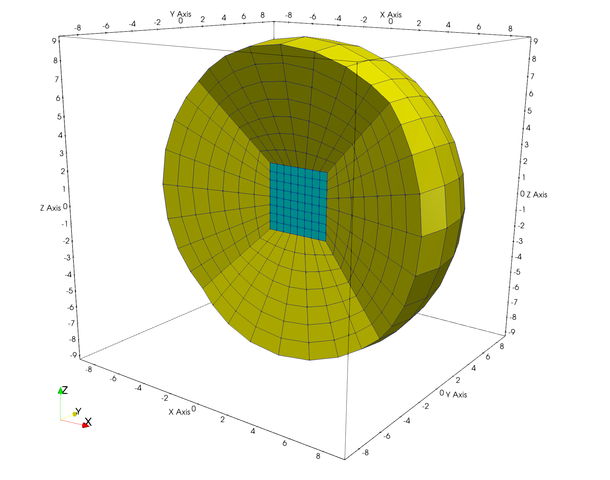
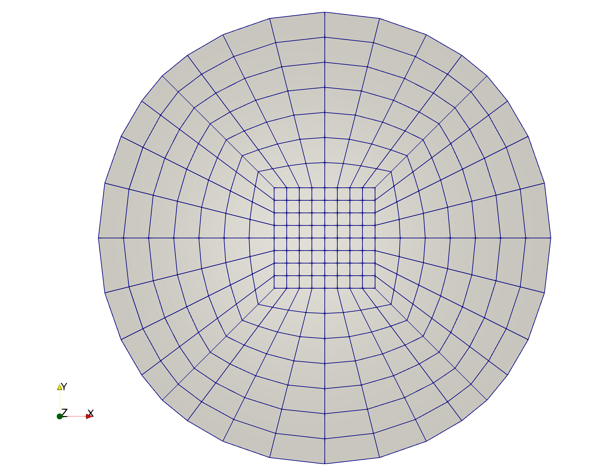
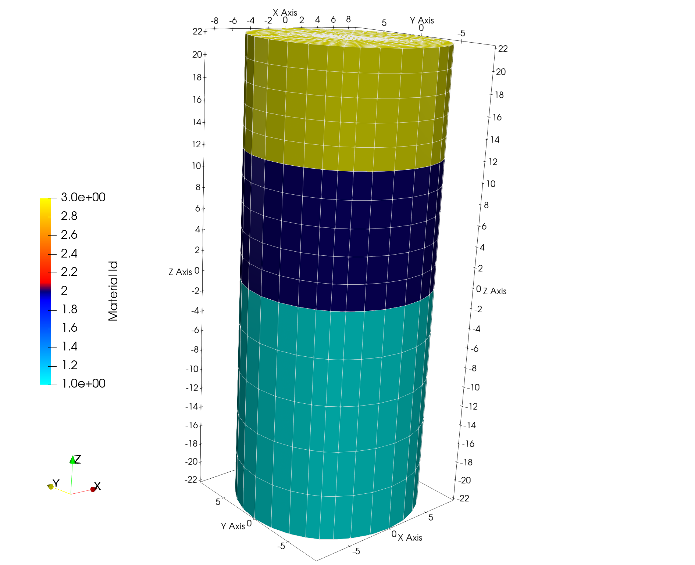
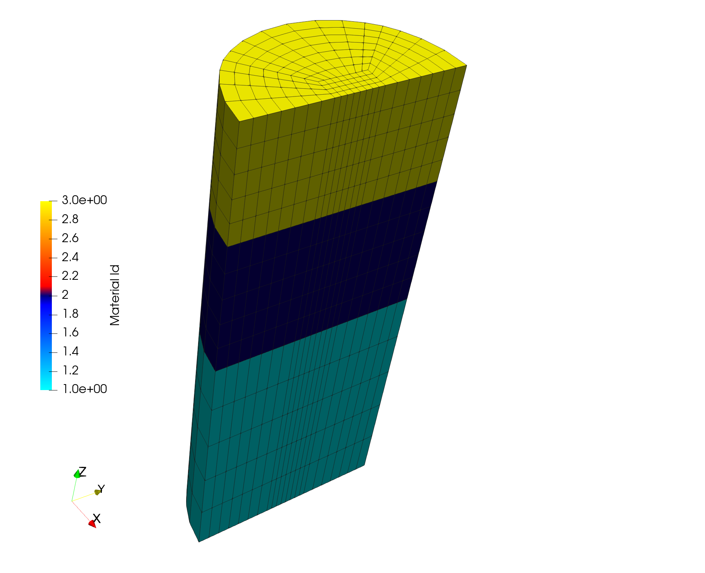

# Example: Use Spherical Hex Mesh to Stack Layers into Cylinder Hex Mesh 

This demo shows how these commands are used to create a quad surface that is stacked into a cylinder shaped mesh. 

### Step 1 createpts/interp

Interpolate cube onto sphere to create hex mesh. 

LaGriT command file: [full_sphere.lgi.txt](input/full_sphere.lgi.txt)

LaGriT report file: [full_sphere.out.txt](output/full_sphere.out.txt)

### Step 2 extract/surfmesh

Extract 2D quad surface from hex sphere. 

LaGriT command file: [extract_2d_surf.lgi.txt](input/extract_2d_surf.lgi.txt)

LaGriT report file: [extract_2d_surf.lgi.txt](output/extract_2d_surf.out.txt)

### Step 3 stack/layers

Stack 2D quad surfaces into 3D hex cylinder mesh.  

LaGriT command file: [stack_into_cylinder.lgi.txt](input/stack_into_cylinder.lgi.txt)

LaGriT report file: [stack_into_cylinder.lgi.txt](output/stack_into_cylinder.out.txt)

### Step 4 dump

Write mesh formats exodus, avs, gmv.  

LaGriT command file: [write_mesh_formats.lgi.txt](input/write_mesh_formats.lgi.txt)

LaGriT report file: [write_mesh_formats.out.txt](output/write_mesh_formats.out.txt)

