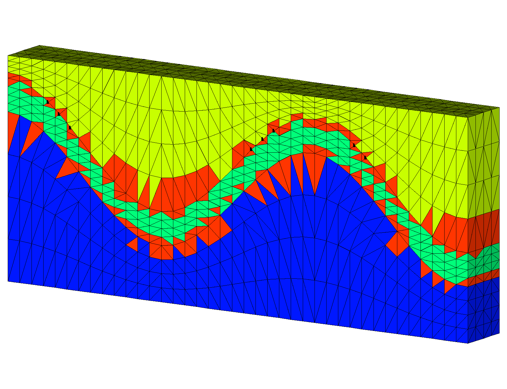
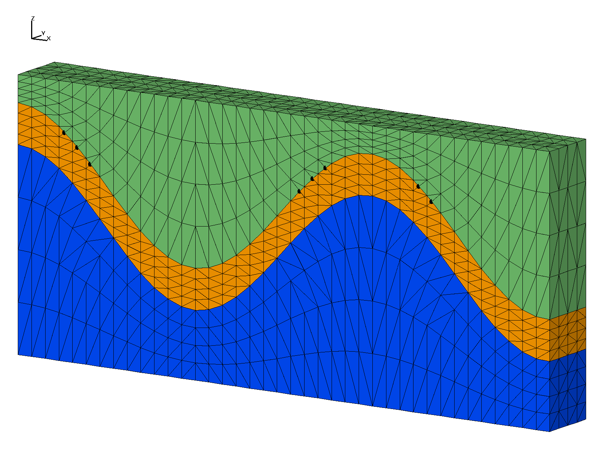

# Example: 3D connect/check_interface with sloped interfaces 

**`connect`** with input points from a convex hex mesh created with **`stack/layers`**. 
This example has a thin layer formed from sloped internal interfaces. Bad elements are created across the internal interfaces resulting in "popped" tets.  

This example is fixed by using **connect/check_interface**. This option requires mesh object geometry as defined by the **region** and **mregion** commands. If geometry is not defined, **check_interfaces** will behave as if there are no internal interfaces.

 [Step 1. Create surfaces](#step-1-create-surfaces)

 [Step 2. Stack surfaces into hex mesh](#step-2-stack-hex-mesh)

 [Step 3. Define geometry for the tetrahedral mesh](#step-3-set-geometry)

 [Step 4. Connect points into tetrahedral mesh](#step-3-connect)

 [Step 5. Interpolate hex colors to tet mesh](#step-4-interpolate)

 

### LaGriT input command file with all steps: [wave_connect_check.in.txt](output/wave_connect_check.in.txt)

### LaGriT output report for all steps: [wave_connect_check.out.txt](output/wave_connect_check.out.txt)

 

## Step 1 Create Surfaces

Use **createpts** to create boundary and internal interfaces. These surfaces will also be used to define the mesh **geometry** in latter steps.

### Commands to create quad surfaces 
<pre>
# spacing near .25
define / XMAX / 9.5 
define / YMAX / 1. 
define / NX / 40
define / NY / 5

define HEX_MESH hex.gmv
define TET_MESH tet.gmv

cmo / create / mosurf / / / quad
quadxy /NX NY/0. 0. 0./ XMAX 0. 0./XMAX YMAX 0./0. YMAX 0./ 1 1 1
createpts/brick/xyz/NX,NY,1/1 0 0 / connect
cmo / setatt / mosurf / imt / 1 0 0 / 1
cmo / setatt / mosurf / itetclr / 1 0 0 / 1
resetpts / itp

math/cos/mosurf/zic/1,0,0/mosurf/xic
cmo / printatt / mosurf / -xyz- / minmax
dump / surf_wave.inp / mosurf

</pre>

### Commands to make surfaces for stacking

Use the quad surface to assign Z values for layers to stack.
The top and bottom of this mesh will be flat. There are 2 wave surfaces being used as internal interfaces for the middle material. These will be used to define the mesh geometry as required by the **check_interface** option of connect.

<pre>
# these are the values for flat top and flat bottom
define ZBOT 0.
define ZTOP 4.

# these are translate values for vertical spacing
define S1 2.
define S2 .6 

cmo select mosurf
trans /1,0,0/ 0. 0. 0./ 0. 0. S1 
dump / surf_wave_low.inp / mosurf

trans /1,0,0/ 0. 0. 0./ 0. 0. S2 
dump / surf_wave_high.inp / mosurf

cmo/setatt/mosurf/ zic/ ZBOT 
dump / surf_flat_bot.inp / mosurf

cmo/setatt/mosurf/ zic/ ZTOP 
dump / surf_flat_top.inp / mosurf

</pre>

## Step 2 Stack Hex Mesh

The **`stack/layers`** command reads the four surfaces that were written. Material ids are assigned and refinement layers are created between input surfaces that will detirmine the vertical resolution. Write this hex mesh and use it to interpolate material ids on to the tet mesh when done.

### Commands to stack layers into a hex mesh

<pre>
# Stack layers from bottom to top with vertical refinement 
cmo/create/mo_stack
stack/layers/avs/ &
  surf_flat_bot.inp 1 &
  surf_wave_low.inp  2 3 &
  surf_wave_high.inp 3 3 &
  surf_flat_top.inp 3  3 

# connect stacked layers into 3D elements
stack/fill/mohex / mo_stack
resetpts/itp

# write information about this mesh object
cmo/printatt/mohex/-xyz- minmax
quality

# check hex volumes
cmo/addatt/mohex/volume hex_vol
cmo/printatt/mohex/hex_vol minmax
eltset/ ebad / hex_vol/le 0.
dump HEX_MESH mohex
</pre>

### Output stacked hex mesh

For this example there are flat top and bottom layers plus 2 internal layers to seperate materials.
The vertical spacing between these input layers are refined proportionally by adding refine layers.
- Bottom (yellow), internal interfaces (green), top (red)
- Blue surfaces are the added proportional layers.

<pre class="lg-output">
 
         surface name  layer color type llcorner  zic         
    surf_flat_bot.inp     1    1   -1         1)   0.000000E+00
               refine     2    1    2       801)   7.500000E-01 
               refine     3    1    2      1601)   1.500000E+00
               refine     4    1    2      2401)   2.250000E+00 
    surf_wave_low.inp     5    2    0      3201)   3.000000E+00
               refine     6    2    2      4001)   3.150000E+00 
               refine     7    2    2      4801)   3.300000E+00  
               refine     8    2    2      5601)   3.450000E+00
   surf_wave_high.inp     9    3    0      6401)   3.600000E+00 
               refine    10    3    2      7201)   3.700000E+00  
               refine    11    3    2      8001)   3.800000E+00
               refine    12    3    2      8801)   3.900000E+00 
    surf_flat_top.inp    13    3   -2      9601)   4.000000E+00  
 
Elements per layer:        711  stacked total:           9243     
Nodes    per layer:        800  stacked total:          10400      
No Truncating layer specified.                                      
 
files read:         4  from total:         4                         
</pre>

The stacked layers are connected into hex elements. 
The **`quality`** and **`cmo/addatt/cmo/volume`** commands are used to check that volumes are positive.

<a href="output/wave_intrf_hex.png" > Hex Mesh  </a>

## Step 3 Set Geometry

Read the surfaces used to define material interfaces for the hex mesh, and use them to define the mesh geometry that will be used by **connect/check_interface**. The geometry is defined by regions above and below the surfaces. Here we set region 2 **r2** and mregion 2 **mr2** as the volume between surf_wave_low.inp and surf_wave_high.inp. The interfaces will be equal to these surfaces.

<pre>
# GEOMETRY defined for tet mesh 
cmo/create/motet
copypts/motet/mohex

# define geometry using surfaces used in stack
read avs surf_wave_low.inp mos1
read avs surf_wave_high.inp mos2

cmo select motet
surface/slow/intrface/sheet/ mos1
surface/shigh/intrface/sheet/ mos2

# define regions
# interfaces must have exactly one region
region/r1/ lt slow
region/r2/ ge slow and le shigh
region/r3/ gt shigh

# define material regions
# exclude internal interfaces
mregion/mr1/ lt slow
mregion/mr2/ gt slow and lt shigh
mregion/mr3/ gt shigh
</pre>

## Step 4 Connect

Copy the hex points into a new mesh object and connect into tetrahedrals. The **check_interface** option will add points as necessary to maintain the defined interfaces.

### Commands to connect

<pre>
# set some defaults for the connect routine
filter / 1 0 0
rmpoint / compress
setpts

dump gmv tmp_input_nodes.gmv motet
cmo/printatt/motet/imt minmax

# connect and check interface connections
connect / check_interface

</pre>

The command **setpts** will assign imt material values as defined in the region and mregion commands. Use this to check that the mesh geometry has beed defined as intended.

<pre class="lg-output">
setpts                                                                          
 FOR imt=   1 NAME= mr1      THERE ARE             800 POINTS                   
 FOR imt=   2 NAME= mr2      THERE ARE             600 POINTS                   
 FOR imt=   3 NAME= mr3      THERE ARE             800 POINTS                   
 FOR imt=   4 NAME= intrface THERE ARE             400 POINTS         
</pre>

Image shows the input points as colored by imt values set in the  **setpts** command. The result is 600 points in region mr2 with imt=2, there are 800 points in the top and bottom regions. The imt=4 values (red) are points on the interface between region 2 and the other regions.

### Output Connected Tet Mesh

<pre class="lg-output">
connect/check_interface                                                         
 Coordinates of enclosing tetrahedron are:                                      
          -0.19000D+02   -0.75000D+00   -0.30000D+01                            
           0.47500D+01   -0.75000D+00    0.17000D+02                            
           0.28500D+02   -0.75000D+00   -0.30000D+01                            
           0.47500D+01    0.42500D+01    0.20000D+01                            
 Candidate connections that may cross boundaries =        72                    
 Adding        72 points to break multimaterial connections        

 Points   2601 -   2672 are being added to break multimaterial connections.     
 
 Successfully eliminated all multimaterial connections.                         
 
 The mesh is now complete!                                                      
 
LaGriT FINISH: connect                                                          

</pre>

The LaGriT output report and image show that points were added to maintain the material interfaces. The added nodes are shown in the images as black dots. Click on image to enlarge.
The tet elements are colored based on the 4 regions, mr1 (blue), mr2 (green), mr3 (lime), interface (red).

## Step 5 Interpolate

### Commands to interpolate hex materials to tet materials

The hex mesh with 3 materials can be interpolated on to the tet mesh.

<pre>
# interpolate element materials from hex mesh
interpolate/map/motet itetclr/1,0,0/mohex itetclr
resetpts / itp

# report mesh quality and check for neg ccoefs
quality
cmo/addatt/motet/volume/tet_vol
cmo/addatt/motet/voronoi_volume/vor_vol
cmo/printatt/motet/tet_vol/minmax
cmo/printatt/motet/vor_vol/minmax
dump TET_MESH motet

finish
</pre>

### Output Colored Tet Mesh

The mesh has  3 materials interpolated from the hex mesh and has internal interfaces conforming to the input surfaces. 

<pre class="lg-output">

elements with aspect ratio b/w .2  and .5 :        235          
elements with aspect ratio b/w .5  and 1. :      11381         
min aspect ratio =  0.3142E+00  max aspect ratio =  0.8686E+00

element volumes b/w  0.1533E-03 and  0.3386E-03:        56   
element volumes b/w  0.3386E-03 and  0.7481E-03:       380  
element volumes b/w  0.7481E-03 and  0.1653E-02:      4520 
element volumes b/w  0.1653E-02 and  0.3651E-02:      2244   
element volumes b/w  0.3651E-02 and  0.8067E-02:      4416  
min volume =   1.5327704E-04  max volume =   8.0668142E-03 

ATTRIBUTE NAME          MIN               MAX     DIFFERENCE        LENGTH  
 tet_vol       1.532770444E-04  8.066814185E-03   7.913537141E-03     11616
 vor_vol       7.612179487E-04  4.559428664E-02   4.483306869E-02      2672 

AMatbld3d_stor: Matrix compress_eps:  0.1000000E-07             
AMatbld3d_stor: Local epsilon:  0.1000000E-14                  
AMatbld3d_stor: *****Zero Negative Coefficients ******        
AMatbld3d_stor: npoints =     2672  ncoefs =      22504      
AMatbld3d_stor: Number of unique coefs =     12588         
AMatbld3d_stor: Maximum num. connections to a node =  17                 
AMatbld3d_stor: Volume min =   7.6121795E-04       
AMatbld3d_stor: Volume max =   4.5594287E-02     
AMatbld3d_stor: Total Volume:   3.8000000E+01  

</pre>

The LaGriT output reports mesh statistics. All element volumes are positive, aspect ratios are acceptable, node voronoi volumes are positive, and there are no negative coupling coefficients.
