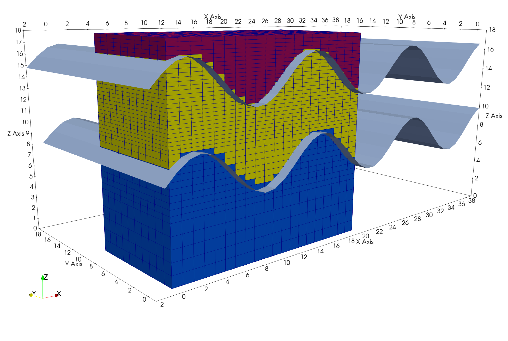
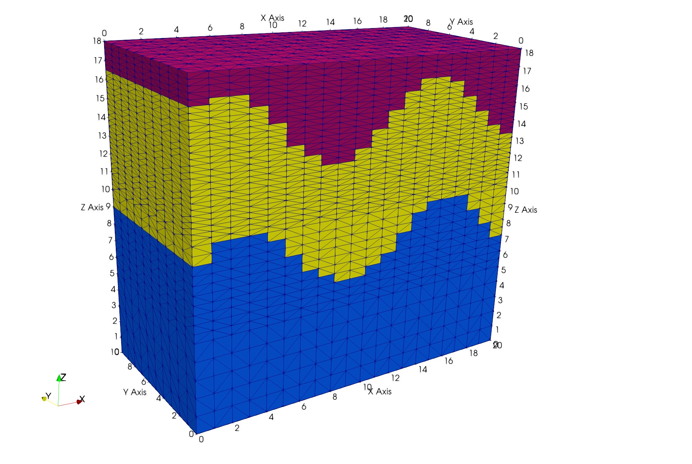

# Example: Truncated Brick Mesh with Surface Regions

The objective is to create a structured mesh with materials and truncation defined by surfaces.
The command **createpts/brick** is used to build a hex mesh. The hex mesh is colored by surface regions and then connected into a Delaunay tet mesh. Material cell colors are interpolated on to the tet mesh to maintain the cube shapes of the hex elements. When truncated the mesh is stair-stepped instead of dips and peaks if truncating by surface directly. The stair-step top needs careful methods to find the boundary tops and sides. The **zone_outside_minmax** is used in this example.

The result will have stair-step geometries by will satisfy the Delaunay critera for modeling applications.

This example command file creates the surfaces and mesh, there are no input files to read except the macro file included here.

### LaGriT command file: [lagrit_input_brick_trunc.lgi.txt](input/lagrit_input_brick_trunc.lgi.txt)

### LaGriT macro called by command file: [reset_truncated_nodes_imt.mlgi.txt](input/reset_truncated_nodes_imt.mlgi.txt)

### LaGriT output report: [lagrit_output_brick_trunc.txt](output/lagrit_output_brick_trunc.txt
)


Input Regular Hex Mesh and Surfaces   

<a href="input/brick_hex_w_surfaces.png" >  </a>

Output Truncated tet Mesh

The output is a truncated tet mesh defined by surfaces regions.
Both the cells and the nodes are colored by surface regions.

<a href="output/brick_tet_materials.png" >  </a>

Truncated tet mesh with outside boundary nodes

<a href="output/output/brick_tet_outside_top.png" >  </a>


## Steps for this Example:

### Step 1. Create hex mesh using **createpts/brick** multiple calls for change in vertical resolution.
 

```
define/XMIN/ 0.
define/YMIN/ 0.
define/ZMIN/ 0.
define/XMAX/ 20.
define/YMAX/ 10.
define NX 21
define NY 11

# Vertical spacing
define/ZMAX/ 18. 
define/Z2  / 10. 
define/Z1  / 5.
define/ZMIN/ 0.

cmo/create/cmohex///hex
cmo/select/cmohex

# Vertical spacing from middle to top 
createpts/brick/xyz/NX NY 28 / XMIN YMIN Z2 / XMAX YMAX ZMAX 

# Vertical spacing from middle 1 to middle 2 
createpts/brick/xyz/NX NY 11 / XMIN YMIN Z1 / XMAX YMAX Z2 

# Vertical spacing bottom to middle
createpts/brick/xyz/NX NY 6 / XMIN YMIN ZMIN / XMAX YMAX Z1 

cmo/printatt/cmohex/ -xyz- minmax
quality
```

### Step 2. Create or Read Surfaces to define Material Regions 

```
# Use x coordinates to compute z based on sin()
# y coordinate detirmines length of surface
define / XMAX / 20. 
define / NX / 40
define / YMAX / 10. 
define / NY / 10
define SCALE_VAL 2.

cmo / create / mosurf / / / quad
cmo select mosurf

quadxy /NX NY/0. 0. 0./ XMAX 0. 0./XMAX YMAX 0./0. YMAX 0./ 1 1 1
createpts/brick/xyz/NX,NY,1/1 0 0 / connect
math/sin/mosurf/zic/1,0,0/mosurf/xic
scale / 1 0 0 / relative / xyz / SCALE_VAL SCALE_VAL SCALE_VAL 
cmo / setatt / mosurf / imt / 1 0 0 / 1
cmo / setatt / mosurf / itetclr / 1 0 0 / 1
resetpts / itp
cmo / printatt / mosurf / -xyz- / minmax

trans / 1 0 0 / 0. 0. 0. / -1. -1. 8.0
dump / surf_sin_01.inp / mosurf
cmo/printatt/mosurf/ zic minmax

cmo/copy/mosurf2/mosurf
cmo/select/mosurf2
trans / 1 0 0 / 0. 0. 0. / -1. 0. 6.8
dump / surf_sin_02.inp / mosurf2
cmo/printatt/mosurf2/ zic minmax
``` 

### Define Geometry using Regions defined by Surfaces 

```
cmo select cmohex
surface / s1 / intrface / sheet  / mosurf
surface / s2 / intrface / sheet  / mosurf2

# set interfaces equal to one surface
region / r1 / lt s1 and le s2
region / r2 / gt s1 and lt s2
region / r3 / ge s2
 
# interfaces are not equal to surface
mregion / mr1 / lt s1 and lt s2
mregion / mr2 / gt s1 and lt s2
mregion / mr3 / gt s2

setpts
settets
resetpts/itp
```

### Connect point distribution into Delaunay tet mesh

```
cmo/create/cmotet
copypts/cmotet/cmohex

# remove duplicate points, reset attributes
filter/1,0,0
rmpoint/compress
cmo / setatt / cmotet / imt / 1 0 0 / 1
cmo / setatt / cmotet / itp / 1 0 0 / 0 

# connect without adding points
connect noadd
resetpts / itp
quality

```

### Interpolate Cell and Node Materials from Hex Mesh for brick shaped geometry


```
interpolate/map/cmotet itetclr /1,0,0/ cmohex itetclr
interpolate/voronoi/cmotet imt /1,0,0/ cmohex imt
cmo/printatt/cmotet/itetclr minmax

# remove cells above material 2
# check for material 3 nodes left behind
eltset/edel/ itetclr / gt 2
rmpoint element eltset,get,edel
rmpoint/compress
resetpts/itp

cmo/printatt/cmotet/itetclr minmax
cmo/printatt/cmotet/imt minmax

# FIX imt of nodes left behind after removal of cells
define CMO cmotet
define MAX_MAT 2
infile reset_truncated_nodes_imt.mlgi
```

### Set Boundary Node Zones

```
# tag outside nodes and save attributes
# we need to use the max node located in each xyz direction
# normal zone_outside will tag stair-steps incorrectly

dump/ zone_outside_minmax/ tet_max /cmotet/ keepatt

# check geometric coefficients
cmo/setatt/cmotet/imt 1	
dump/ stor/ tet_trunc / cmotet
```

### LaGriT Output Report for Mesh Quality

<pre class="lg-output">
 
# check geometric coefficients                                                  
dump/stor/tet_trunc/cmotet                                                      
 
*** Construct and Compress Sparse Matrix:3D ***                                 
   *** Compress Area Coefficient Values ***                                     
 
AMatbld3d_stor: Matrix compress_eps:  0.1000000E-07                             
AMatbld3d_stor: Local epsilon:  0.1000000E-14                                   
AMatbld3d_stor: *****Zero Negative Coefficients ******                          
AMatbld3d_stor: Number of 'zero' (< compress_eps) coefs         0               
AMatbld3d_stor: npoints =     7898  ncoefs =      52244                         
AMatbld3d_stor: Number of unique coefs =        16                              
AMatbld3d_stor: Maximum num. connections to a node =          7                 
AMatbld3d_stor: Volume min =   3.7037037E-02                                    
AMatbld3d_stor: Volume max =   1.0000000E+00                                    
AMatbld3d_stor: Total Volume:   3.0251852E+03                                   
AMatbld3d_stor: abs(Aij/xij) min =   0.0000000E+00                              
AMatbld3d_stor: abs(Aij/xij) max =   3.3750000E+00                              
AMatbld3d_stor: (Aij/xij) max =   0.0000000E+00                                 
AMatbld3d_stor: (Aij/xij) min =  -3.3750000E+00                                 
AMatbld3d_stor Matrix coefficient values stored as scalar area/distance         
AMatbld3d_stor Matrix compression used for graph and coefficient values         
ascii STOR file written with name tet_trunc.stor                                
 
*** SPARSE COEFFICIENT MATRIX _astor SUCCESSFUL ***                             
 
3D Matrix Coefficient file written with name tet_trunc.stor                     
 
# check quality                                                                 
quality                                                                         
 
epsilonl, epsilonaspect:   6.2122430E-12  2.3974265E-34                         
--------------------------------------------                                    
elements with aspect ratio < .01:                    0                          
elements with aspect ratio b/w .01 and .02:          0                          
elements with aspect ratio b/w .02 and .05:          0                          
elements with aspect ratio b/w .05 and .1 :          0                          
elements with aspect ratio b/w .1  and .2 :          0                          
elements with aspect ratio b/w .2  and .5 :      20686                          
elements with aspect ratio b/w .5  and 1. :      17649                          
min aspect ratio =  0.2950E+00  max aspect ratio =  0.1000E+01                  
 
epsilonvol:   7.4672778E-10                                                     
---------------------------------------                                         
element volumes b/w  0.4938E-01 and  0.7235E-01:     20310                      
element volumes b/w  0.7235E-01 and  0.1060E+00:     11941                      
element volumes b/w  0.1060E+00 and  0.1553E+00:         0                      
element volumes b/w  0.1553E+00 and  0.2275E+00:      6026                      
element volumes b/w  0.2275E+00 and  0.3333E+00:        58                      
min volume =   4.9382716E-02  max volume =   3.3333333E-01                      
-----------------------------------------------------------                     
     38335 total elements evaluated.    
 
</pre>

 
