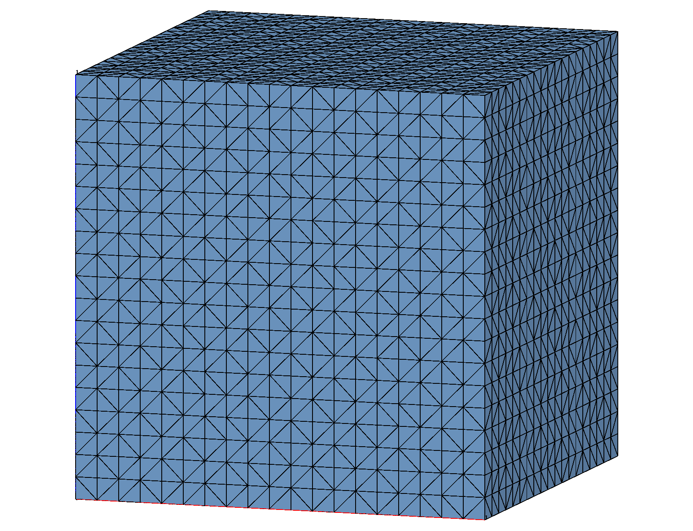

# Example: connect 3D Cube

  
The objective is to connect a set of existing nodes (3 dimensional)
  into a tetrahedral mesh that satisfies the Delaunay criterion using
  the **connect** command. The output consists of two mesh files - one showing the point
  distribution and the other showing the resulting tetrahedral mesh.

GMV and AVS format mesh files are written here. The AVS format is common and can be read by many applications. 
The GMV (General Mesh Viewer) files are best read by GMV but other applications such as VisIt and MATLAB can read them.
 

## LaGriT command file
```
# TEST connect (3d) (lagrit_input_connect)
# LaGriT input file to generate an orthogonal grid on
# a unit cube. Just change nx,ny,nz to change the resolution.
#

define/nx/20
define/ny/20
define/nz/20
 
cmo / create / cmo / / / tet
createpts/xyz/ nx ny nz/ 0. 0. 0. / 1. 1. 1. / 1 1 1
cmo / setatt / cmo / imt / 1 0 0 / 1
dump/ gmv /output_conn1.gmv/cmo

# write the point files
dump / gmv / input_points.gmv/cmo
dump / avs / input_points.inp/cmo

# no materials so turn off interface detection
connect / noadd
resetpts / itp
 
# write the mesh files
dump / gmv / output_connect.gmv/cmo
dump / avs / output_connect.inp/cmo

# write mesh object information
cmo/status
cmo/printatt//-all-/minmax
quality

finish
```


## Created points and connected tetrahedral mesh

<a href="output/connect_cube_nodes.png">Input Points </a>
<a href="output/connect_cube_tet.png">Output Tet Mesh </a>


## Sample output text for createpts

<pre class="lg-output">
cmo/create/cmo///tet                                                            
createpts/xyz/nx ny nz/0. 0. 0./1. 1. 1./1 1 1                                  
  RZ GENERATED POINTS                    1 TO                 8000              
cmo/setatt/cmo/imt/1 0 0/1                                                      
Warning: nelements = 0                                                          
      8000 values reset for attribute imt1               
</pre>
 
## Sample output text for connect
<pre>                                                                                
connect/noadd                                                                   
 Coordinates of enclosing tetrahedron are:                                      
          -0.20000D+01   -0.75000D+00   -0.75000D+00                            
           0.50000D+00   -0.75000D+00    0.42500D+01                            
           0.30000D+01   -0.75000D+00   -0.75000D+00                            
           0.50000D+00    0.42500D+01    0.50000D+00                            
 ntets=     29572     node index=     5000     nlstfail=       0 %done=  61.58  
 
 The mesh is now complete!                                                      
 
LaGriT FINISH: connect                   
</pre>


## Sample output text showing minmax of the mesh attributes and quality report
<pre class="lg-output">
cmo/printatt//-all-/minmax                                                      
ATTRIBUTE NAME              MIN               MAX         DIFFERENCE    LENGTH  
 -def-              0.000000000E+00  0.000000000E+00 0.000000000E+00      8000  
 scalar                           1                1               0         1  
 vector                           3                3               0         1  
 nnodes                        8000             8000               0         1  
 nedges                           0                0               0         1  
 nfaces                           0                0               0         1  
 nelements                    40751            40751               0         1  
 mbndry                    16000000         16000000               0         1  
 ndimensions_topo                 3                3               0         1  
 ndimensions_geom                 3                3               0         1  
 nodes_per_element                4                4               0         1  
 edges_per_element                6                6               0         1  
 faces_per_element                4                4               0         1  
 isetwd                           0                0               0      8000  
 ialias                           0                0               0      8000  
 imt1                             1                1               0      8000  
 itp1                             0               10              10      8000  
 icr1                             0                0               0      8000  
 isn1                             0                0               0      8000  
 xic                0.000000000E+00  1.000000000E+00 1.000000000E+00      8000  
 yic                0.000000000E+00  1.000000000E+00 1.000000000E+00      8000  
 zic                0.000000000E+00  1.000000000E+00 1.000000000E+00      8000  
 xtetwd                           0                0               0     40751  
 itetclr                          1                1               0     40751  
 itettyp                          5                5               0     40751  
 itetoff                          0           163000          163000     40751  
 jtetoff                          0           163000          163000     40751  
 itet                             1             8000            7999     40751x4
 jtet                             1         16000000        15999999     40751x4
 epsilon            1.000000004E-15  1.000000004E-15 0.000000000E+00         1  
 epsilonl           3.845925373E-13  3.845925373E-13 0.000000000E+00         1  
 epsilona           6.661338148E-13  6.661338148E-13 0.000000000E+00         1  
 epsilonv           2.220446049E-13  2.220446049E-13 0.000000000E+00         1  
 ipointi                       8000             8000               0         1  
 ipointj                       8000             8000               0         1  
 idebug                           0                0               0         1  
 itypconv_sm                      1                1               0         1  
 maxiter_sm                      25               25               0         1  
 tolconv_sm         1.000000000E+00  1.000000000E+00 0.000000000E+00         1  
 nnfreq                           1                1               0         1  
 ivoronoi                         1                1               0         1  
 iopt2to2                         2                2               0         1  
 xmin               0.000000000E+00  0.000000000E+00 0.000000000E+00         1  
 ymin               0.000000000E+00  0.000000000E+00 0.000000000E+00         1  
 zmin               0.000000000E+00  0.000000000E+00 0.000000000E+00         1  
 xmax               1.000000000E+00  1.000000000E+00 0.000000000E+00         1  
 ymax               1.000000000E+00  1.000000000E+00 0.000000000E+00         1  
 zmax               1.000000000E+00  1.000000000E+00 0.000000000E+00         1  
 kdtree_level                     0                0               0         1  
 max_number_sets                 64               64               0         1  
 number_of_psets                  0                0               0         1  
 number_of_eltsets                0                0               0         1  
 number_of_fsets                  0                0               0         1  
 
quality                                                                         
 
epsilonl, epsilonaspect:   3.8459254E-13  5.6885628E-38                         
--------------------------------------------                                    
elements with aspect ratio < .01:                    0                          
elements with aspect ratio b/w .01 and .02:          0                          
elements with aspect ratio b/w .02 and .05:          0                          
elements with aspect ratio b/w .05 and .1 :          0                          
elements with aspect ratio b/w .1  and .2 :          0                          
elements with aspect ratio b/w .2  and .5 :          0                          
elements with aspect ratio b/w .5  and 1. :      40751                          
min aspect ratio =  0.6230E+00  max aspect ratio =  0.1000E+01                  
 
epsilonvol:   2.2204460E-13                                                     
---------------------------------------                                         
element volumes b/w  0.2430E-04 and  0.2791E-04:     40348                      
element volumes b/w  0.2791E-04 and  0.3206E-04:         0                      
element volumes b/w  0.3206E-04 and  0.3683E-04:         0                      
element volumes b/w  0.3683E-04 and  0.4231E-04:         0                      
element volumes b/w  0.4231E-04 and  0.4860E-04:       403                      
min volume =   2.4298975E-05  max volume =   4.8597949E-05                      
-----------------------------------------------------------                     
     40751 total elements evaluated.                
 
finish
</pre>


