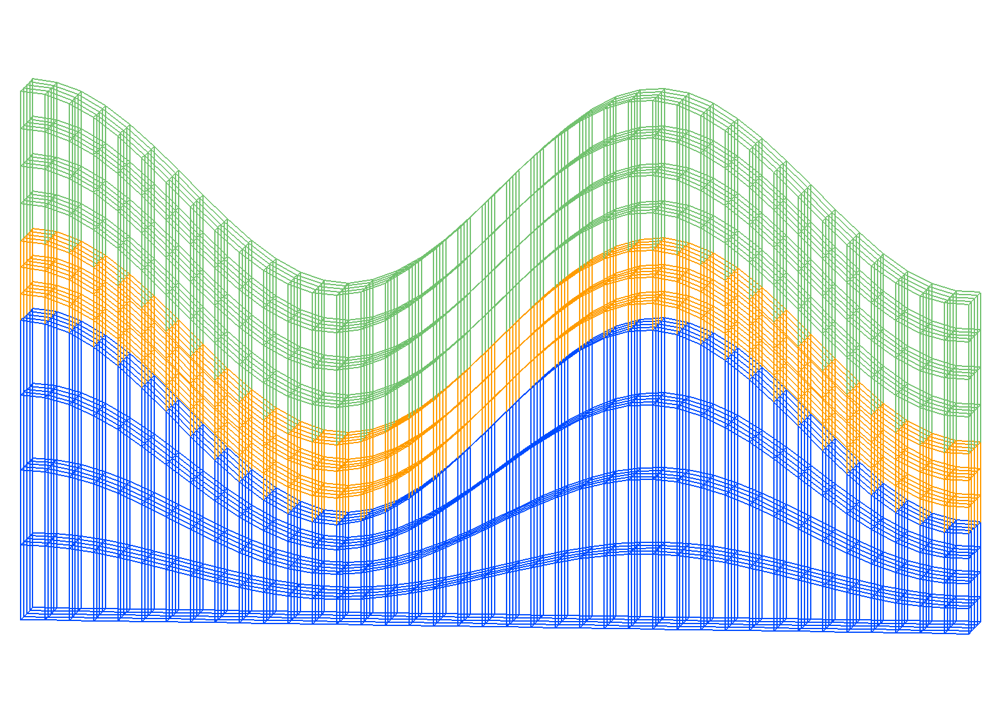
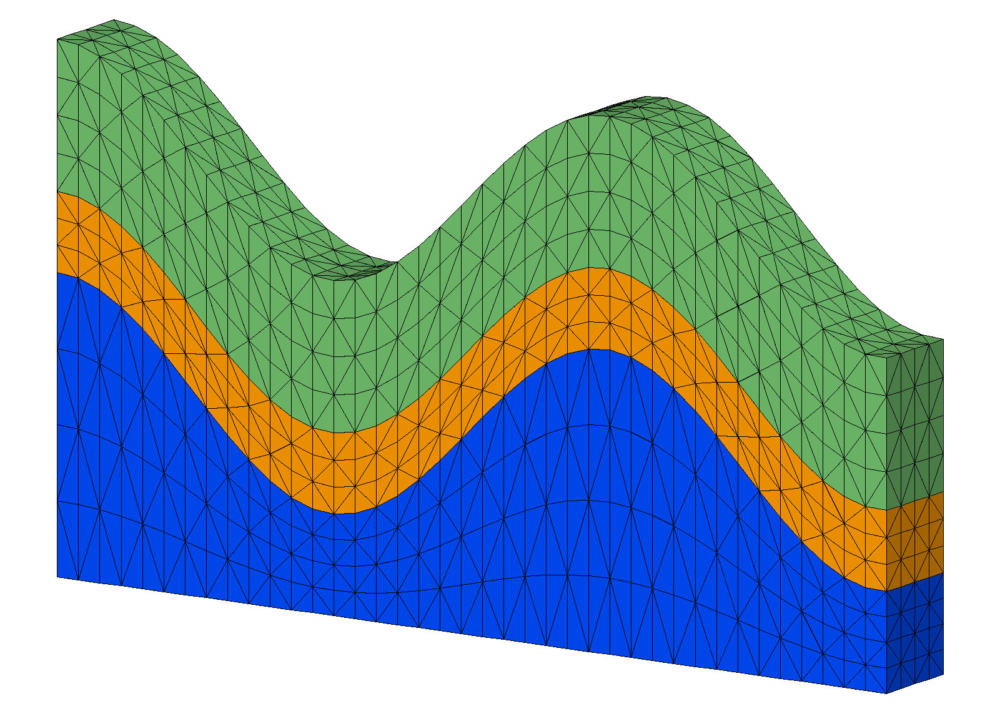

# Example: Stacked Mesh using grid2grid


 The objective is to stack quad surfaces into a hex mesh then convert each hex element into 5 tets using
 **grid2grid/hextotet5**

Use of **hex2tet** to convert a 3D mesh to a tetrahedral mesh will in general result in a non-Delaunay tetrahedral mesh. 
If the ultimate goal is a Delaunay mesh,  use the connect command, see Examples at [connect 3D](main_connect.md) and [connect 2D](main_2d_connect.md).

<a href="output/wave_hex_lines.png" >Stacked Hex Mesh  </a>
<a href="output/wave_hextotet5_tet_edges.png" >Output Tet Mesh  </a>


### LaGriT command file: [grid2grid_wave_tet5.in.txt](output/grid2grid_wave_tet5.in.txt)

### LaGriT output report: [grid2grid_wave_tet5.out.txt](output/grid2grid_wave_tet5.out.txt)

## Steps for this Example:

### Step 1. Create hex mesh using **createpts** and **stack/layers**

```
#--* LAGriT Example Input file
#--* Create a non-convex hex and use grid2grid 
#----------------------------------------------
# Use x coordinates to compute z based on cos()

# spacing near .25
define / XMAX / 9.5 
define / YMAX / 1. 
define / NX / 40
define / NY / 5

#-------------------------------------------------
# Create the quad mesh with wave topology
# this is the template used for all surfaces

cmo / create / mosurf / / / quad
quadxy /NX NY/0. 0. 0./ XMAX 0. 0./XMAX YMAX 0./0. YMAX 0./ 1 1 1
createpts/brick/xyz/NX,NY,1/1 0 0 / connect
cmo / setatt / mosurf / imt / 1 0 0 / 1
cmo / setatt / mosurf / itetclr / 1 0 0 / 1
resetpts / itp

math/cos/mosurf/zic/1,0,0/mosurf/xic

dump / surf_wave.inp / mosurf
dump / surf_wave.gmv / mosurf
cmo / printatt / mosurf / -xyz- / minmax

#-------------------------------------------------
# make layers for for input into stack
# top is wave, bottom is flat

define ZBOT 0.

# translate surfaces for vertical spacing
define S1 2.
define S2 .8 
define S3 1.5 

cmo select mosurf
trans /1,0,0/ 0. 0. 0./ 0. 0. S1 
dump / surf_wave_low.inp / mosurf

trans /1,0,0/ 0. 0. 0./ 0. 0. S2 
dump / surf_wave_high.inp / mosurf

trans /1,0,0/ 0. 0. 0./ 0. 0. S3 
dump / surf_wave_top.inp / mosurf

cmo/setatt/mosurf/ zic/ ZBOT 
dump / surf_flat_bot.inp / mosurf

#-------------------------------------------------
# Stack layers from bottom to top wave
cmo/create/mo_stack
stack/layers/avs/ &
  surf_flat_bot.inp 1 &
  surf_wave_low.inp  2 3 &
  surf_wave_high.inp 3 2 &
  surf_wave_top.inp 3  3 

dump gmv tmp_stack_layers.gmv mo_stack
cmo/printatt/mo_stack/ -xyz- minmax

# connect statcked surfaces into 3D elements
stack/fill/mohex / mo_stack
cmo select mohex
resetpts itp

# write information about this mesh object
cmo/printatt/mohex/-xyz- minmax
quality

# check hex volumes
cmo/addatt/mohex/volume hex_vol
cmo/printatt/mohex/hex_vol minmax
eltset/ ebad / hex_vol/le 0.

dump hex_stack.inp mohex
dump hex_stack.gmv mohex

```

### Step 2. Convert hex elements to tets using **grid2grid/hextotet5**

```
#-------------------------------------------------
# convert each hex to 5 tetrahedrals

cmo/select/mohex
grid2grid/ hextotet5/ motet5 / mohex
resetpts/itp
cmo/select/motet5

# report mesh statistics
quality
cmo/addatt/motet5/volume/tet_vol
cmo/addatt/motet5/voronoi_volume/vor_vol
cmo/printatt/motet5/ -all- minmax

finish
``` 

### Check quality and volume reports for mesh statistics

The mesh statistics show positive volumes for all elements and acceptable aspect ratios.
The voronoi volumes for each mesh node are positive but there are many negative coupling coeficients.
The impact of these coupling coeficients will depend on the simulation being used.


<pre class="lg-output">
# report mesh statistics                                                        
quality                                                                         
 
epsilonl, epsilonaspect:   2.4256785E-12  1.4272489E-35                         
--------------------------------------------                                    
elements with aspect ratio < .01:                    0                          
elements with aspect ratio b/w .01 and .02:          0                          
elements with aspect ratio b/w .02 and .05:          0                          
elements with aspect ratio b/w .05 and .1 :          0                          
elements with aspect ratio b/w .1  and .2 :          0                          
elements with aspect ratio b/w .2  and .5 :       2332                          
elements with aspect ratio b/w .5  and 1. :       6248                          
min aspect ratio =  0.2881E+00  max aspect ratio =  0.9995E+00                  
 
epsilonvol:   1.1179946E-11                                                     
---------------------------------------                                         
element volumes b/w  0.2538E-02 and  0.3629E-02:      2672                      
element volumes b/w  0.3629E-02 and  0.5190E-02:      2992                      
element volumes b/w  0.5190E-02 and  0.7421E-02:      1572                      
element volumes b/w  0.7421E-02 and  0.1061E-01:      1056                      
element volumes b/w  0.1061E-01 and  0.1517E-01:       288                      
min volume =   2.5381908E-03  max volume =   1.5173843E-02                      
-----------------------------------------------------------                     
      8580 total elements evaluated.                                            
 
 
AMatbld3d_stor: *****Negative Coefficients ******                               
AMatbld3d_stor: Total Number of Negative Coefficients      4706                 
AMatbld3d_stor: Number of Significant Negative Coefs      4706                  
AMatbld3d_stor: Number of 'zero' (< 10e-8 *max) coefs         0                 
Negative coef at row        2  Column       41 with value  -4.1720408E-05       
Negative coef at row        2  Column       43 with value  -3.5374846E-04       
Negative coef at row        2  Column      201 with value  -1.8519331E-03       
Negative coef at row        2  Column      242 with value  -3.8554407E-04       
AMatbld3d_stor: npoints =     2400  ncoefs =      26874                         
AMatbld3d_stor: Number of unique coefs =     14637                              
AMatbld3d_stor: Maximum num. connections to a node =         19                 
AMatbld3d_stor: Volume min =   1.6435114E-04                                    
AMatbld3d_stor: Volume max =   5.3887416E-02                                    
AMatbld3d_stor: Total Volume:   4.0775221E+01                                   
AMatbld3d_stor: abs(Aij/xij) min =   0.0000000E+00                              
AMatbld3d_stor: abs(Aij/xij) max =   8.6219865E-01                              
AMatbld3d_stor: (Aij/xij) max =   1.9116418E-01                                 
AMatbld3d_stor: (Aij/xij) min =  -8.6219865E-01                                 
AMatbld3d_stor Matrix coefficient values stored as scalar area/distance         
AMatbld3d_stor Matrix compression used for graph, not coefficient values        
motet5 attribute with voronoi volumes created with name vor_vol                 
 
cmo/printatt/motet5/-all- minmax                                                
ATTRIBUTE NAME              MIN               MAX         DIFFERENCE    LENGTH  
 -def-              0.000000000E+00  0.000000000E+00 0.000000000E+00      2400  
 scalar                           1                1               0         1  
 vector                           3                3               0         1  
 nnodes                        2400             2400               0         1  
 nedges                           0                0               0         1  
 nfaces                           0                0               0         1  
 nelements                     8580             8580               0         1  
 mbndry                    16000000         16000000               0         1  
 ndimensions_topo                 3                3               0         1  
 ndimensions_geom                 3                3               0         1  
 nodes_per_element                4                4               0         1  
 edges_per_element                6                6               0         1  
 faces_per_element                4                4               0         1  
 isetwd                           0                0               0      2400  
 ialias                           0                0               0      2400  
 imt1                             1                3               2      2400  
 itp1                             0               12              12      2400  
 icr1                             0                0               0      2400  
 isn1                             0                0               0      2400  
 xic                0.000000000E+00  9.500000000E+00 9.500000000E+00      2400  
 yic                0.000000000E+00  1.000000000E+00 1.000000000E+00      2400  
 zic                0.000000000E+00  5.300000000E+00 5.300000000E+00      2400  
 xtetwd                           0                0               0      8580  
 itetclr                          1                3               2      8580  
 itettyp                          5                5               0      8580  
 itetoff                          0            34316           34316      8580  
 jtetoff                          0            34316           34316      8580  
 itet                             1             2400            2399      8580x4
 jtet                             1         16024947        16024946      8580x4
 epsilon            1.000000004E-15  1.000000004E-15 0.000000000E+00         1  
 epsilonl           2.425678519E-12  2.425678519E-12 0.000000000E+00         1  
 epsilona           2.649880315E-11  2.649880315E-11 0.000000000E+00         1  
 epsilonv           1.117994586E-11  1.117994586E-11 0.000000000E+00         1  
 ipointi                          1                1               0         1  
 ipointj                       2400             2400               0         1  
 idebug                           0                0               0         1  
 itypconv_sm                      1                1               0         1  
 maxiter_sm                      25               25               0         1  
 tolconv_sm         1.000000000E+00  1.000000000E+00 0.000000000E+00         1  
 nnfreq                           1                1               0         1  
 ivoronoi                         1                1               0         1  
 iopt2to2                         2                2               0         1  
 xmin               0.000000000E+00  0.000000000E+00 0.000000000E+00         1  
 ymin               0.000000000E+00  0.000000000E+00 0.000000000E+00         1  
 zmin               0.000000000E+00  0.000000000E+00 0.000000000E+00         1  
 xmax               9.500000000E+00  9.500000000E+00 0.000000000E+00         1  
 ymax               1.000000000E+00  1.000000000E+00 0.000000000E+00         1  
 zmax               5.300000000E+00  5.300000000E+00 0.000000000E+00         1  
 kdtree_level                     0                0               0         1  
 max_number_sets                 64               64               0         1  
 number_of_psets                  0                0               0         1  
 number_of_eltsets                0                0               0         1  
 number_of_fsets                  0                0               0         1  
 layertyp                        -2                2               4      2400  
 nlayers                         12               12               0         1  
 nnperlayer                     200              200               0         1  
 neperlayer                     156              156               0         1  
 hex_vol            0.000000000E+00  4.552152812E-02 4.552152812E-02      8580  
 tet_vol            2.538190758E-03  1.517384271E-02 1.263565195E-02      8580  
 vor_vol            1.643511423E-04  5.388741581E-02 5.372306467E-02      2400  
 ccoef             -1.911641805E-01  0.000000000E+00 1.911641805E-01      2400  
 ij_ccoef                         0             2399            2399      2400  
 
</pre>

 
