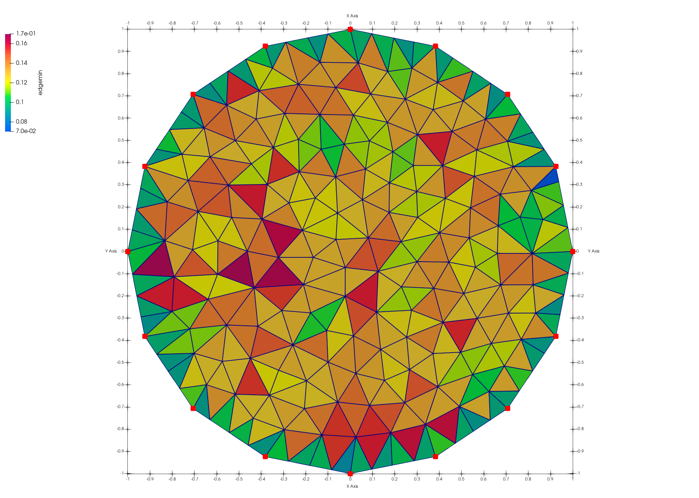
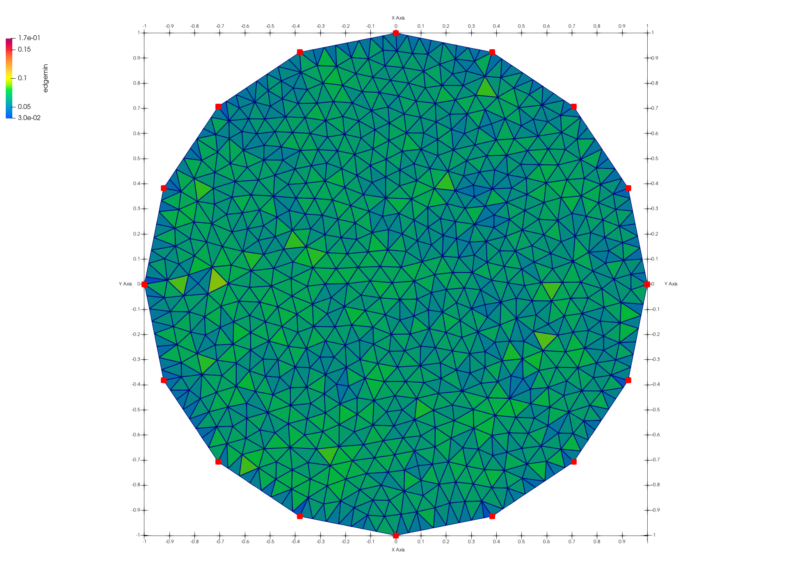
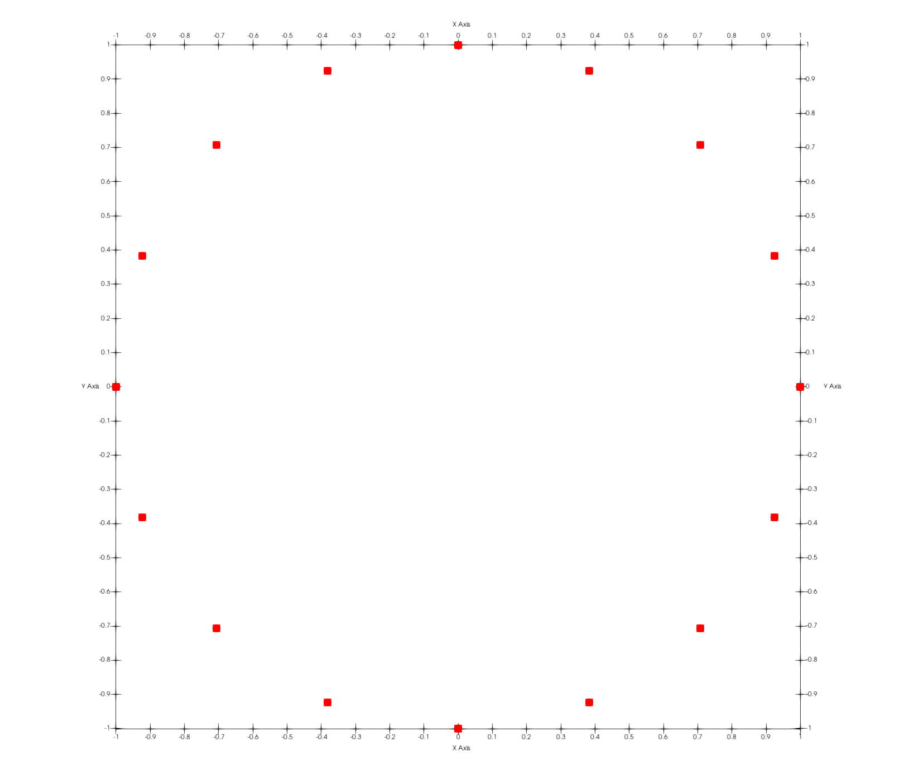
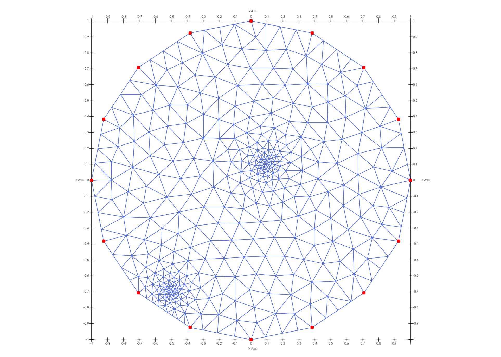
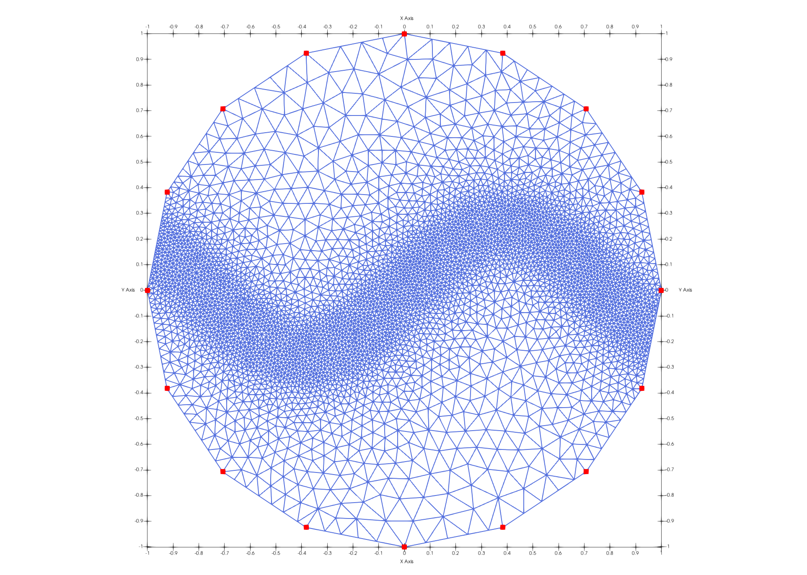

# Demo: Poisson Disk 2D on a Circle 

The objective is to use the command **createpts/poisson_disk** on a circle polygon. Various arguments are used to show how they work. The LaGriT command file includes the following steps:
- create and write the circle of points representing the input polygon 
- distribute poisson vertices and connect into a Delaunay triangulation with h = 0.1
- distribute poisson vertices and connect into a Delaunay triangulation with h = 0.05
- variable resolution mesh with target edge length defined in user_resolution_1.mlgi
- variable resolution mesh with target edge length defined in user_resolution_2.mlgi 


The following LaGriT command files are used:

LaGriT main command file: [lagrit_input_poi_circle.lgi.txt](input/lagrit_input_poi_circle.lgi.txt)
LaGriT macro called by main: [user_resolution_1.mlgi](input/user_resolution_1.mlgi)
LaGriT macro called by main: [user_resolution_2.mlgi](input/user_resolution_2.mlgi)

LaGriT output report: [lagrit_output_poi_circle.out.txt](output/lagrit_output_poi_circle.out.txt)


Create poisson disk point distribution and connect into triangles using h = 0.1
<a href="output/poi_output02_tri_h0.1_lines.png" >  </a>

Create poisson disk point distribution and connect into triangles using h = 0.05
<a href="output/poi_output03_tri_h0.05_lines.png" >  </a>


### Step 1. Create Input Polygon 
Build a unit circle polygon with number of points (NP) = 17.  One node will be removed because vertices are distributed from 0-360 degrees so last overlaps first.  The command 'filter' removes the duplicate vertex.


```
define / NP / 17
cmo / create / mo_pts / / / tet
createpts/rtz/ 1,NP,1 /1.,0.,0./1.,360.,0./1,1,1/
cmo / printatt / mo_pts / -xyz- / minmax
filter / 1 0 0
rmpoint / compress
dump / avs / tmp_polygon_circle_16.poly / mo_pts / 1 0 0 0
```
<a href="input/poi_circle_poly.png" >  </a>

### Step 2. Compute Poisson Disk vertex distribution with target spacing of 0.1
Connect the vertices into triangles and add the min edge length attribute "emin".

```
define / H_SCALE / 0.1
createpts / poisson_disk / 2d_polygon / mo_poisson_disk / mo_polygon &
      / H_SCALE / connect
quality / edge_min / y
dump / avs / output02_triangle_h_0.1.inp / mo_poisson_disk
``` 
<a href="output/poi_output02_tri_h0.1_lines.png" >  </a> <a href="output/poi_output02_tri_h0.1_emin.png" >  </a>

### Step 3. Compute Poisson Disk vertex distribution with target spacing of 0.05
Connect the vertices into triangles and add the min edge length attribute "emin".

```
define / H_SCALE / 0.05
createpts / poisson_disk / 2d_polygon / mo_poisson_disk / mo_polygon &
      / H_SCALE / connect
quality / edge_min / y
dump / avs / output03_triangle_h_0.05.inp / mo_poisson_disk
```
<a href="poi_output03_tri_h0.05_lines.png" >  </a> <a href="poi_output03_tri_h0.05_emin.png" >  </a>

### Step 4. Create a variable resolution mesh based on points
- Resolution is defined in user functions  in [user_resolution_1.mlgi](input/user_resolution_1.mlgi) 
- Decrease the resolution to a target spacing of 0.01
- The two user defined variables H_SCALE, 10H_SCALE, are used in user_resolution_1.mlgi
- Use the macro file to create points and use the distance from the points for resolution field h(x,y)

```
define /   H_SCALE / 0.01
define / 10H_SCALE / 0.1
createpts / poisson_disk / 2d_polygon / mo_poisson_disk / mo_polygon &
      / H_SCALE / connect / user_resolution_1.mlgi
quality / edge_min / y
dump / avs / output04_triangle_variable_1.inp / mo_poisson_disk
```
<a href="output/poi_output04_tri_var1_lines.png" >  </a>

### Step 5. Create a variable resolution mesh based on sin() wave 
- Resolution is defined in user functions in [user_resolution_2.mlgi](input/user_resolution_2.mlgi)
- The two user defined variables H_SCALE, 10H_SCALE, are used in user_resolution_2.mlgi
- Use the macro file to create points and use the distance from the points for resolution field h(x,y)

```
define /   H_SCALE / 0.01
define / 10H_SCALE / 0.1
createpts / poisson_disk / 2d_polygon / mo_poisson_disk / mo_polygon &
      / H_SCALE / connect / user_resolution_2.mlgi
quality / edge_min / y
dump / avs / output05_triangle_variable_2.inp / mo_poisson_disk
```
<a href="output/poi_output05_tri_var2_lines.png" >  </a>


### LaGriT Output Report for Mesh Quality

Reading the "lagrit.out" and screen output, the min edge results can be viewed.
Shown below is the quality report of min edge lengths for user_resolution_2.mlgi used in Step 5.

<pre class="lg-output">
 
quality/edge_min/y

epsilonl, epsilonaspect:   6.2803698E-13  2.4771691E-37
--------------------------------------------
Edge min normalized by dividing with max value.
element norm min edge length < .01:                0
element norm edge length b/w .01 and .02:          0
element norm edge length b/w .02 and .05:          0
element norm edge length b/w .05 and .1 :        340
element norm edge length b/w .1  and .2 :       7110
element norm edge length b/w .2  and .5 :       1931
element norm edge length b/w .5  and 1. :        329
min min edge length =  0.8143E-02  max min edge length =  0.1118E+00
-----------------------------------------------------------
      9710 total elements evaluated.

dump/avs/output05_triangle_variable_2.inp/mo_poisson_disk 
</pre>

 
