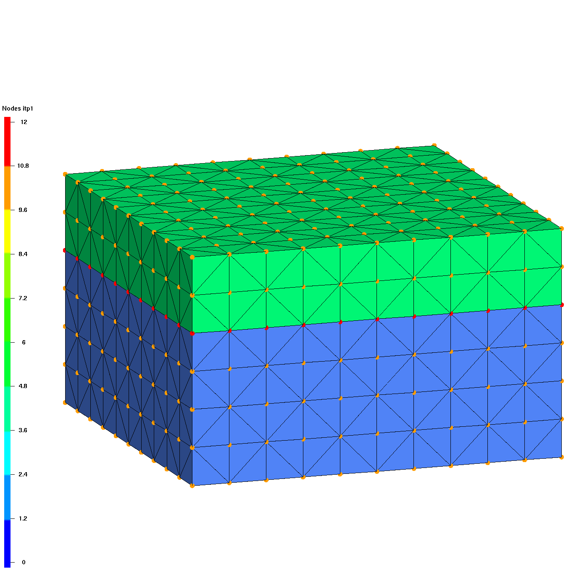
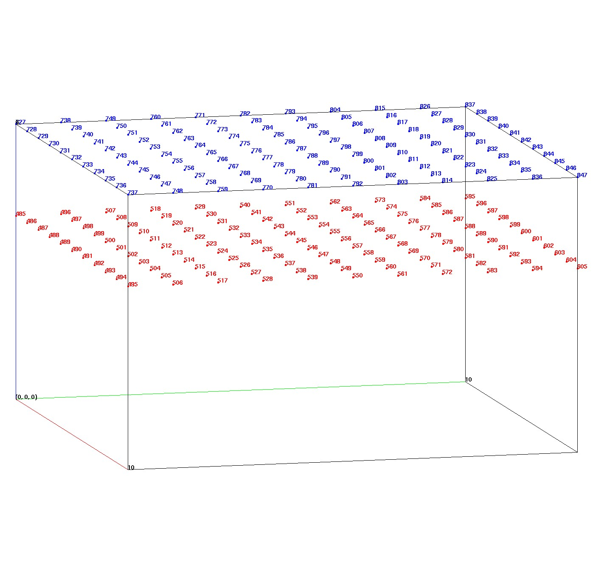

# DEMO Write Face and Node Sets

------------------

This example shows how extract/surfmesh can be used to write boundary face and node information. This is the method used to add facesets (side sets) that are added to an ExodusII mesh file. This information can also be read and parsed for used for modeling application for boundary conditions in FEHM and PFLOTRAN.

*Note it is very important that you use the master source mesh to extract node and element numbers. If you subset or change the master mesh, the node and element numbers might change and your face and node list will not be valid.*

This Demo shows how to
- Create the tet mesh with 2 materials (one interface). See [**`CREATEPTS/BRICK`**](../commands/createpts/CRTPTBRICK.md).
- Write the mesh node sets as an FEHM zone file or as an AVS format file.  See [**`PSET WRITE and ZONE`**](../commands/PSET.md). 
- Create a surface mesh consisting of faces on the boundary and interface. See [**`EXTRACT_SURFMESH`**](../commands/dump/EXTRACT_SURFMESH.md).
- Write the mesh face and node information to files that can be used define boundary conditions. See [**`DUMP EXO`**](../commands/EXODUS.md) and [**`DUMP AVS`**](../commands/DUMP2.md).

 

## Images for this Demo

Click on images to enlarge.

|  Master Tet Mesh |     Extracted Surfmesh  |  Colored Surfmesh | 
| :---: |  :---: | :---: | 
|  |  |  |  
| Create hex mesh with 2 materials and one interface.   Set mesh object itp array to tag boundary and interface nodes. | Extract surface representing faces  on the boundary and the interface. Surfmesh **itetclr0** is used to select the interface.  | Color the surfmesh with desired subsets, interface (blue) and top (green).  | 

 

| Output Face Sets  | Output Node Sets  |   
| :---: | :---: | 
|  |  |   
| Output face sets for top and interface  | Output nodes for top and interface  (node numbers shown in image)  |   

 

## LaGriT Command Files for Demo 

LaGriT command file for Demo: [write_face_node_sets.lgi.txt](input/write_face_node_sets.lgi.txt)

LaGriT output report for Demo: [write_face_node_sets.out.txt](output/write_face_node_sets.out.txt)

 

## Demo Output Files

This Demo will write the following files:

- **top_nodes.zonn** and **inter_nodes.zonn**  list of nodes at top and interface of master mesh FEHM zonn format.
- **top_nodes.vertexset** and **inter.vertexset** list of nodes at top and interface of master mesh in pset format.
- **top_nodes.dat** and **interface_nodes.dat** master node attribute values for subset node id to master in AVS node attribute format.
- **top.faceset**  and  **interface.faceset** extract/surfmesh attributes with master element id to surface face id, readable for ExodusII files.
- **mesh_facesets.exo** master mesh with facesets (side sets) viewable with Paraview and GMV
- **mesh_facesets.gmv** master mesh with facesets (surfaces) viewable with GMV

head **ZONN** file top_nodes.zonn:
 <pre class="lg-output">
zonn
000001     TOP_NODES
nnum
    121
    727        728        729        730        731        732        733        734        735        736
    737        738        739        740        741        742        743        744        745        746
</pre>

head **PSET** file top_nodes.vertexset:
<pre class="lg-output">
pset ascii   1
TOP_NODES    1        121
    727        728        729        730        731        732        733        734        735        736
    737        738        739        740        741        742        743        744        745        746
</pre>

head **AVS** node attribute file top_nodes.dat:
 <pre class="lg-output">
    0     0     1     0     0    
00001  1
id_node, integer
    1   486
    2   496
    3   485
    4   497
    5   487
</pre>

head **AVS** element attribute file top.faceset:
 <pre class="lg-output">
    0     0     0     2     0    
00002  1  1
idelem1, integer
idface1, integer
  1503  2
  1504  2
  1508  2
  1509  2
</pre>

