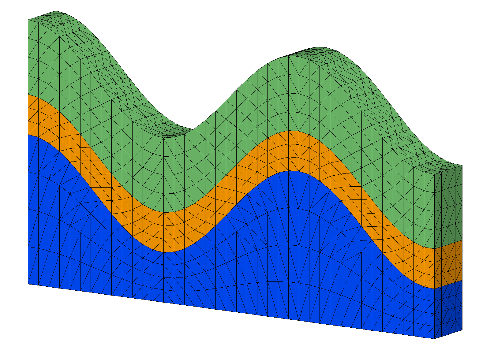
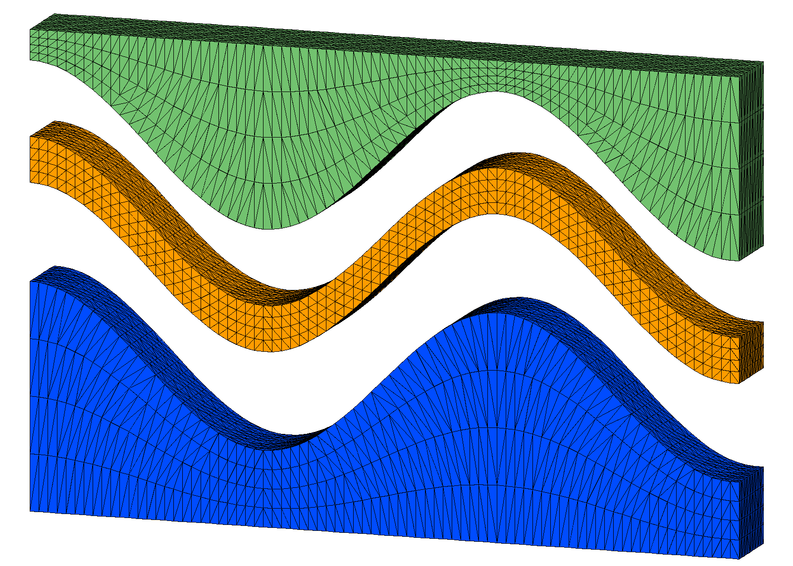
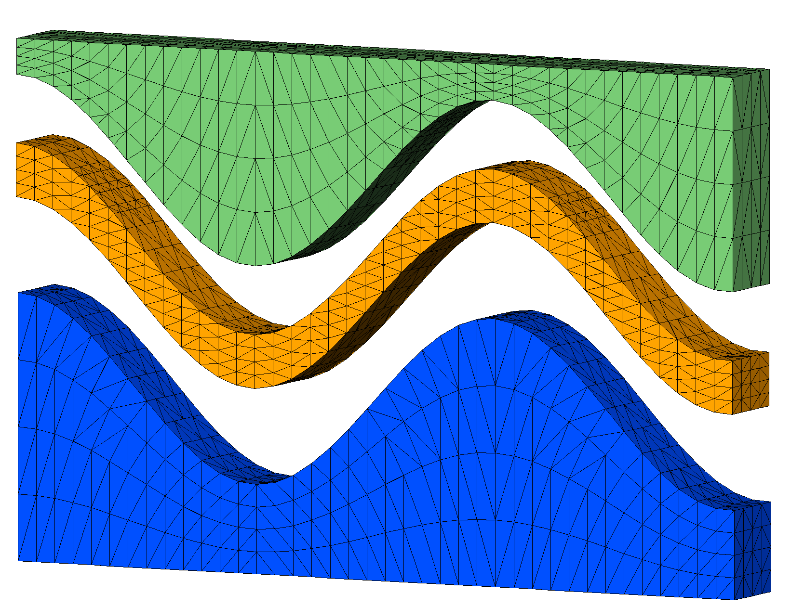

# Examples: connect 3D non-convex

## [Example connect with sloped top boundary](description2_connect.md)

**`connect / noadd`** with input points from a hex mesh created with **`stack/layers`**. This example has a non-convex boundary and bad elements are created connecting across the boundary. 

This fix uses **`interpolate/map`** from the hex mesh to the tet mesh to tag and remove bad tets connecting across the boundary.

## [Example connect for conforming sloped interfaces](description3_connect.md)

**`connect`** with input points from a convex hex mesh created with **`stack/layers`**. 
This example has a thin layer formed from sloped internal interfaces. Bad elements are created across the internal interfaces resulting in "popped" tets.  

This example is fixed with resolution that improves the height to width ratio of the mesh spacing.

## [Example connect with check_interface for conforming interfaces ](description4_connect.md)

**`connect / check_interface`** with input points from a convex hex mesh created with **`stack/layers`**. 

This example has a thin layer formed from sloped internal interfaces. Bad elements are created connecting across the internal interfaces resulting in "popped" tets.  

This example is fixed using defined geometry **`region`**  and the option  **`check_interface`** to add points at the interface. Note that the interface is preserved but the added nodes may result in thin tets.

## See Related Pages 

[**`connect`** command](https://lanl.github.io/LaGriT/pages/docs/commands/CONNECT1.html) description.

[**`connect`** 3D box Example](description_connect.md) 

[**`grid2grid`** command](https://lanl.github.io/LaGriT/pages/docs/commands/GRID2GRID.html) convert each mesh element to tri or tet elements (such as hex to 5 tets).

[**`grid2grid`** Example](description_hextet.md) convert hex mesh to 5 tets each hex.

