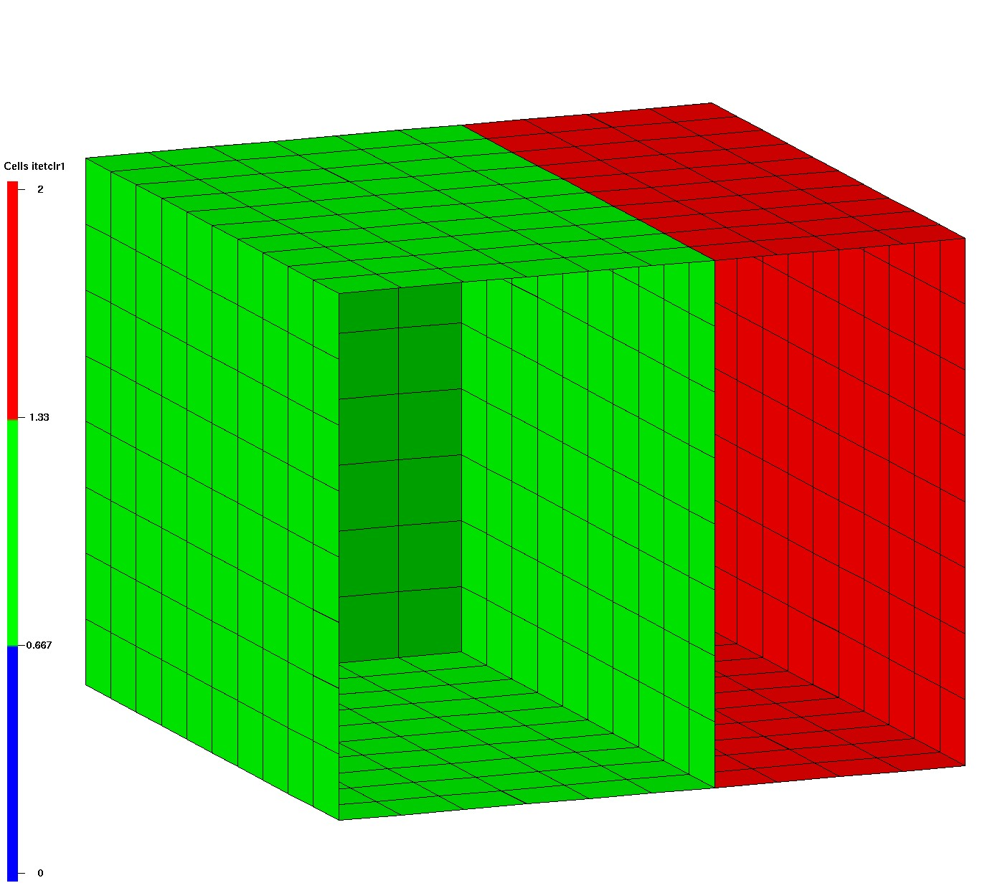
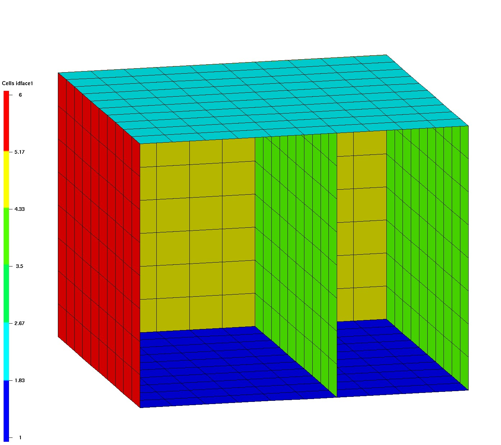
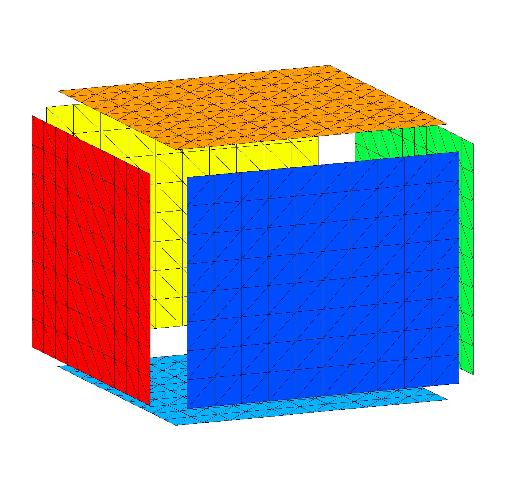

## DEMO EXTRACT/SURFMESH 

This demonstrates the difference between extracting all interfaces and boundaries and extracting external boundaries only. 
For syntax and description see [**`EXTRACT_SURFMESH`**](../commands/dump/EXTRACT_SURFMESH.md).

The LaGriT input and output log file are included below.


|  |  |   | 
| :---: | :---: | :---:  | 
|  **Input Hex Mesh** |  **surfmesh all** |  **surfmesh external**  | 
| <a href="output/box_hex_itp_clip.png"> </a> | <a href="output/box_surfmesh_all.png"> </a> | <a href="output/box_quad_external.png"></a> |  
| Hex mesh colored by itetclr material, nodes show itp values (clip front)|  extract all boundaries and interfaces, color by itetclr1 (clip front) |  extract external boundaries only, color by itetclr1 (clip front) |  


### Demo Description

The first image shows the input hex mesh with 2 materials,  one internal interface, and a simple box shaped boundary.
The interface and boundary nodes are tagged with the appropriate **itp** values. See more about mesh object attributes at [Mesh Object](../meshobject.md).
The **itp** values are shown in the image as round points:
- 0 (dark blue) internal nodes
- 2 (light blue) internal nodes on the interface between materials
- 10 (yellow) outside boundary nodes
- 12 (red) outside boundary nodes on the interface between materials

The middle image shows the quad surface extracted from the hex mesh with the default option of all boundaries and interfaces.

The second image shows the quad surface extracted from the hex mesh with the option **external** which ignores internal interfaces.

The surface element type will depend on the element face being extracted, a hex element will produce a quad surface, a tet element will produce a tri surface.

New mesh object attributes are added to the output mesh. Use commands [**cmo/status**](../commands/cmo/cmo_status.md) and [**cmo/printatt**](../commands/cmo/cmo_printatt.md) to see these attributes.
The output from these commands are included in the example LaGriT input and output below.

### Added Mesh Object Attributes

Six new element attributes and one node attribute, are added to the output mesh object.
- itetclr0 and itetclr1 material colors (itetclr) of each side of the extracted surface. 0 indicates a face on the boundary.
- idelem0 and idelem1 element number on each side of the extracted surface.
- idface0 and idface1 the local face number for each element on either side of the extracted surface.
- facecol is a model face number constructed from the itetclr0 and itetclr1 attributes and is not guaranteed that the same facecol value will not be given to two disjoint patches of mesh faces.
- idnode0 provides the mapping from nodes in the extracted interface network to (parent) nodes in the input mesh object; that is, IDNODE0(J) is the parent node in the input mesh object that corresponds to node J in the output mesh object.


|  |  |   |  |
| :---: | :---: | :---:  | :---:  | 
|  **itetclr0** |  **itetclr1** |  **idface0**  | **idface1**  | 
| <a href="output/box_surf_itetclr0.png"> </a> | <a href="output/box_surf_itetclr1.png"> </a> | <a href="output/box_surf_idface0.png"></a> |  <a href="output/box_surf_idface1.png"></a> |
|between 0 and max material number  | between 1 and max material number  | between 0 and 6   | between 1 and 6  |

### Convert Quad Surface to Tri Surface

This demo uses the [grid2grid](../commands/GRID2GRID.md) command to convert each quad element to 2 triangles each. 
Some of the extracted quad mesh objects will no longer have values that make sense, particularly the itetclr0, idface0 etc attributes that have values from the oritinal hex mesh. These attributes can be removed with the [**cmo/DELATT/**](../commands/cmo/cmo_delatt.md) command.

After the triangle mesh is created, we can set the materials based on normals in 6 directions. This is a quick way to check that triangles have outward pointing normals. Use the command [**settets/normal**](../commands/SETTETS.md).


|  |  |   
| :---: | :---: |  
|  **convert quad to tri** |  **settets normal** |
| <a href="output/box_surfmesh_tri_external.png"> </a> | <a href="output/box_tri_ext_normals_ex.png"> </a> | 
| external quads to 2 triangles each (clip front)  | triangles colored by 6 normal directions (exploded view)   |   


### LaGriT command file: [ex_extract_surfmesh.lgi.txt](input/ex_extract_surfmesh.lgi.txt)
### LaGriT output report: [ex_extract_surfmesh.out.txt](output/ex_extract_surfmesh.out.txt)

LaGriT command file:
```
# CREATE hex mesh

define MO_MESH mo_hex
define/R0/  0.0
define/Z0/  0.0
define/R1/ 10.0
define/Z1/  8.0
define/ND/  11
define/NZ/  9

cmo / create / MO_MESH / / / hex
createpts/brick/xyz/ND ND NZ/R0 R0 Z0/R1 R1 Z1/1 1 1

# COLOR elements material 1 and material 2 
pset/p2/attribute xic/1,0,0/ gt 6.
eltset/e2/ inclusive pset,get,p2
cmo / setatt / MO_MESH / itetclr 1 
cmo / setatt / MO_MESH / itetclr eltset,get,e2 2 

# SET BOUNDARIES AND INTERFACES
resetpts/itp
dump/avs/box.inp/ MO_MESH

# EXTRACT ALL EXTERNAL AND INTERFACE BOUNDARIES
# Set material itetclr to attribute itetclr1
extract/surfmesh/1,0,0/ mos_all / MO_MESH
cmo/copyatt/ mos_all mos_all / itetclr itetclr1

# EXTRACT EXTERNAL ONLY 
# Set material itetclr to attribute itetclr1
extract/surfmesh/1,0,0/ mos_ext / MO_MESH / external
cmo/copyatt/ mos_ext mos_ext / itetclr itetclr1

# CONVERT QUADS to TRI
# Set material itetclr to normals in 6 directions
grid2grid/quadtotri2/ mos_tri / mos_ext
cmo/select/mos_tri
settets/normal

# write files
dump/avs/ surfmesh_all.inp / mos_all
dump/ surfmesh_all.gmv / mos_all

dump/avs/ surfmesh_external.inp / mos_ext
dump/ surfmesh_external.gmv / mos_ext

dump/avs/ surfmesh_ext_tri.inp / mos_tri
dump/ surfmesh_ext_tri.gmv / mos_tri

# report status of all mesh objects
cmo/status

# report attribute min max for mos_all
cmo/printatt/mos_all/ -all- minmax

finish
```

Command to view min and max of extracted quad surface mos_all attributes:
```
cmo/printatt/mos_all/-all- minmax 
``` 

Sample output:
<pre class="lg-output">
ATTRIBUTE NAME        MIN               MAX       DIFFERENCE    LENGTH  
-def-                 0.00000E+00  0.00000E+00 0.00000E+00      585  
 scalar                1                1               0         1  
 vector                3                3               0         1  
 nnodes              585              585               0         1  
 nedges                0                0               0         1  
 nfaces                0                0               0         1  
 nelements           600              600               0         1  
...
 imt1                  1                1               0       585  
 itetclr               1                2               1       600  
...
 idnode0               1             1089            1088       585  
 idelem0               0              797             797       600  
 idelem1               1              800             799       600  
 facecol               1                3               2       600  
 idface0               0                6               6       600  
 idface1               1                6               5       600  
...
</pre>


