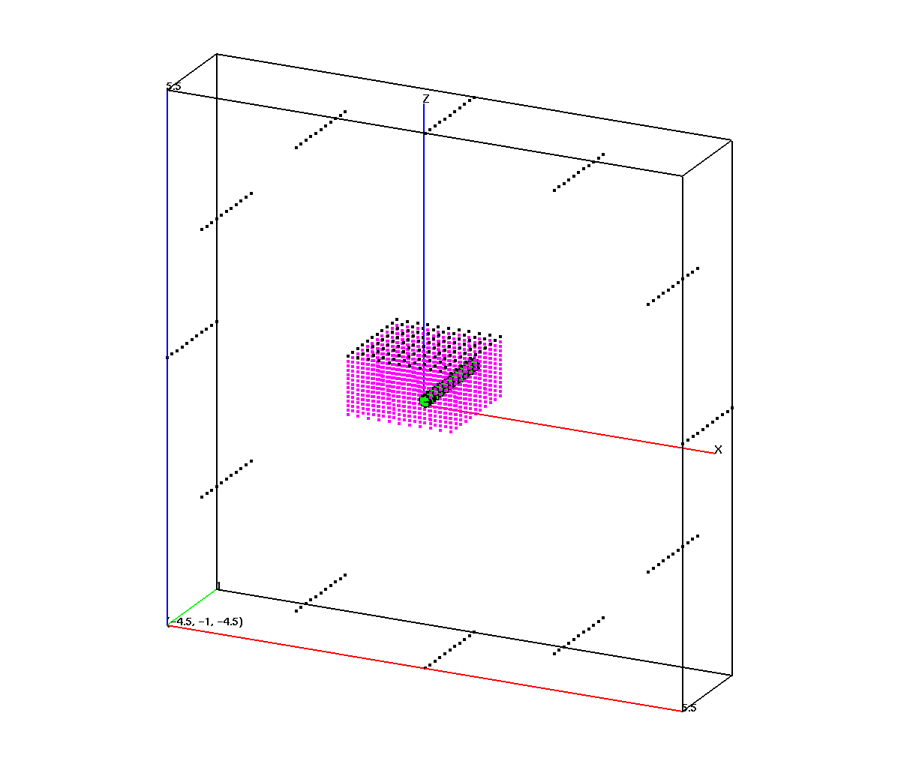
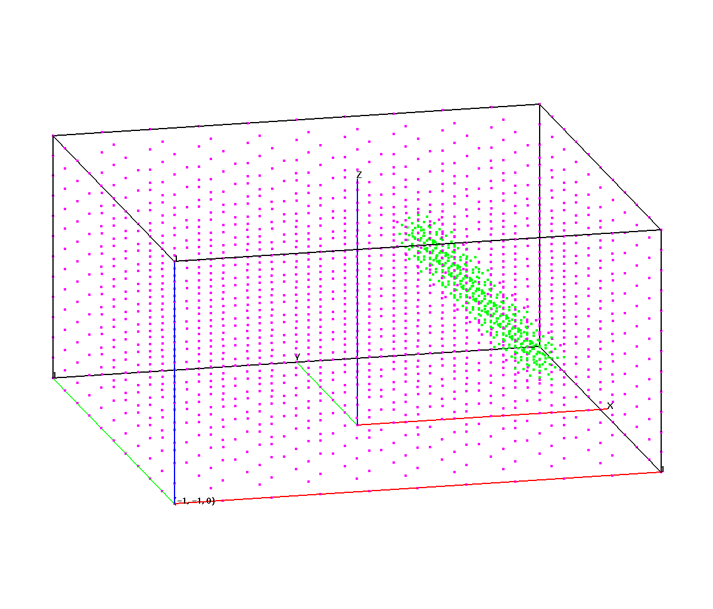
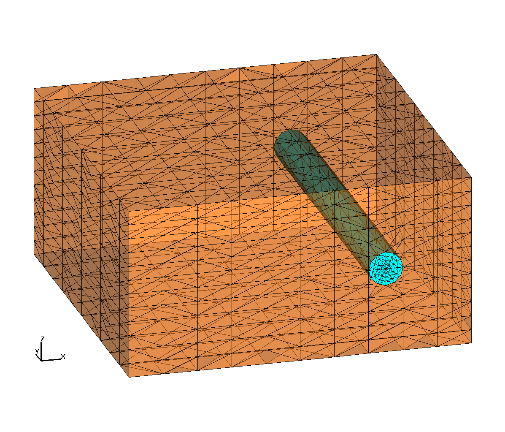

## DEMO ROTATED CYLINDER IN BOX

Create a box with a cylinder object, use **rotateln** and **trans** to move the cylinder.


|  |  |   | 
| :---: | :---: | :---:  | 
|  |  |   | 
|  **Rotated Points** |  **Remove dud points** |  **tet mesh**  | 
| <a href="output/mesh_rot_allpts.png"> </a> | <a href="output/mesh_rot_rmpts.png"></a> | <a href="output/mesh_rot_tet.png"></a>  | 


1. Create a cylinder centered around x=.5,z=.5, radius = .1 the cylinder is aligned parallel to the y-axis and  inside a box of width =2 , length=2.

2. Create geometry and material regions.
The regions are air for the cylinder - solid outside the cyl.

3. Create the point distribution.
Points are spread by surrounding the whole object with a cylinder shell of points and then creating rays between
these points and the major axis of the cylinder. Points are distributed along these rays inside the cylindrical region. 
A background rectangular grid of points is spread outside the cylinder.
The rz command always distributes points with the z-axis as the axis of symmetry
The first image shows the points (magenta and green) and the ray points (in black).

4. Rotate and translate
Use the rotateln and trans commands to move the point distribution after it is created.

5. Set node and element materials, remove ray points (black points in image), and connect into a tet mesh.


```
cmo/create/3dmesh
surface/box1/reflect/box/-1.0,-1.0,0.0/ 1.0, 1.0, 1.0/
surface/h1/intrface/cylinder/ 0.5, -1.,0.5/ 0.5, 1.0, 0.5/.1/

# set geometric and material regions
region/H1/ le box1 and le h1 /
region/Fill/ le box1 and gt h1 /
mregion/Air/ le box1 and lt h1 /
mregion/Solid/Fill

# create point distributions
createpts/xyz/11,11,1/-1. -1. 1.1/1.0 1.0 1.1/1,1,0/
pset/rays/seq/1,0,0/

regnpts/Fill/11/pset,get,rays/xyz/ 0.0,0.0,-0.1/1.0,1.0,-0.1/ &
               0.0,1.0,-0.1/0,0/

createpts/rtz/1,13,11/5.,0.,-1./5.,360.,1./0,1,1/0,0,0/
pset/ray1/seq/0,0,0/

# rotate and move the points
rotateln/pset,get,ray1/nocopy/-100.,0.,0./100.,0.,0./-90./0.,0.,0./
trans/pset,get,ray1/0.,0.,0./0.5,0.,0.5/

regnpts/H1/3/pset,get,ray1/rtz/0.5,-1.1,0.5/0.5,1.1,0.5/0,0/


# remove duplicates
filter/1,0,0/

# dud some nodes that were ray points
cmo/setatt//itp1/pset,get,rays/21
cmo/setatt//itp1/pset,get,ray1/21

# set imt materials for nodes
setpts

dump/gmv/cylinder_rot.gmv/3dmesh

# connect into delaunay tet mesh
connect

# set itetclr materials for elements
settets

dump/gmv/mesh_tet_duds.gmv/3dmesh

# remove dud nodes and set boundary
rmpoint/compress
resetpts/itp

dump/gmv/mesh_tet.gmv/3dmesh


finish
```


