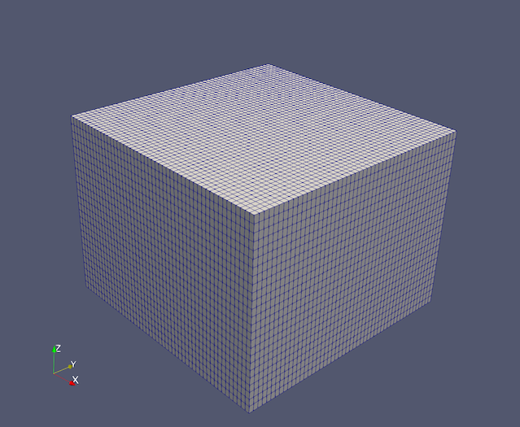

## Requirments:

* LaGriT 3.3.0+
* ParaView

# Tutorial Hex Mesh

In this tutorial, we are going to ____.

## 1. Building a Hex Mesh

First, we are going to construct a structured hex mesh. The hex mesh will span from 0 meters to 4000 m, 4000 m, and 3000 m, for the x/y/z coordinates respectively. 

In LaGriT, we can assign variables using the define keyword. Variables are used when the workflow is kept the same, but parameters defining it may change. Let's do that now:

```
define / X0 / 0.
define / X1 / 4000.
define / Y0 / 0.
define / Y1 / 4000.
define / Z0 / 0.
define / Z1 / 3000.

define / NX / 51
define / NY / 51
define / NZ / 26

define / MONAME / mohex
```

Above, we have defined ,

Next, we will create an empty mesh object, with element type `hex`, using the [`cmo / create`](null.md) command:

```
cmo / create / MONAME / / / hex
```

Due to the variable assignment of `MONAME <- mohex` above, this command is translated internally as:

```
cmo / create / mohex / / / hex
```

We can then populate this empty object with nodes and elements. 
The [`createpts / brick`](null.md) command will generate a defined number of hex elements across a defined domain. 

```
createpts / brick / xyz / NX NY NZ / X0 Y0 Z0 / X1 Y1 Z1 / 1 1 1
```

Optionally, [save the mesh object](null.md):

```
dump / avs / tmp_hex_01.inp / MONAME
```

This file can be rendered in certain scientific 3D visualization applications, such as [ParaView](https://www.paraview.org).



### Full script:

```
define / X0 / 0.
define / X1 / 4000.
define / Y0 / 0.
define / Y1 / 4000.
define / Z0 / 0.
define / Z1 / 3000.

define / NX / 51
define / NY / 51
define / NZ / 26

define / MONAME / mohex

cmo / create / MONAME / / / hex
createpts / brick / xyz / NX NY NZ / X0 Y0 Z0 / X1 Y1 Z1 / 1 1 1
cmo / status / brief
quality
finish
```

## 2. Use PSets to Ider


We want to set boundary conditions on the top face of the face.

Before beginning this sub-section, 

In LaGriT, a pset (or *point-set*) is a collection of points (nodes) within a mesh object. Similarly, an eltset (*element-set*) is a collection of mesh elements. By capturing points and elements, discrete manipulations can be performed on them, such as translation, removal, or attribute functions.

```
# Set vertices (imt) and cells (itetlcr) to 1
cmo / setatt / mohex / imt / 1 0 0 / 1
cmo / setatt / mohex / itetclr / 1 0 0 / 1
#
resetpts / itp
```