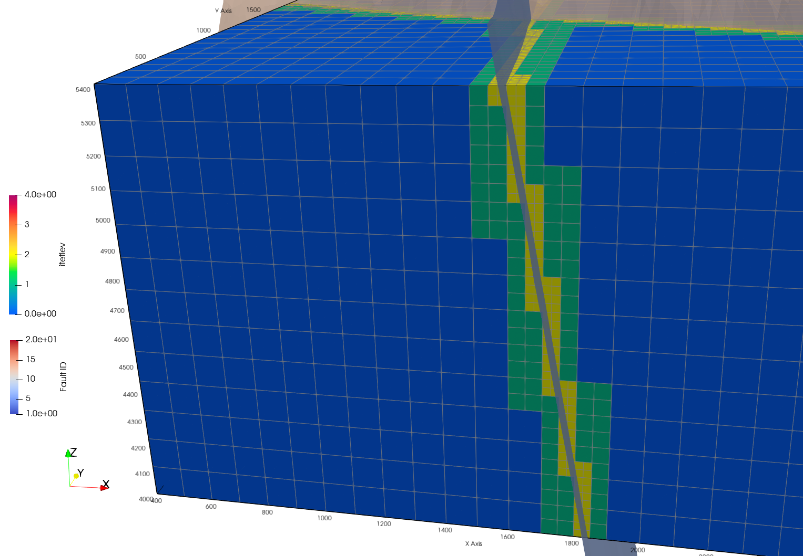

# Demo Faults with Octree Refinement

## Featuring

<!-- Begin image -->
<p> Octree Refinement using Fault Surfaces

<br>
<a href="images/hex_ref02_flts_xaxis.png">  </a>
</p>
<br>

<p> Methods to View and Evaluate Fault Objects
<br>
<a href="images/hex3b_fault_pieces.png">  </a>

</p>

<p> View and Evaluate Mesh and Fault Volumes 
 <a href="images/hex3b_fault_pieces_vorvol.png">  </a>

 <a href="images/hex3b_fault_pieces_vorvol.png">  </a>

</p>
<br>
<!-- End image -->

## LaGriT Command Files

Main driver calling infile macros [**`hex_refine.lgi`**](./hex_refine.lgi)

- Refine hex mesh by intersected object [**`refine_object.mlgi`**](./refine_object.mlgi)
- Add attributes including volumes to the mesh [**`hex_add_volumes.mlgi`**](./hex_add_volumes.mlgi)
- Subset attribute mesh by intersection by fault surfaces [**`extract_hex_fault.mlgi`**](./extract_hex_fault.mlgi)
- Subset hex faults into single node for thin faults [**`extract_thin_faults.mlgi`**](./extract_thin_faults.mlgi)
- Remove extra unused attributes [**`remove_attributes.mlgi`**](./remove_attributes.mlgi)

========================================================================

 Three new integer element attributes will be created as part of the
 book keeping for the octree mesh data structure.

 When elements are refined
 the original element (parent) is not removed when eight child elements
 are created. For example, if you have a single hex and refine it, you
 will then have 9 elements, 1 itetlev=N element and 8 children of the
 original perent element refined to itetlev = N+1.

 itetlev = level of refinement
         = 0 not refined
         = 1 refined once
         = 2 refined twice
           etc.

========================================================================


## CREATE HEX MESH
This is Level 0 mesh that will be refined

```
# Mesh domain 100x50x80
define / XMIN / 400.
define / XMAX / 2600.
define / YMIN / 200.
define / YMAX / 2200.
define / ZMIN / 4000.
define / ZMAX / 5400.

# Set the number of points along each axis
# 2200x2000x1400 domain
define / NX / 23
define / NY / 21
define / NZ / 15

# create hex mesh
cmo / create / mohex / / / hex
createpts/brick/xyz/ NX NY NZ / XMIN YMIN ZMIN/ XMAX YMAX ZMAX / 1,1,1
cmo / setatt / mohex / imt / 1,0,0 / 1
cmo / setatt / mohex / itetclr / 1,0,0 / 1
resetpts/itp
quality
quality/edge_min
dump/avs/hex0.inp/mohex
```

## SET REFINE OBJECTS

merge faults for easier refinement

See Demo Import Surfaces

```
read/avs/fault_surf06.inp/mo_flt6
read/avs/fault_surf12.inp/mo_flt12
addmesh/merge/mo_faults/mo_faults/mo_flt6
addmesh/merge/mo_faults/mo_faults/mo_flt12
  cmo/printatt/mo_faults/itetclr/minmax
  cmo/printatt/mo_faults/-xyz-/minmax
  cmo/printatt/mohex/-xyz-/minmax
```

## REFINE and VIEW RESULTS

This is the majority of work and can be skipped once resolutions are decided.
View results to decide on preferred resolutions
 Use the following infile macros for each refinement
 1. hex_add_volumes.mlgi
    Reduce octree to tet mesh and add volume attributes

 These are called seperately for each fault
 so each can be examined to decide on final resolution
 2. extract_hex_fault.mlgi
    Extract intersected cells as refined hex faults
 3. extract_thin_faults.mlgi
     Extract either side as single node thin faults

## START with LEVEL 0 100m spacing
No Refinement

**** WRITE RESULTS ****

```
define MOHEX     mohex
define MOVOL     movol

# define the octree mesh name and volume tet mesh name
# this is not an octree mesh yet so just make a copy
cmo/copy/MOVOL/MOHEX
cmo/addatt/MOVOL/itetlev/vint/scalar/nelements/linear/permanent//0.0
  infile hex_add_volumes.mlgi

# Write files for level 0 fault 6
define MOHEX     movol
define MATNO     6
define MOS       mo_flt6
define FILE_FLT  hex0_fault_6.inp
define FILE_NFLT hex0_fault_6_side_n.inp
define FILE_PFLT hex0_fault_6_side_p.inp
  infile extract_hex_fault.mlgi
  infile extract_thin_faults.mlgi

# Write files for level 0 fault 12
define MOHEX     movol
define MATNO     12
define MOS       mo_flt12
define FILE_FLT  hex0_fault_12.inp
define FILE_NFLT hex0_fault_12_side_n.inp
define FILE_PFLT hex0_fault_12_side_p.inp
  infile extract_hex_fault.mlgi
  infile extract_thin_faults.mlgi

dump/hex0_attributes.inp/movol
cmo/delete/movol
cmo/status/brief
```

## REFINE LEVEL 1 50m spacing with a single call using merged fault object

```
# refine intersected hex cells
cmo / select / mohex
intersect_elements / mohex / mo_faults / if_inter
eltset / e_refine / if_inter / gt / 0
refine / eltset / eltset get e_refine
cmo / setatt / mohex / if_inter / 1 0 0 / 0
```


**** WRITE RESULTS ****

```
define MOHEX     mohex
define MOVOL     movol

# convert octree mesh to standard form add attributes
cmo/delete/MOVOL
grid2grid/tree_to_fe/ MOVOL / MOHEX
  dump/tmp_grid2grid.inp/MOVOL
  quality
  infile hex_add_volumes.mlgi

# Write files for level 1 fault 6
define MOHEX     movol
define MATNO     6
define MOS       mo_flt6
define FILE_FLT  hex1_fault_6.inp
define FILE_NFLT hex1_fault_6_side_n.inp
define FILE_PFLT hex1_fault_6_side_p.inp
  infile extract_hex_fault.mlgi
  infile extract_thin_faults.mlgi

# Write files for level 1 fault 12
define MOHEX     movol
define MATNO     12
define MOS       mo_flt12
define FILE_FLT  hex1_fault_12.inp
define FILE_NFLT hex1_fault_12_side_n.inp
define FILE_PFLT hex1_fault_12_side_p.inp
  infile extract_hex_fault.mlgi
  infile extract_thin_faults.mlgi

dump/hex1_attributes.inp/movol
cmo/delete/movol
cmo/status/brief
```


## REFINE LEVELS 2 and 3 using LOOP

 USE LOOP through LEVELS
 Syntax
 loop/ do / variable / start stop stride/ loop_end / command

```
# Definitions used in macro infile refine_object.mlgi
define CMO_HEX    mohex
define CMO_OBJ    mo_faults
define LEVEL      3
define LOOP_MAX   3
define ATT_NAME_E if_inter

**** LOOP ********
cmo/printatt/mohex/itetlev/minmax
loop / do / LOOP_VAR / 2 LOOP_MAX 1 / loop_end &
            infile refine_object.mlgi
**** LOOP END ****

```


**** WRITE RESULTS ****

```
define MOHEX     mohex
define MOVOL     movol

# convert octree mesh to standard form add attributes
cmo/delete/MOVOL
grid2grid/tree_to_fe/ MOVOL / MOHEX
  dump/tmp_grid2grid.inp/MOVOL
  quality
  infile hex_add_volumes.mlgi

# Write files for level 3 fault 6
define MOHEX     movol
define MATNO     6
define MOS       mo_flt6
define FILE_FLT  hex3_fault_6.inp
define FILE_NFLT hex3_fault_6_side_n.inp
define FILE_PFLT hex3_fault_6_side_p.inp
  infile extract_hex_fault.mlgi
  infile extract_thin_faults.mlgi

# Write files for level 3 fault 12
define MOHEX     movol
define MATNO     12
define MOS       mo_flt12
define FILE_FLT  hex3_fault_12.inp
define FILE_NFLT hex3_fault_12_side_n.inp
define FILE_PFLT hex3_fault_12_side_p.inp
  infile extract_hex_fault.mlgi
  infile extract_thin_faults.mlgi

dump/hex3_attributes.inp/movol
cmo/delete/movol
cmo/status/brief
```

## REFINE and EXPAND level 3 around single fault 12


```
# refine intersected hex cells for fault 12
cmo / select / mohex
cmo /setatt/ mohex / if_inter / 0
intersect_elements / mohex / mo_flt12 / if_inter
eltset / e_refine / if_inter / gt / 0

# do not add another level of refinment
# expand level 2 connected to 3 to be level 3
pset/pref/ eltset / e_refine
eltset/ eref_inc / inclusive / pset,get,pref
eltset/ eref_exc / exclusive / pset,get,pref
eltset/ elev2 / itetlev / eq 2
eltset/ eref / inter / elev2 eref_inc
  cmo/setatt/mohex/itetclr/ eltset,get,e_refine / 2
  cmo/setatt/mohex/itetclr/ eltset,get,elev2 / 3
  cmo/setatt/mohex/itetclr/ eltset,get,eref / 4
  dump/tmp_ck_eref.inp/mohex
  cmo/setatt/mohex/itetclr / 1

refine / eltset / eltset get eref
cmo / setatt / mohex / if_inter / 1 0 0 / 0
cmo / printatt/ mohex / itetlev / minmax
```

**** WRITE RESULTS ****

```
define MOHEX     mohex
define MOVOL     movol

# convert octree mesh to standard form add attributes
cmo/delete/MOVOL
grid2grid/tree_to_fe/ MOVOL / MOHEX
  dump/tmp_grid2grid.inp/MOVOL
  quality
  infile hex_add_volumes.mlgi

# Write files for level 1 fault 12
define MOHEX     movol
define MATNO     12
define MOS       mo_flt12
define FILE_FLT  hex3b_fault_12.inp
define FILE_NFLT hex3b_fault_12_side_n.inp
define FILE_PFLT hex3b_fault_12_side_p.inp
  infile extract_hex_fault.mlgi
  infile extract_thin_faults.mlgi

dump/hex3b_attributes.inp/movol
cmo/delete/movol
cmo/status/brief
```

## WRITE FINAL REFINED MESH and ATTRIBUTES

```
define MOHEX     mohex
define MOVOL     movol

dump/hex_refine_octree.inp/mohex

# convert octree mesh to standard form to add attributes
cmo/delete/MOVOL
grid2grid/tree_to_fe/ MOVOL / MOHEX
  quality
  infile hex_add_volumes.mlgi

cmo/printatt/MOVOL/-all- minmax
dump/avs/ hex_refine_attributes.inp /MOVOL

finish

```


<p> <a href="images/hex_ref02_flt.png">  </a></p>
<p> <a href="images/hex_ref02_flts_xaxis.png">  </a></p>
<p> <a href="images/hex_ref02_flts_yaxis.png">  </a></p>


<p> <a href="images/hex3b_itetlev.png">  </a></p>
<p> <a href="images/hex3b_cell_vol.png">  </a></p>
<p> <a href="images/hex3b_vor_vol.png">  </a></p>
<p> <a href="images/hex3b_vor_vol_cut.png">  </a></p>
<p> <a href="images/hex3b_edgemax.png">  </a></p>
<p> <a href="images/hex3b_edgemin.png">  </a></p>

<p> <a href="images/hex3b_surfs_cell_vol.png">  </a></p>
<p> <a href="images/hex3b_surfs_vor_vol.png">  </a></p>

<p> <a href="images/hex3b_fault_pieces_lev0.png">  </a></p>
<p> <a href="images/hex3b_fault_pieces.png">  </a></p>
<p> <a href="images/hex3b_fault_pieces_vorvol.png">  </a></p>


</p>


 


