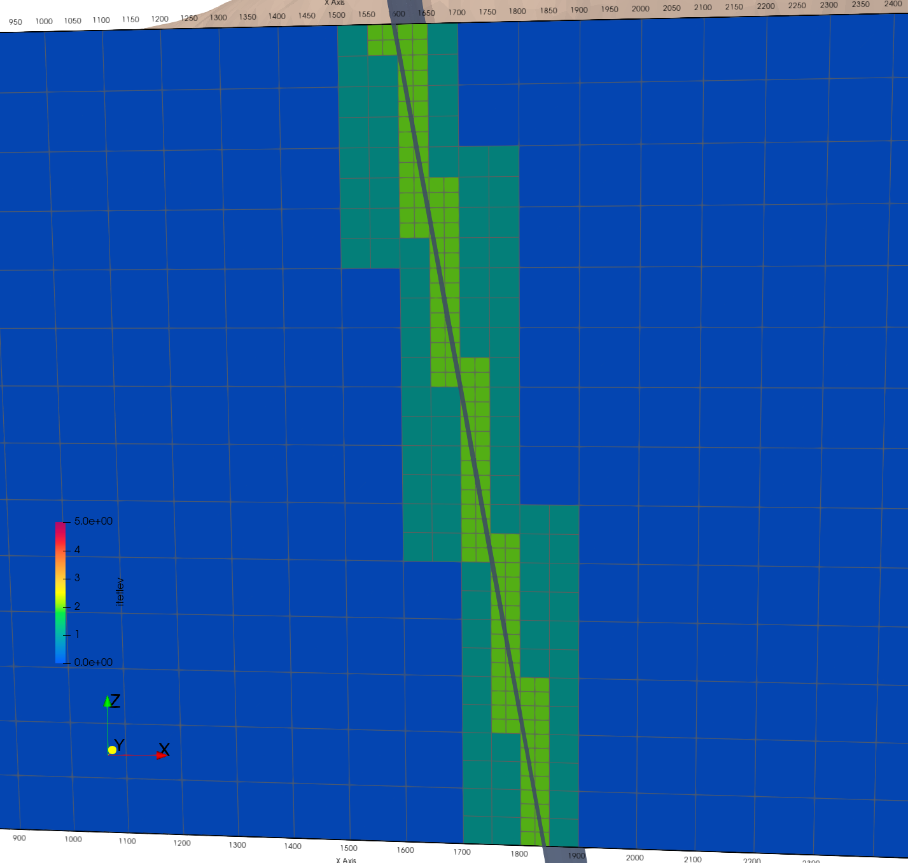

# Demo Faults with Octree Refinement

## Featuring

<!-- Begin image -->
<p> Detailed Example for Octree Refinement using Fault Surfaces
<br>
<a href="images/fault_surfaces.png">  </a>
<a href="images/hex_ref02_flts_xaxis.png">  </a>
</p>
<br>

<p> Evaluate Cell and Voronoi Volumes of the Meshed faults to aid Model Setup 
<br>
 <a href="images/hex3b_vor_vol_cut.png">  </a>
 <a href="images/hex3b_fault_pieces_vorvol.png">  </a>
</p>
<br>
<!-- End image -->

This example demonstrates how to manage multiple fault objects to control fault resolutions for intended volumes. For each level of refinement (0=none, 1= half spacing, 2 = quarter spacing...) attributes are added and examined. This mesh starts with 100m spacing with refinement at intersection of two fault surfaces. 

Attributes are added to the fault and fault pieces to detirmine the level and extent of refinement.
Fault ID 6 (near vertical) will be represented by a cell thickness of 12.5m with voronoi volumes 2 nodes thick with 2000 - 3500 m^3 each node
Fault ID 12 will have a single nodes with edge lengths of 12.5m and voronoi volume 2000 m^3 for entire surface

## LaGriT Command Files

Main driver refining and writing files  [**`hex_refine.lgi`**](./hex_refine.lgi)

For each LEVEL of resolution 0 to 3:
- Refine hex mesh by intersected object [**`refine_object.mlgi`**](./refine_object.mlgi)
- Add attributes including volumes to the mesh [**`hex_add_volumes.mlgi`**](./hex_add_volumes.mlgi)
- Subset the attribute mesh to cells intersected by fault surfaces [**`extract_hex_fault.mlgi`**](./extract_hex_fault.mlgi)
- For thin faults, extract nodes from either side of the hex fault [**`extract_thin_faults.mlgi`**](./extract_thin_faults.mlgi)
- Remove extra unused attributes [**`remove_attributes.mlgi`**](./remove_attributes.mlgi)


## CREATE HEX MESH

Create a hex mesh with a domain of 2200x2000x1400 meters and 100 m spacing using the **createpts** command in the main control file [**`hex_refine.lgi`**](./hex_refine.lgi). 
For details on these commands see tutorial [Build a Hex Mesh](https://lanl.github.io/LaGriT/pages/tutorial/lagrit_introduction/step_01.html)
This is Level 0 mesh that will be refined by halves using the octree method. If you know your target spacing, choose a level 0 mesh spacing that is multiples of 2. For example if you want a fault with 10m spacing, your level 0 hex mesh will need to have spacing of 20, 40, 80, or 160 etc.

The output file *lagrit.out* and the screen reports the following about this mesh.

<pre class="lg-output">
cmo/create/mohex///hex
createpts/brick/xyz/NX NY NZ/XMIN YMIN ZMIN/XMAX YMAX ZMAX/1,1,1
          Number of nodes:        7245
          Number of elements:        6160
          Number of negative volume elements:           0
          Total volume:     0.616000000000E+10

All elements have volume  1.0000000E+06
min min edge length =  0.1000E+03  max min edge length =  0.1000E+03

</pre>


## SET REFINE OBJECTS

merge faults for easier refinement

These faults were exported from an Earthvision Geologic model as triangulated surfaces. The material ID 6 (green) and 12 (yellow) were assigned based on provided fault names. See image at page top.

There are many ways surfaces may be processed and read by LaGriT. See [Demo Import Surfaces](surfaces/index.md)

For multiple objects used for refinement it is recommended they are merged into a single mesh oject.
Assign a value to each for reference while merged. For this example **addmesh/merge** is used which will not change material values. **addmesh/append** will increment material values to each object appended to the final mesh. See more at [addmesh/merge](https://lanl.github.io/LaGriT/pages/docs/commands/ADDMESH.html)

 

```
read/avs/fault_surf06.inp/mo_flt6
read/avs/fault_surf12.inp/mo_flt12
addmesh/merge/mo_faults/mo_faults/mo_flt6
addmesh/merge/mo_faults/mo_faults/mo_flt12
  cmo/printatt/mo_faults/itetclr/minmax
```

In the first call to addmesh, **mo_faults** is created and **mo_flt6** is copied. In the second call to addmesh, **mo_flt12** is added to mo_faults which now has both fault 6 and 12. This syntax can be scripted or used in a loop to easily merge a large number of objects into one mesh object. In this example fault 6 can still be used by its itetclr value of 6.

Use cmo/printatt to confirm the merged mesh object has both 6 and 12.

<pre class="lg-output">
cmo/printatt/mo_faults/itetclr/minmax
ATTRIBUTE NAME              MIN               MAX         DIFFERENCE    LENGTH
 itetclr                          6               12               6      9723

</pre>


## VIEW RESULTS for each level of Refinement

The cells and nodes used to represent faults often need refinement to more closely fit the surfaces and for more appropriate fault thickness. These steps aid in evaluating the faults at each refinement. As usual there is a trade off between a high number of nodes for best resolution vs the total number of nodes added by each level of refinement.

Once resolutions are decided, this can be skipped and used just once at the end to report volume information for each fault.

The following infile macros are used at each refinement.
 
1.  Connect nodes into a tet mesh for node and cell volumes [hex_add_volumes.mlgi](hex_add_volumes.md)
2.  Extract intersected cells as refined hex fault pieces [extract_hex_fault.mlgi](extract_hex_fault.md)
3.  Extract either side of hex piece as single node thin faults [extract_thin_faults.mlgi](extract_thin_faults.md)


## START with LEVEL 0 100m spacing

No Refinement
Node count: 7245


```
infile hex_add_volumes.mlgi
infile extract_hex_fault.mlgi
infile extract_thin_faults.mlgi
dump/hex0_attributes.inp/movol
```

Results (after converting to tets)

The itetlev is 0 so cells at 100x100x100 have volumes at 1.00E+06. The node voronoi volumes are also 1.00E+06 internally and 1.25E+05 at the boundary. The edgemin and edgemax are 100 meters as expected.

<pre class="lg-output">
ATTRIBUTE NAME      MIN               MAX         DIFFERENCE    LENGTH
 itetlev                  0                0               0      6160
 vor_vol    1.250000000E+05  1.000000000E+06 8.750000001E+05      7245
 cell_vol   1.000000000E+06  1.000000000E+06 0.000000000E+00      6160
 edgemin    1.000000000E+02  1.000000000E+02 0.000000000E+00      6160
 edgemax    1.000000000E+02  1.000000000E+02 0.000000000E+00      6160
</pre>

<p> View of hex level 0 mesh with fault surfaces and hex pieces subset by intersection.
<br>
<a href="images/hex0_surfs.png">  </a>
<a href="images/hex0_fault_pieces.png">  </a>
</p>


## REFINE LEVEL 1 50m spacing with a single call using merged fault object

Refine 1 time
Node count: 15782

```
# refine intersected hex cells
cmo / select / mohex
intersect_elements / mohex / mo_faults / if_inter
eltset / e_refine / if_inter / gt / 0
refine / eltset / eltset get e_refine
cmo / setatt / mohex / if_inter / 1 0 0 / 0
```

<pre class="lg-output">
 itetlev                          0                1               1     12040
 vor_vol            3.124999999E+04  1.000000000E+06 9.687500001E+05     15782
 cell_vol           1.250000000E+05  1.000000000E+06 8.750000000E+05     12040
 edgemin            5.000000000E+01  1.000000000E+02 5.000000000E+01     12040
 edgemax            5.000000000E+01  1.000000000E+02 5.000000000E+01     12040

</pre>

<p> View of hex level 1 mesh hex pieces colored by voronoi volumes.
<br>
<a href="images/hex1_itetlev.png">  </a>
<a href="images/hex1_flt12_vor_vol.png">  </a>
<a href="images/hex1_flt6_vor_vol.png">  </a>
</p>


## REFINE LEVELS 2 and 3 using LOOP

 USE LOOP through LEVELS
 Syntax
 loop/ do / variable / start stop stride/ loop_end / command

```

# Definitions used in macro infile refine_object.mlgi
define CMO_HEX    mohex
define CMO_OBJ    mo_faults
define LEVEL      3
define LOOP_MAX   3
define ATT_NAME_E if_inter

**** LOOP ********
cmo/printatt/mohex/itetlev/minmax
loop / do / LOOP_VAR / 2 LOOP_MAX 1 / loop_end &
            infile refine_object.mlgi
**** LOOP END ****

```

Refine 3 times
Node count: 202831

<pre class="lg-output">
 itetlev                          0                3               3    147889
 vor_vol            4.882812487E+02  1.000000000E+06 9.995117188E+05    202831
 cell_vol           1.953125000E+03  1.000000000E+06 9.980468750E+05    147889
 edgemin            1.250000000E+01  1.000000000E+02 8.750000000E+01    147889
 edgemax            1.250000000E+01  1.000000000E+02 8.750000000E+01    147889

</pre>

<p> View of hex level 1 mesh hex pieces colored by voronoi volumes.
<br>
<a href="images/hex3_itetlev.png">  </a>
<a href="images/hex3_fault_pieces_vorvol.png">  </a>
</p>

## REFINE and EXPAND level 3 around single fault 12
Make sure neighbor and connecting cells are the same size to ensure the same voronoi volume around each node representing this fault.

Refine both faults 3 times, one fault refinement is expanded
Node count: 264766

```
# refine intersected hex cells for fault 12
cmo / select / mohex
cmo /setatt/ mohex / if_inter / 0
intersect_elements / mohex / mo_flt12 / if_inter
eltset / e_refine / if_inter / gt / 0

# do not add another level of refinment
# expand level 2 connected to 3 to be level 3
pset/pref/ eltset / e_refine
eltset/ eref_inc / inclusive / pset,get,pref
eltset/ eref_exc / exclusive / pset,get,pref
eltset/ elev2 / itetlev / eq 2
eltset/ eref / inter / elev2 eref_inc
  cmo/setatt/mohex/itetclr/ eltset,get,e_refine / 2
  cmo/setatt/mohex/itetclr/ eltset,get,elev2 / 3
  cmo/setatt/mohex/itetclr/ eltset,get,eref / 4
  dump/tmp_ck_eref.inp/mohex
  cmo/setatt/mohex/itetclr / 1

refine / eltset / eltset get eref
cmo / setatt / mohex / if_inter / 1 0 0 / 0
cmo / printatt/ mohex / itetlev / minmax
```

**** WRITE RESULTS ****

```
define MOHEX     mohex
define MOVOL     movol

# convert octree mesh to standard form add attributes
cmo/delete/MOVOL
grid2grid/tree_to_fe/ MOVOL / MOHEX
  dump/tmp_grid2grid.inp/MOVOL
  quality
  infile hex_add_volumes.mlgi

# Write files for level 1 fault 12
define MOHEX     movol
define MATNO     12
define MOS       mo_flt12
define FILE_FLT  hex3b_fault_12.inp
define FILE_NFLT hex3b_fault_12_side_n.inp
define FILE_PFLT hex3b_fault_12_side_p.inp
  infile extract_hex_fault.mlgi
  infile extract_thin_faults.mlgi

dump/hex3b_attributes.inp/movol
cmo/delete/movol
cmo/status/brief
```


Results for extracted fault and single side of fault

<pre class="lg-output">
ATTRIBUTE NAME              MIN               MAX         DIFFERENCE    LENGTH
 itetlev                          3                3               0     30255
 cell_vol           1.953125000E+03  1.953125000E+03 0.000000000E+00     30255
 vor_vol            4.882812492E+02  1.953125048E+03 1.464843798E+03     61581

Thin fault

ATTRIBUTE NAME              MIN               MAX         DIFFERENCE    LENGTH
 imt1                            12               12               0     30960
 cell_vol           1.562500000E+02  1.562500000E+02 0.000000000E+00     30384
 vor_vol            4.882812492E+02  1.953125048E+03 1.464843798E+03     30960

</pre>


## WRITE FINAL REFINED MESH and ATTRIBUTES

```
define MOHEX     mohex
define MOVOL     movol

dump/hex_refine_octree.inp/mohex

# convert octree mesh to standard form to add attributes
cmo/delete/MOVOL
grid2grid/tree_to_fe/ MOVOL / MOHEX
  quality
  infile hex_add_volumes.mlgi

cmo/printatt/MOVOL/-all- minmax
dump/avs/ hex_refine_attributes.inp /MOVOL

finish

```

Mesh node count 264766 and tet count 208943

<pre class="lg-output">

 itetlev                          0                3               3    208943
 vor_vol            4.882812462E+02  1.000000000E+06 9.995117188E+05    264766
 cell_vol           1.953125000E+03  1.000000000E+06 9.980468750E+05    208943
 edgemin            1.250000000E+01  1.000000000E+02 8.750000000E+01    208943
 edgemax            1.250000000E+01  1.000000000E+02 8.750000000E+01    208943

</pre>

<p> <a href="images/hex0_surfs.png">  </a></p>
<p> <a href="images/hex0_fault_pieces.png">  </a></p>

<p> <a href="images/hex_ref02_flt.png">  </a></p>
<p> <a href="images/hex_ref02_flts_xaxis.png">  </a></p>
<p> <a href="images/hex_ref02_flts_yaxis.png">  </a></p>


<p> <a href="images/hex3b_faults_zoom.png">  </a></p>

<p> <a href="images/hex3b_itetlev.png">  </a></p>
<p> <a href="images/hex3b_cell_vol.png">  </a></p>
<p> <a href="images/hex3b_vor_vol.png">  </a></p>
<p> <a href="images/hex3b_vor_vol_cut.png">  </a></p>
<p> <a href="images/hex3b_edgemax.png">  </a></p>
<p> <a href="images/hex3b_edgemin.png">  </a></p>

<p> <a href="images/hex3b_surfs_cell_vol.png">  </a></p>
<p> <a href="images/hex3b_surfs_vor_vol.png">  </a></p>

<p> <a href="images/hex3b_fault_pieces_lev0.png">  </a></p>
<p> <a href="images/hex3b_fault_pieces.png">  </a></p>
<p> <a href="images/hex3b_fault_pieces_vorvol.png">  </a></p>


</p>


 


