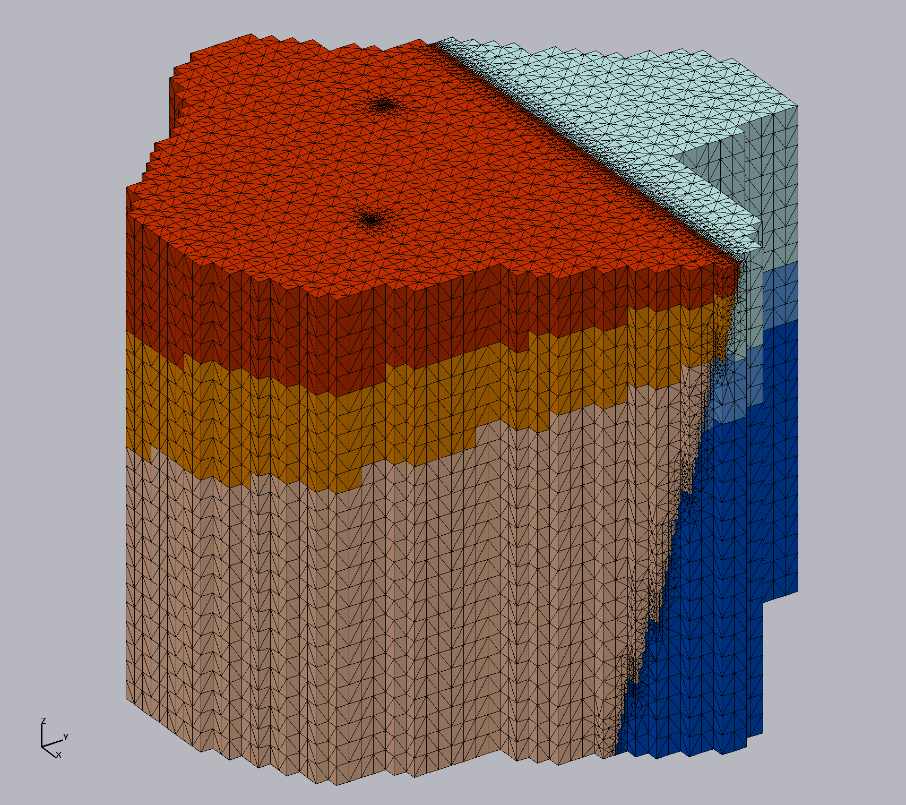

<!-- This is a button toggling the modal with the default close button -->
<button class="uk-button uk-button-default uk-margin-small-right" type="button" uk-toggle="target: #modal-close-default">Mesh Design, why does it matter?</button>

<!-- This is the modal with the default close button -->

    

        <button class="uk-modal-close-default" type="button" uk-close></button>
        <h2 class="uk-modal-title">Mesh Design, why does it matter?</h2>
        

            The mesh design is chosen with consideration of the physics to be modeled, mesh size restrictions (number of degrees of freedom)
            versus mesh resolution needed for model features, and the mesh and model information needed by the model application.
              
            For modeling applications with complex stratigraphy, depending on the mesh, you can get a stable but inaccurate solution
            to the physics (Zyvoloski and Vesselinov, 2006). Choose a mesh design and meshing method that gives the best performance from
            the modeling application possible, with respect to the difficulty in generating the mesh.
              
            LaGriT is used to generate meshes with control volume discretization such that the underlying control volumes are Voronoi
            tessellations. Developed by Los Alamos National Laboratory as open source software, LaGriT provides a variety of meshing
            tools with capabilities specific to geologic applications and Voronoi control volume solvers. Examples of methods used
            for geologic applications include unstructured and structured, both with adaptive refinement to geological features.
            The unstructured approach allows the creation of meshes that exactly conform to the geometric model, but
            requires some expertise in building the mesh such that it will also meet the Delaunay criteria. The easier
            method is to use a structured mesh with fine resolution, or a coarser mesh that uses octree refinement to increase
            resolution in user specified regions of interest. These result in stair-stepped  geometries instead of smooth, but can
            be acceptable for where the geometry spacing is small relative to the full model domain. (Sentis and Gable, 2017).
        

    

<h1 class="uk-heading-line">Tutorials</h1>

<!-- Tutorial card -->

        

     	

   	
	

        

    <a href="{{ "/pages/tutorial/stratigraphy/index.html" | relative_url }}">
        

            

                <h3 class="uk-card-title">Stratigraphic Hex to Tet Mesh Tutorial</h3>
                
Hex mesh using octree refinement with stratigraphy, faults, wells, and subsurface layering

                Advanced
            

        

    </a>

<!-- End tutorial card -->

<h1 class="uk-heading-line">Examples</h1>
<!-- Types are tutorial, demo, utility, commands in order from most complex to simple -->

The following are grouped according to the level of complexity. For specific command examples, see the [command index](/pages/commands.md).
Select All, or by one of the categories:

- <b>Commands</b> are command examples showing a few lines for syntax and usage. 
- <b>Utility</b>  is  a set of commands for a particular task. 
- <b>Demo</b> is a set of commands from start to finish demonstrating a particular method.
- <b>Tutorial</b> is a full set of files and commands involving many steps to achieve a final mesh. 

<!-- Cards for Example commands, utility, and demo, tutorial  -->

    <ul class="uk-subnav uk-subnav-pill">
        <li class="uk-active" uk-filter-control><a href="#">All</a></li>
        <li uk-filter-control="[data-color='command']"><a href="#">Commands</a></li>
        <li uk-filter-control="[data-color='utility']"><a href="#">Utility</a></li>
        <li uk-filter-control="[data-color='demo']"><a href="#">Demo</a></li>
        <li uk-filter-control="[data-color='tutorial']"><a href="#">Tutorial</a></li>
    </ul>
    <ul class="js-filter uk-child-width-1-2 uk-child-width-1-3@m uk-text-center" uk-grid="masonry: true">

<!-- demo cards -->

       
	
	<li data-color="demo">
            

                <a href="{{ "/pages/docs/demos/demo_creatept_interp.html" | relative_url }}">
                    

                        

                            
                        

                        
Create Quad Surface from Hex Sphere   Stack surfaces into Hex Cylinder

                    

                </a>
            

        </li>

	<li data-color="demo">
            

                <a href="{{ "/pages/docs/demos/description_brick_trunc.html" | relative_url }}">
                    

                        

                            
                        

                        
 Define Layers using Surfaces   Connect Tets and Truncate top 

                    

                </a>
            

        </li>

        <li data-color="demo">
            

                <a href="https://github.com/lanl/GeologicMeshing/tree/master/GDSA/">
                    

                        

                            
                        

                        
 Four Octree Mesh Examples   for GDSA Testing (on github)

                    

                </a>
            

        </li>
	    
	    <li data-color="demo">
            

                <a href="https://meshing.lanl.gov/proj/examples/ex_octree_refine_intersect_object/index.html">
                    

                        

                            
                        

                        
Octree Refine Hex with Surface Intersect

                    

                </a>
            

        </li>

  <li data-color="demo">
            

                <a href="https://meshing.lanl.gov/proj/examples/stack_fs_from_bndry/method.html">
                    

                        

                            
                        

                        
Stack surfaces into Exodus mesh with Materials with facesets of Boundary and Outlet

                    

                </a>
            

        </li>

        <li data-color="demo">
            

                <a href="{{ "/pages/docs/demos/main_rotateln.html" | relative_url }}">
                    

                        

                            
                        

                        
Use createpts and regnpts   to Create a Rotated Cylinder in Box

                    

                </a>
            

        </li>

     <li data-color="demo">
            

                <a href="{{ "/pages/docs/demos/main_extract_surfmesh.html" | relative_url }}">
                    

                        

                            
                        

                        
Extract Boundary Surfaces   from a Multi-material 3D Mesh

                    

                </a>
            

        </li>

 <li data-color="demo">
            

                <a href="{{ "/pages/docs/demos/main_connect.html" | relative_url }}">
                    

                        

                            
                        

                        
Stack cos() surfaces into Hex Mesh and Connect Delaunay  

                    

                </a>
            

        </li>
	    
	<li data-color="demo">
            

                <a href="{{ "/pages/docs/demos/description_hextet.html" | relative_url }}">
                    

                        

                            
                        

                        
Stack cos() surfaces into Hex Mesh and Convert into Tets

                    

                </a>
            

        </li>

<!-- tutorial cards -->

        <li data-color="tutorial">
            

                <a href="{{ "/pages/tutorial/tutorials/regions_points_to_tet.html" | relative_url }}">
                    

                        

                            
                        

                        
Tutorial: Create Tet Mesh using Regions and Ray Shooting

                    

                </a>
            

        </li>

      <li data-color="tutorial">
            

                <a href="{{ "/pages/tutorial/stratigraphy/index.html" | relative_url }}">
                    

                        

                            
                        

                        
Tutorial: Octree refined Hex to Tet Mesh   with Well and Stratigraphic Surfaces

                    

                </a>
            

        </li>

<!-- utility cards -->

        <li data-color="utility">
            

                <a href="https://meshing.lanl.gov/proj/examples/ex_quad_surface_prevent_crossing/index.html">
                    

                        

                            
                        

                        
Merge Intersecting Surfaces

                    

                </a>
            

        </li>

        <li data-color="utility">
            

                <a href="{{ "/pages/docs/demos/extract_facesets.html" | relative_url }}">
                    

                        
 Extract Face and Node Sets   with extract/surfmesh

                    

                </a>
            

        </li>

	 <li data-color="utility">
            

                <a href="{{ "/pages/tutorial/utility/convert_feet_to_meters.html" | relative_url }}">
                    

                        
Convert   Meters and Feet

                    

                </a>
            

        </li>

        <li data-color="utility">
            

                <a href="{{ "/pages/tutorial/utility/reset_truncated_nodes_imt.html" | relative_url }}">
                    

                        
Reset imt values   for truncated mesh

                    

                </a>
            

        </li>

<li data-color="utility">
            

                <a href="{{ "/pages/tutorial/utility/cmo_addatt_vorvol.html" | relative_url }}">
                    

                        
Voronoi node attribute 

                    

                </a>
            

        </li>

<!-- command cards alphabetical -->

        <li data-color="command">
            <a href="{{ "/pages/docs/demos/main_addmesh.html" | relative_url }}" style="font-weight: bold;">
                
addmesh

            </a>
        </li>
        <li data-color="command">
            <a href="{{ "/pages/docs/demos/main_2d_connect.html" | relative_url }}" style="font-weight: bold;">
                
connect 2D

            </a>
        </li>
       <li data-color="command">
            <a href="{{ "/pages/docs/demos/description_connect.html" | relative_url }}" style="font-weight: bold;">
                
connect 3D

            </a>
        </li>
	 <li data-color="command">
            <a href="{{ "/pages/docs/demos/main_createpts.html" | relative_url }}" style="font-weight: bold;">
                
createpts

            </a>
        </li>
        <li data-color="command">
            <a href="{{ "/pages/docs/demos/main_dump.html" | relative_url }}" style="font-weight: bold;">
                
dump

            </a>
        </li>
        <li data-color="command">
            <a href="{{ "/pages/docs/demos/description_hextet.html" | relative_url }}" style="font-weight: bold;">
                
grid2grid hextotet5

            </a>
        </li>
        <li data-color="command">
            <a href="{{ "/pages/docs/demos/main_rivara.html" | relative_url }}" style="font-weight: bold;">
                
negative_aij

            </a>
        </li>
        <li data-color="command">
            <a href="{{ "/pages/docs/demos/main_pset.html" | relative_url }}" style="font-weight: bold;">
                
pset

            </a>
        </li>
        <li data-color="command">
            <a href="{{ "/pages/docs/demos/main_qual.html" | relative_url }}" style="font-weight: bold;">
                
quality

            </a>
        </li>
        <li data-color="command">
            <a href="{{ "/pages/docs/demos/main_2d_recon.html" | relative_url }}" style="font-weight: bold;">
                
recon 2D

            </a>
        </li>
        <li data-color="command">
            <a href="{{ "/pages/docs/demos/main_regnpts.html" | relative_url }}" style="font-weight: bold;">
                
regnpts

            </a>
        </li>
        <li data-color="command">
            <a href="{{ "/pages/docs/demos/main_rmmat.html" | relative_url }}" style="font-weight: bold;">
                
rmmat

            </a>
        </li>
        <li data-color="command">
            <a href="{{ "/pages/docs/demos/description_rotatept.html" | relative_url }}" style="font-weight: bold;">
                
rotatept

            </a>
        </li>
        <li data-color="command">
            <a href="{{ "/pages/docs/demos/main_sort.html" | relative_url }}" style="font-weight: bold;">
                
sort

            </a>
        </li>
        <li data-color="command">
            <a href="{{ "/pages/docs/demos/main_trans.html" | relative_url }}" style="font-weight: bold;">
                
trans

            </a>
        </li>
        <li data-color="command">
            <a href="{{ "/pages/docs/demos/main_tri.html" | relative_url }}" style="font-weight: bold;">
                
triangulate

            </a>
        </li>

    </ul>

<!-- Examples demos grid -->
