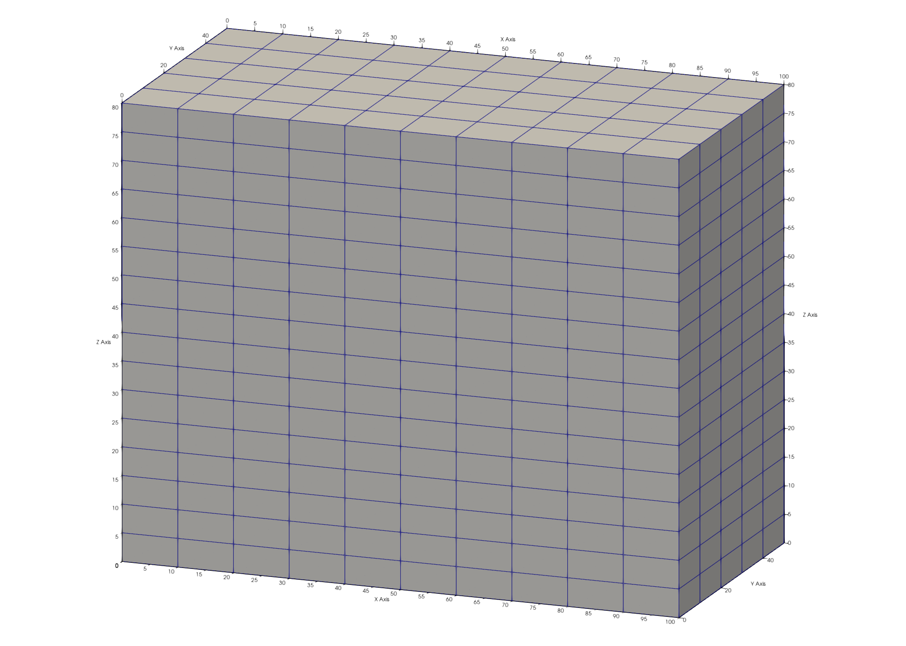
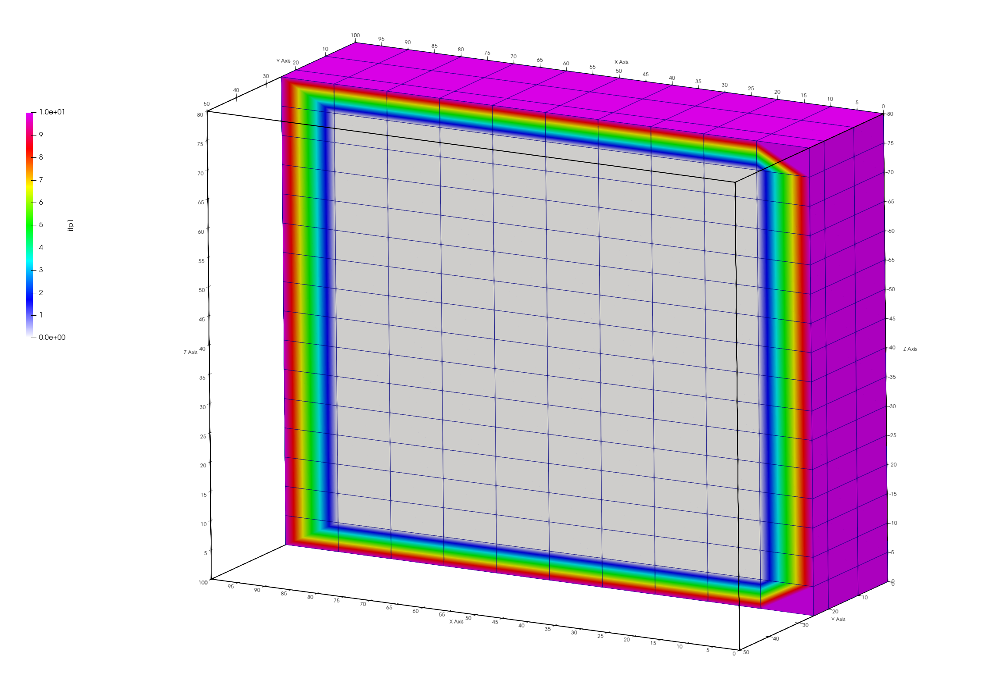

# Step 1. Build a Hex Mesh 

<!-- Begin image -->
<p><a href="step_01/01_hex_mesh.png">  </a></p>
<br>
<!-- End image -->


### LaGriT command file: [01_create_hex.lgi](step_01/01_create_hex.lgi.txt)
### LaGriT  output file: [lagrit.out](step_01/01_create_hex.out.txt)


A mesh object can be created by reading a mesh, ie ```read/avs/mesh.inp/ 3dmesh```
or the mesh can be created. For this example we will start with one of the [`createpts`](../../docs/commands/createpts.md) commands. These are used to add points to a mesh object with defined distributions.

For your first command you will create a 3D mesh object and name it `3dmesh`. This will be a structured hex mesh so we add the element type to the end of the command syntax.

See more on the Mesh Object data structure at [LaGriT Mesh Object](https://lanl.github.io/LaGriT/pages/docs/meshobject.html)

*Note on spacing: the slashes seperate keywords. The slashes with empty spaces are place holders if the user wants to define npoints or nelements in the command. We do not define these here since these values will be updated in the mesh object as points are created.*

```
cmo / create / 3dmesh / / / hex
```

View the contents of this empty mesh object. Note the mesh attributes nnodes and nelements is currently 0. LaGriT book-keeping routines will update the mesh object as it is modified.
 
```
cmo/status/3dmesh
```

We will use one of the simple **`createpts`** commands, this version will create a structured rectangular mesh. Checking the syntax for [createpts/brick/](https://lanl.github.io/LaGriT/pages/docs/commands/createpts/CRTPTBRICK.html) we see options that can be defined as variables, making them easy to change.

In LaGriT, variables are assigned using the `define` keyword. We define the variables before the commands. It is good practice to locate these all together with comments at the top of the command file. 

```
# Mesh domain 100x50x80
define / XMIN / 0.
define / XMAX / 100.
define / YMIN / 0.
define / YMAX / 50.
define / ZMIN / 0.
define / ZMAX / 80.

# Set the number of points along each axis
# Spacing of 10 will have 11 points for length 100
define / NX / 11
define / NY / 6
define / NZ / 9
define / NZ / 17
```

Above, the spatial domain (MIN and MAX values) and node density (`NX/NY/NZ`) have been defined.
Now we can use the define values to add points to the mesh object.
The [`createpts / brick`](../../docs/commands/createpts/CRTPTBRICK.md) command will generate a defined number of
hex elements across a defined domain. 

`NX` number of hex elements, along with their corresponding vertices, will be created in the spatial domain along the X axis, with `NY` elements in the Y domain and `NZ` elements in the Z domain.

```
createpts/brick/xyz/ NX NY NZ / XMIN YMIN ZMIN/ XMAX YMAX ZMAX / 1,1,1
```

As shown in the screen report, **`createpts/brick`** creates 1122 hex points and 800 hex elements. The connect option should not be used for the **brick** option  because the hex connectivity is created automatically.


It is good practice to set materials for nodes (imt) and elements (itetlcr) to 1 before continuing. A 0 value in these arrays will cause some viewers to ignore that point or element. These attributes must be positive non-zero integers.

*Note 1,0,0 represents all for node start,stride,end*

```
cmo / setatt / 3dmesh / imt / 1,0,0 / 1
cmo / setatt / 3dmesh / itetclr / 1,0,0 / 1
```

It is also good practice to reset the itp attribute anytime materials are changed. This attribute indicates which nodes are on the boundary and which are internal and is used in many of the meshing routines.

```
resetpts/itp
```

View the Mesh Object status, brief version. This report affirms the creation of a 3D hex mesh. The **brief** option shows the cmo header without all the attributes.
```
cmo/status/ 3dmesh / brief
```

View the min max values of the mesh attributes of the coordinates as another check.
The keyword -all- or -xyz- can be used to view mesh object attributes.
```
cmo/printatt/3dmesh/ -xyz- minmax
```

Check the mesh with the **`quality`** command.  There should be no negative or zero volumes.

```
quality
```

Write an AVS format mesh file for viewing the mesh.
This file can be rendered in certain scientific 3D visualization applications such as Paraview.

Viewing this mesh you should see something similar to the image at the top of the page.
By default, paraview will color the mesh by imt values which are all equal to 1. 

View the mesh using the node attribute itp to see the boundary nodes. The outside nodes will have value of 10 and internal nodes will have value 0. Note when viewing a mesh colored by a node, the colors will "bleed" from one node to the next. Views colored by cell or element will be more distinct.

Image shows hex mesh with node itp colors. The mesh is clipped in half to see the inside nodes of the mesh.
<p><a href="step_01/01_hex_mesh_itp.png">  </a></p>

```
dump/ avs / 01_hex_mesh.inp / 3dmesh
```

Always end a session or a file with the **finish** command.

```
finish
```

