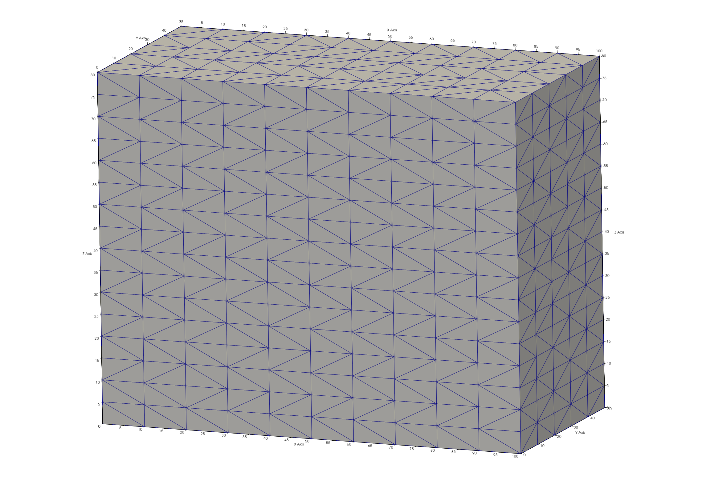
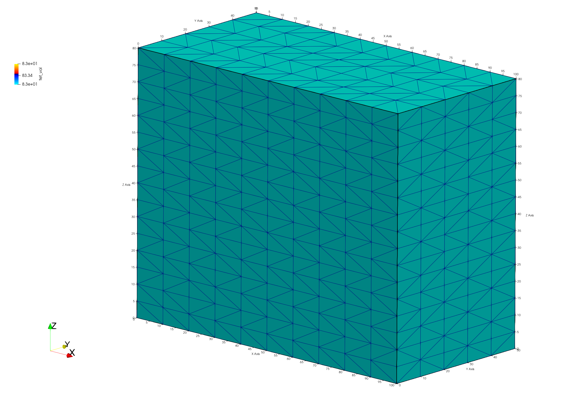
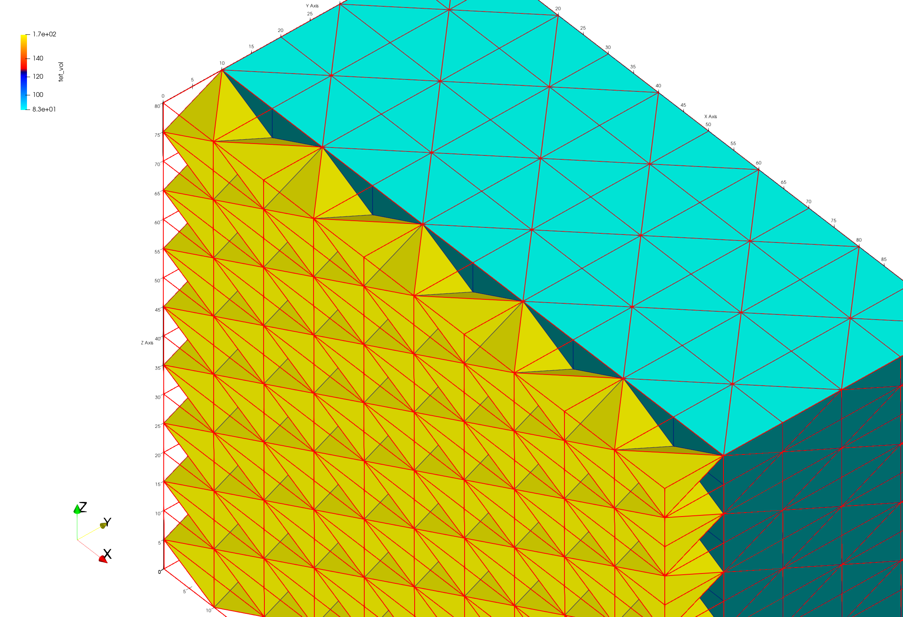
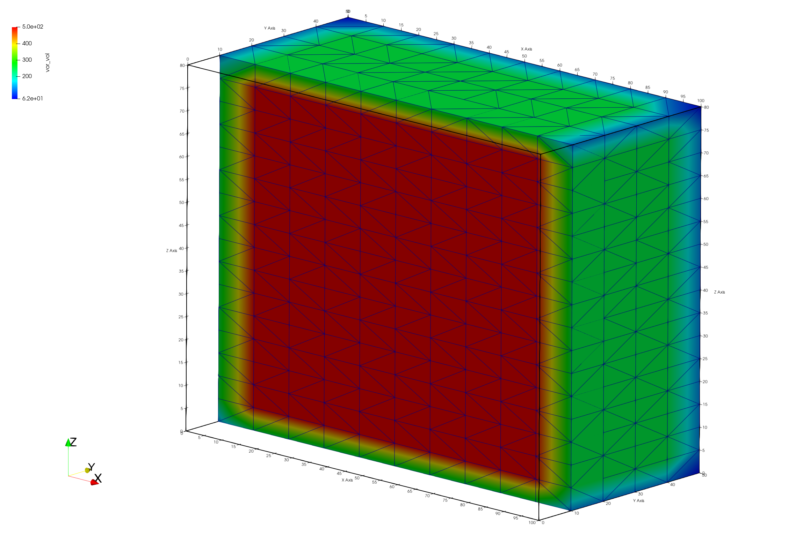
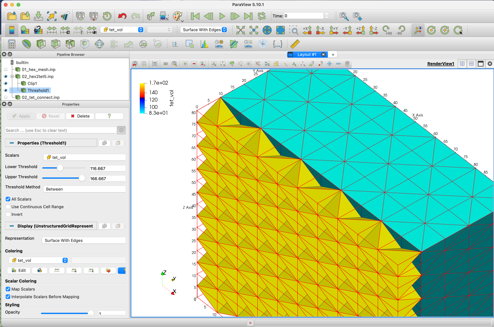

# Step 2. Create Tet Mesh from the Hex Mesh 

<!-- Begin image -->
<p><a href="step_02/02_hextotet.png">  </a></p>
<!-- End image -->

#### LaGriT command file: [02_hex_to_tet.lgi](step_02/02_hex_to_tet.lgi.txt)
#### LaGriT  output file: [lagrit.out](step_02/02_hex_to_tet.out.txt)

This example will use 2 methods for creating a tet mesh from a hex mesh. The first method will use the mesh points to [**'connect'**](https://lanl.github.io/LaGriT/pages/docs/commands/CONNECT1.html) into a Delaunay tet mesh. The second will use [**'grid2grid'**](https://lanl.github.io/LaGriT/pages/docs/commands/GRID2GRID.html) to convert hex elements into tetrahedrals.

Use of **hextotet** (or **grid2grid**) to convert a 3D mesh to a tetrahedral mesh may result in a non-Delaunay tetrahedral mesh. If the target simulator is one that uses two-point flux approximation and Voronoi control volumes (FEHM, PFLOTRAN, TOUGH2) then the **connect** command should be used to create a Delaunay mesh.


[Click here for Delaunay Definition](https://en.wikipedia.org/wiki/Delaunay_triangulation)

[Click here for Voronoi Definition](https://en.wikipedia.org/wiki/Voronoi_diagram)

[Click here for more details on the connect algorithm](https://lanl.github.io/LaGriT/pages/docs/connect_notes.html)


# Method using Connect Delaunay


## Create the Hex Mesh from Step 1


The **'infile'** command is used to read and run a LaGriT command file. In this case we read and run the same command file that was used to create a hex mesh in Step 1. 
Use the **cmo/status** command to confirm the mesh object "3dmesh" was created.

```
infile 01_create_hex.lgi
cmo/status/ 3dmesh / brief
```

The status report should indicate the current mesh object is a hex mesh with 1122 nodes and 800 hex elements. 
<pre class="lg-output">
The current-mesh-object(CMO) is: 3dmesh

  1 Mesh Object name: 3dmesh
    number of nodes =          1122        number of elements =          800
    dimensions geometry =         3        element type =                hex
    dimensions topology =         3        8 nodes      6 faces     12 edges
    boundary flag =        16000000        status =                   active
</pre>


## Create a new mesh object with points to connect 

The [**'connect'**](https://lanl.github.io/LaGriT/pages/docs/commands/CONNECT1.html) command will create connectivity from a cloud of points. There should be no duplicate points and the **imt** material should be a single value. The point distribution will impact the success of a connected tet mesh. 
A point distribution where spacing varies from very small to very large can result in high aspect ratios and boundary problems. This hex mesh provides structured regular spacing and is topologically consistent and will result in success.  

Copy the hex points into a new mesh object, this removed the connectivity so new elements cat be created. 
```
cmo / create / mo_tet
copypts / mo_tet / 3dmesh
```

We now have multiple mesh objects. You can see a list of mesh objects, use **cmo/select** command to make "mo_tet" mesh object current for the next commands.

```
cmo /list
cmo/ select / mo_tet
cmo/ status / mo_tet /brief
```

Prepare the points by removing duplicate points and setting imt to a single value and boundry tags to 0. The **filter** command will mark duplicate points as "dudded" points, the **rmpoint/compress** command will remove the dudded nodes from the mesh object. These commands will not make any changes if there are no duplicate points. 

*Note: the use of special character ";" to call multiple commands on the same line.*

```
# remove dupplicate points if they exist
filter/1,0,0 ; rmpoint/compress

# Set some defaults for the connect routine
cmo / setatt / mo_tet / imt / 1 0 0 / 1
cmo / setatt / mo_tet / itp / 1 0 0 / 0

# Create Delaunay tet connectivity of all nodes in the mesh
connect

```

The result of the **connect** command should show successs.
<pre class="lg-output">
 Coordinates of enclosing tetrahedron are:
          -0.20000D+03   -0.37500D+02   -0.60000D+02
           0.50000D+02   -0.37500D+02    0.34000D+03
           0.30000D+03   -0.37500D+02   -0.60000D+02
           0.50000D+02    0.21250D+03    0.40000D+02

 Successfully eliminated all multimaterial connections.

 The mesh is now complete!
</pre>


It is good practice to make sure there are no zero or negative volume elements with the **quality** command. Set the newly created tet materials to 1 and set the **itp** boundary nodes.
```
quality
cmo / setatt / mo_tet / itetclr / 1
resetpts / itp
```

# Method using grid2grid to convert each hex into 5 tets 

The [**'grid2grid'**](https://lanl.github.io/LaGriT/pages/docs/commands/GRID2GRID.html) is a wrapper that simplifies many of the grid to grid conversions. In this case we will use the option that converts each hex element into 5 tets (with nopoints added). This command requires the creation of a new mesh object, the new name is given first, with the source mesh object name at the end.

```
grid2grid / hextotet5 / mo_hex2tet / 3dmesh
```

Check the list of mesh objects, the new "mo_hex2tet" mesh object should now be current as the newly created object.
Check for positive volumes and set mesh default values.

```
cmo / list

quality

cmo / setatt / mo_hex2tet / itetclr / 1
resetpts / itp
```

Now we have two tet meshes, one created with **connect** and the other with **grid2grid**. In general we use the connect algorithm to create Delaunay meshes using Voronoi control volumes (FEHM, PFLOTRAN, TOUGH2). Converting hex elements into tet elements will not be Delaunay and may affect results depending on the physics used. 

For viewing these new meshes, we can add node and element attributes. With the following commands we add values for each tet volume and for the voronoi volume around each mesh node.
See a list of attributes that can be created at [**`cmo/addatt`**](https://lanl.github.io/LaGriT/pages/docs/commands/cmo/cmo_addatt.html)


```
cmo/addatt / mo_tet / volume / tet_vol
cmo/addatt / mo_tet / voronoi_volume / vor_vol

cmo/addatt / mo_hex2tet / volume / tet_vol
cmo/addatt / mo_hex2tet / voronoi_volume / vor_vol

cmo/printatt/ mo_tet / tet_vol / minmax
cmo/printatt/ mo_tet / vor_vol / minmax
cmo/printatt/ mo_hex2tet / tet_vol / minmax
cmo/printatt/ mo_hex2tet / vor_vol / minmax

dump/avs/02_tet_connect.inp/mo_tet
dump/avs/02_hex2tet5.inp/mo_hex2tet
```

We can use the **cmo/printatt** command to view the minmax values of the attributes in named mesh objects. 

```
cmo/printatt/ mo_tet / tet_vol / minmax
cmo/printatt/ mo_tet / vor_vol / minmax
cmo/printatt/ mo_hex2tet / tet_vol / minmax
cmo/printatt/ mo_hex2tet / vor_vol / minmax
```

The connect mesh and the hextotet mesh have the same 1122 number of nodes. But the connectivity created 4800 tet elements with connect and 4000 for hextotet mesh. Notice the tet element minmax volumes have different results, the connected mesh has volumes all equal. For this structured point distribution, the voronoi volumes for each node have the same min max range. 

<pre class="lg-output">
cmo/printatt/mo_tet/tet_vol/minmax
ATTRIBUTE NAME              MIN               MAX         DIFFERENCE    LENGTH
 tet_vol            8.333333333E+01  8.333333333E+01 0.000000000E+00      4800

cmo/printatt/mo_tet/vor_vol/minmax
ATTRIBUTE NAME              MIN               MAX         DIFFERENCE    LENGTH
 vor_vol            6.250000000E+01  5.000000000E+02 4.375000000E+02      1122

cmo/printatt/mo_hex2tet/tet_vol/minmax
ATTRIBUTE NAME              MIN               MAX         DIFFERENCE    LENGTH
 tet_vol            8.333333333E+01  1.666666667E+02 8.333333333E+01      4000

cmo/printatt/mo_hex2tet/vor_vol/minmax
ATTRIBUTE NAME              MIN               MAX         DIFFERENCE    LENGTH
 vor_vol            6.250000000E+01  5.000000000E+02 4.375000000E+02      1122
</pre>


# Viewing the Tet Meshes

The following images were created by using Paraview reading the AVS mesh files. Click to see full resolution images.

Paraview images show tet elements colored by element volumes of connected Delaunay mesh (left) and grid2grid (right). The grid2grid view is clipped in order to see the internal tet elements that are larger than the tets formed at the hex corners. 

<!-- Begin image -->
<p><a href="step_02/02_connect_vol_clipped.png">  </a>
   <a href="step_02/02_hex2tet_vol_clipped.png">  </a>
</p>

Paraview images show the mesh colored by node voronoi volumes. The boundary nodes will have half volumes, the corner nodes will have quarter volumes. Internal voronoi volumes are all the same. Image is clipped to show internal mesh nodes. Both meshes have the same voronoi volumes.

<!-- Begin image -->
<p><a href="step_02/02_connect_vorvol_clipped.png">  </a>
   <a href="step_02/02_hex2tet_vorvol_clipped.png">  </a>
</p>
<!-- End image -->

This is a snapshot showing the Paraview settings for the clipped mesh. The full 02_hex2tet5.inp mesh displayed with red wire frame. The mesh is clipped -10, and threshold is used to display tet volumes over 116.

<p><a href="step_02/02_hex2tet_vol_clipped_para.png"> 
</p>

## finish

Always end a session or a file with the **finish** command.

```
finish
```
