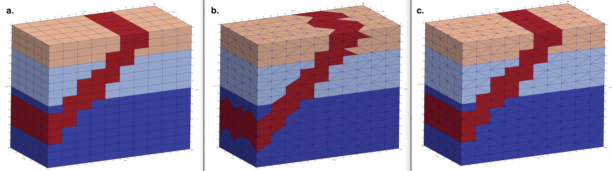
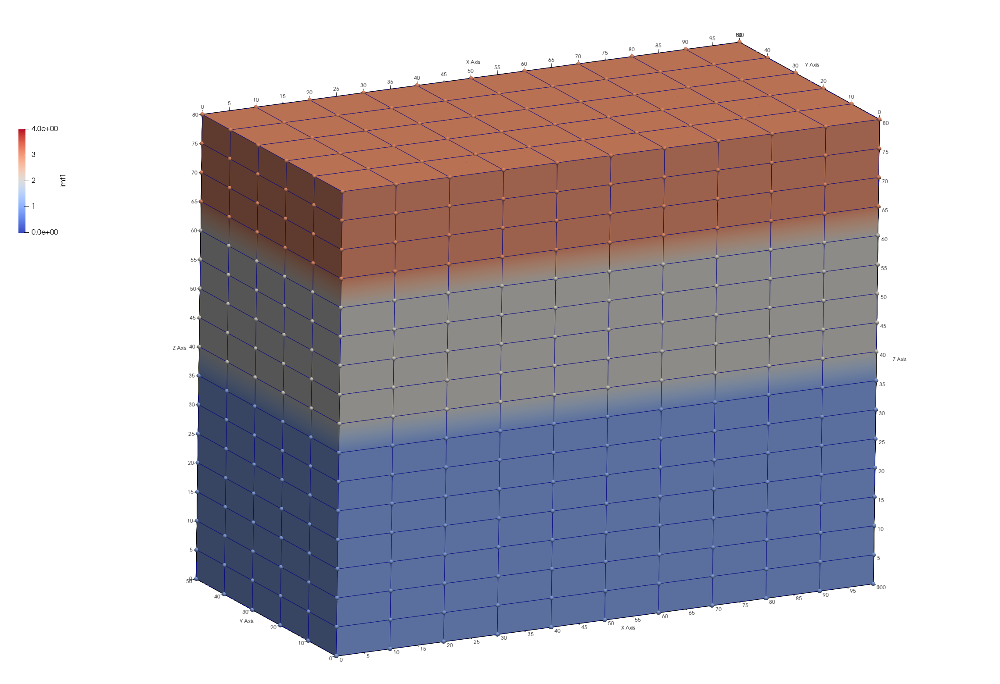
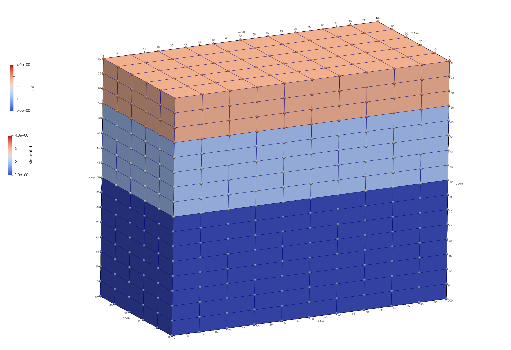
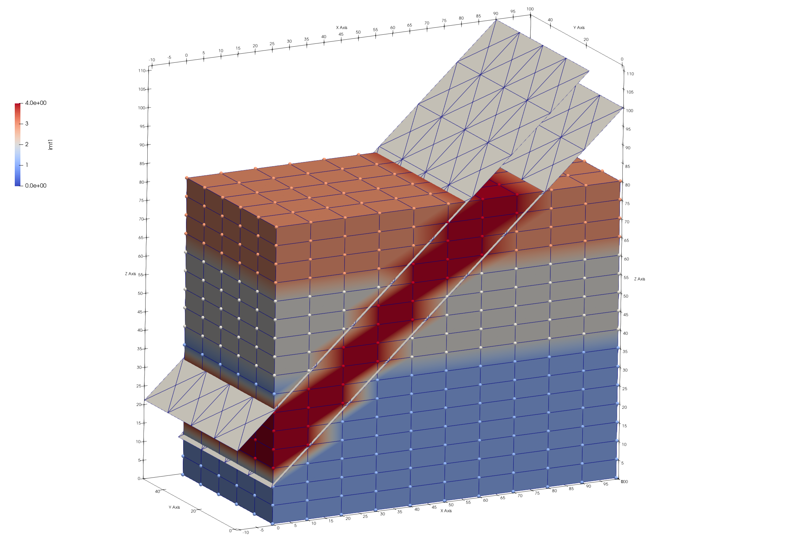

# Step 3. Assign materials to Hex Mesh and Tet Mesh 

<p>
<a href="step_03/step_03_3_meshes.png">  </a>
</p>
<br>
<!-- End image -->


#### LaGriT command file: [03_assign_materials.lgi](step_03/03_assign_materials.lgi.txt)
#### LaGriT  output file: [lagrit.out](step_03/03_assign_materials.out.txt)

This example will show how to use some basic commands to assign materials to mesh nodes and elements. Methods include:

- Set selections using [**`pset`**](https://lanl.github.io/LaGriT/pages/docs/commands/PSET.html) for mesh points and [**`eltset`**](https://lanl.github.io/LaGriT/pages/docs/commands/ELTSET2.html).
- Regions defined by surfaces using [**`surface`**](https://lanl.github.io/LaGriT/pages/docs/commands/SURFACE.html) and [**`region`**](https://lanl.github.io/LaGriT/pages/docs/commands/REGION.html)
- Interpolation from hex materials to tet mesh materials using [**`interpolate`**](https://lanl.github.io/LaGriT/pages/docs/commands/main_interpolate.html) 

## Define Mesh Names

In this example we assign materials (color) to the hex mesh, then interpolate hex mesh materials to the tet mesh. This method ensures nice interfaces between materials. If the tet mesh is colored with following methods, the tet interfaces will be ragged, with tet elements sticking out. 

Define input and output file names for easy switch between mesh types. As seen here, the second set of file names are last defined and will be used. If you want to see how it looks to use the tet mesh, simply copy and past the first 2 lines after the hex file names. 

Results are shown in image at top of page. Image a. This example hex_colors.inp b. Run with tet_colors.inp c. This example using interpolation for tet_colors.inp

```
define IN_FILE 02_tet_mesh.inp
define OUT_FILE tet_colors.inp

define IN_FILE 01_hex_mesh.inp
define OUT_FILE hex_colors.inp
```

## Read the Hex Mesh  

We start with the hex mesh created in Step 1. of this tutorial. Instead of creating it again, we just read the AVS mesh file. Note the variable IN_FILE is define above as "01_hex_mesh.inp". We have given the mesh object the name mo_mat to indicate it is the mesh object we will assign materials to. You can name the mesh anything you want as long as it is clear and consistent with your usage.

```
read/avs/ IN_FILE / mo_mat
cmo/status/mo_mat/ brief
cmo/select/mo_mat
```

## Assign Materials by Selected Sets (pset and eltset) 

Define some elevations for layers between top and bottom of mesh  between 0. and 80.

```
define MAT1_Ztop 40.
define MAT2_Ztop 62.
```

For the current mesh, select node sets based on the attribute zic (Z coordinate). Name the psets "pmat1", "pmat2", and "pmat3" for use in assigning materials. Note reminder the "1,0,0" refers to node numbers start,stride,stop where "0,0" indicates "all".

```
pset/pmat1/attribute zic/1,0,0/ lt MAT1_Ztop
pset/pmat2/attribute zic/1,0,0/ lt MAT2_Ztop
pset/pmat3/attribute zic/1,0,0/ ge MAT2_Ztop
```

Based on the set selections above, we can now assign integer values to node materials in the **imt** attribute.
In this example ordering of assignment matters as both "pmat1" and "pmat2" overlap below zic=40. This is ok, we simply overwrite by assigning the lowest set last.

```
cmo/setatt/mo_mat/imt/ pset,get,pmat3 / 3
cmo/setatt/mo_mat/imt/ pset,get,pmat2 / 2
cmo/setatt/mo_mat/imt/ pset,get,pmat1 / 1
```

To assign materials to the elements, we use the psets above to create element sets. Note elements can be formed to make sure each vertice of the element is in the pset, or such that only one needs to be in the pset.
In this example we use **inclusive** which will include more elements than the **exclusive** option.

After setting the element sets, assign material integers to the **itetclr** element attribute in same order as the psets.

```
eltset/emat1/inclusive/pset,get,pmat1
eltset/emat2/inclusive/pset,get,pmat2
eltset/emat3/inclusive/pset,get,pmat3

cmo/setatt/mo_mat/itetclr/eltset,get,emat3/ 3
cmo/setatt/mo_mat/itetclr/eltset,get,emat2/ 2
cmo/setatt/mo_mat/itetclr/eltset,get,emat1/ 1
```

Write a temporary file to view node and element colors so far.
 
```
dump/ tmp_layers.inp / mo_mat
```

Viewing the mesh file tmp_layers.inp we can check if node **imt** and element Materials are set as we intended. The result is a mesh with 3 layers with material 1 at the bottom and 3 at the top.

These images were created from Paraview showing the mesh colored by node attribute **imt** left. The mesh is colored by element materials on the right, mesh nodes colored by **imt**. Though modeling software such as FEHM use only the node materials, viewing the mesh by element color presents a better picture. Click on images to view full resolution image.

<p>
<a href="step_03/step_03_hex_layers_imt.png">  </a>
<a href="step_03/step_03_hex_layers_imt_itetclr.png">  </a>
</p>
<br>


## Assign Materials by Surfaces

Create surfaces to define a fourth material defined by the region between the surfaces.
In this case we use a mesh object name that implies it is temporary. Creating naming conventions for your objects will help you to keep track of objects during the workflow.

```
cmo / create / motmp
cmo / select / motmp
```

Create a quad mesh based on corner coordinates, since this will be used to define regions on the mesh, make sure the surface coordinates extend equal or greater to the mesh. A surface that truncates inside the mesh domain will be ill defined with respect to below or above.

The **brick** option for **createpts** is used to create a quad mesh from the point distribution.  The quads are converted to triangles with the **hextotet** command. After the surface is created, print the minmax coordinates and view the surface to make sure it where you want it. 

```
quadxy / 10 5 /-1. -1. 10.   /100.1 -1.  100./ &
               100.1 51. 100./   -1. 51. 10.
createpts/brick/xyz/ 10 5 1 /1,0,0/connect
hextotet/4/ mosurf1 / motmp
cmo / printatt / mosurf1 / -xyz- / minmax
dump/ tmp_surf1.inp / mosurf1
```

Create a second surface offset from first surface by a distance of 15 in the positive direction.

```
offsetsurf/ mosurf2 / mosurf1 / 15.
dump/ tmp_surf2.inp / mosurf2
```

View the mesh and the surfaces together to be sure it is correct. The nodes colored red in the image is the region we will set to material 4.

<p>
<a href="step_03/step_03_hex_colors_surfs.png">  </a>
</p>

To use the geometry commands such as surfaces and regions, FIRST make sure your mesh object is current. Otherwise these geometry command will not be available for use on the mesh object. Use the **cmo/select** command to make sure you apply these commands to the "mo_mat" mesh object.

In the previous steps we created two mesh objects, mosurf1 and mosurf2. We now tell LaGriT to use those mesh objects to geometry of type **sheet**. There are many types of surfaces such as cone, and box. See more at [**`surface`**](https://lanl.github.io/LaGriT/pages/docs/commands/SURFACE.html). There are options for boundary type which are not necessary for this simple example, so **reflect** is used here.

```
cmo / select / mo_mat
surface / s_mosurf1 / reflect / sheet / mosurf1
surface / s_mosurf2 / reflect / sheet / mosurf2
```

Now that LaGriT has named sheets as part of the mesh object geometry, we can now define the region between. Use the surface names and above (ge) and below (le) to set region between the surfaces.

Note: see page describing directional operators at [**`lt, le, gt, ge`**](https://lanl.github.io/LaGriT/pages/docs/dividereg.html) 

```
region/ r_slant / ge s_mosurf1 and le s_mosurf2
```

Select node and element sets in the slanted region.
And assign node and element materials for both.

```
pset/ pslant / region / r_slant
eltset/ eslant / region / r_slant

cmo/ setatt / mo_mat / imt / pset,get,pslant / 4
cmo/ setatt / mo_mat / itetclr / eltset,get,eslant / 4
```

Update the boundary and interface attribute **itp** and write the mesh with materials.
Note here we are using the "OUT_FILE" variable defined above with the output mesh name.

```
resetpts/itp
dump / OUT_FILE / mo_mat
cmo / status / mo_mat / brief
```

Debug hint: things often go wrong early in the script, make sure there are no errors before continuing. You can do this by adding an early finish and observing the output report. If there are no errors reported and the mesh looks as expected, comment the **finish** command so the LaGriT command continues.

```
# uncomment Early finish to check results
# 
finish
```


## Assign Materials by Interpolation

This will preserve the stair-step interfaces of materials

 remove unneeded mesh objects

```
cmo/delete/motmp
cmo/delete/mosurf1
cmo/delete/mosurf2
cmo/list
```

 Read tet mesh from Step 2

```
read/avs/ 02_tet_mesh.inp / mo_tet
cmo/select/mo_tet
```

Use the **interpolate** command using the materials assigned to mesh object "mo_mat".

```
interpolate/map/mo_tet/ itetclr /1,0,0/ mo_mat itetclr
interpolate/voronoi/mo_tet/ imt /1,0,0/ mo_mat imt
```

 check interpolated values

```
cmo/printatt/mo_tet/imt minmax
cmo/printatt/mo_tet/itetclr minmax
```

 Set boundary nodes and write view file

```
resetpts/itp
dump/avs/tet_interp_materials.inp mo_tet
```


## Report Material Quantities


## finish

Always end a session or a file with the **finish** command.

```
finish
```

