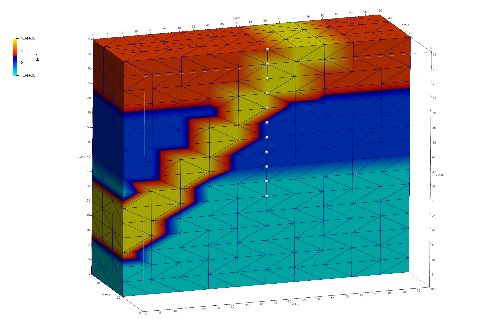
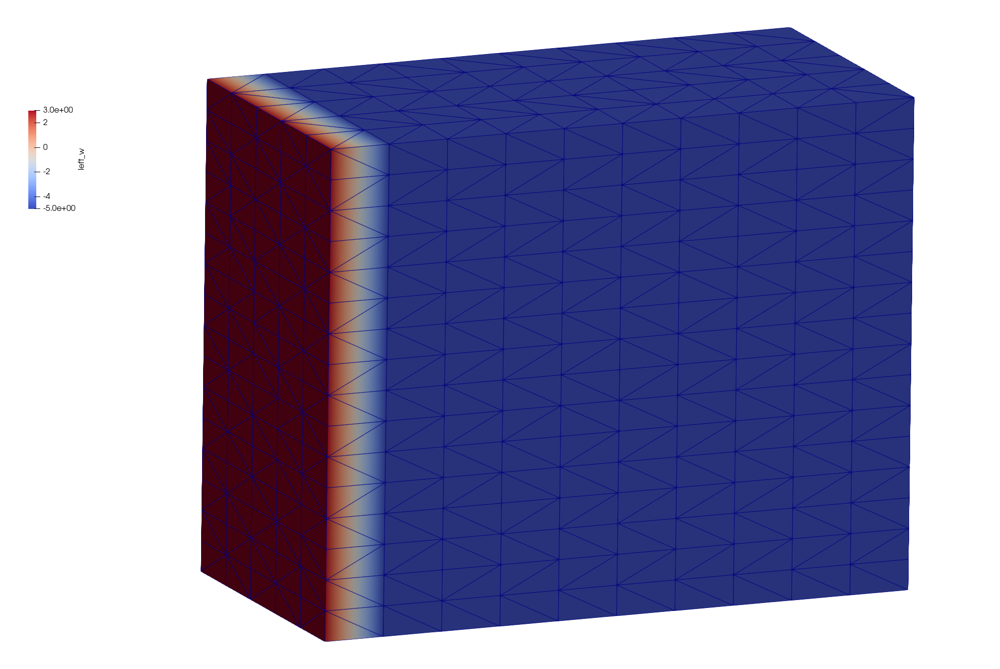
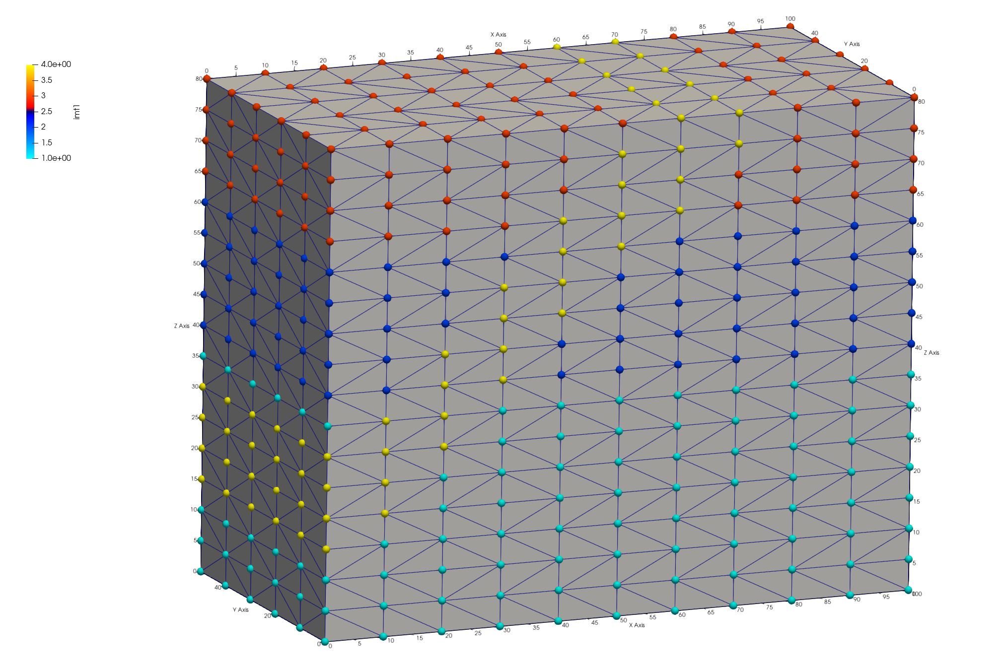
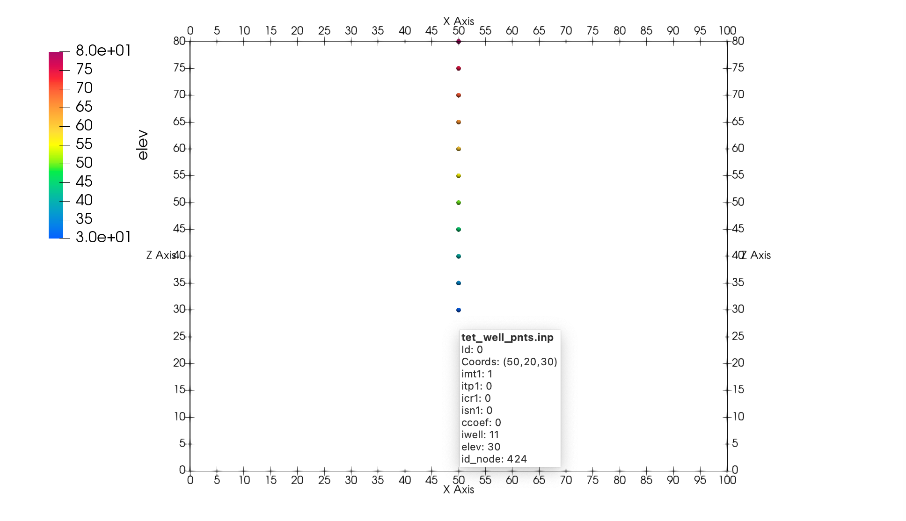
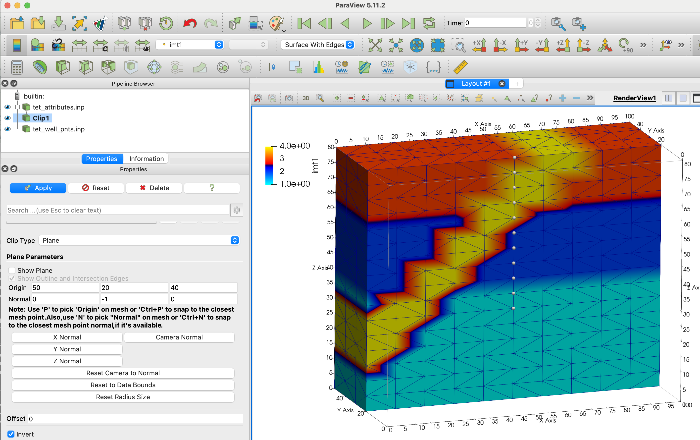

# Step 4. Write FEHM setup files (In Progress) 

<p>
<a href="step_04/04_tet_nodes_imt_well_pts.png">  </a>
</p>
<br>
<!-- End image -->


#### LaGriT command file: [04_fehm_files.lgi](step_04/04_fehm_files.lgi.txt)
#### LaGriT  output file: [lagrit.out](step_04/04_fehm_files.out.txt)

LaGriT's meshing tools are tailored for geologic applications and Voronoi control volume solvers.  Though LaGriT can write files that are of general use, some are specifically designed for the FEHM porous flow and transport code. This example writes model setup files used by FEHM but can be modified for use in other simulators using Voronoi control volumes (FEHM, PFLOTRAN, TOUGH2). 

- Use the tetrahedral mesh with materials created in Step 3.
- Use [**`dump/fehm`**](https://lanl.github.io/LaGriT/pages/docs/commands/dump/DUMP3.html) to write 7 model setup files.
- Locate and write a list of nodes representing a vertical well zone.
- View and check the mesh quality and defined zones.

The following model setup files will be written:
-   .fehm - mesh coordinates and geometry in FEHM grid format. Same as [**`dump/coord`**](https://lanl.github.io/LaGriT/pages/docs/commands/DUMP2.html#coord)
-  material.zone - node zone lists for each material. Same as [**`dump/zone_imt`**](https://lanl.github.io/LaGriT/pages/docs/commands/DUMP2.html#zone)
-  outside.zone - lists of nodes on outside boundaries such as top, bottom, and sides. Same as [**`dump/zone_outside`**](https://lanl.github.io/LaGriT/pages/docs/commands/DUMP2.html#zone)
-  outside_vor.area - voronoi areas associated with nodes on outside boundaries
-  multi_mat.zone - lists of node pairs connected across material interfaces (multi-material nodes) 
-  interface.zone - lists of nodes along material interfaces (for multi-material cells seldom used with FEHM)
-  .stor - file with voronoi control volumes associated with each node and the sparse matrix structure. Same as [**`dump/stor`**](https://lanl.github.io/LaGriT/pages/docs/commands/DUMP2.html#stor) and described at [**stor format**](https://lanl.github.io/LaGriT/pages/docs/STOR_Form.html)


## Read the tetrahedral mesh with materials from Example 3


Read the mesh and check for positive volumes and expected node material values. The `quality` command shows all cells with the same volume as expected. The [`**cmo/printatt**`](https://lanl.github.io/LaGriT/pages/docs/commands/cmo/cmo_printatt.html) command is recommended for checking mesh attributes at important places in the input file. The keyword **minmax** will display the min and max values of mesh attributes for easy confirmation of values. As expected, the node attribute has material values 1 to 4. (See Step 3).

Note. You can add a `finish` command after this section and run just to be sure all is as expected. Then comment out or remove the temporary finish. 

```
read / avs / tet_interp_materials.inp / mo_tet
quality
cmo/printatt/mo_tet/imt minmax
```

<pre class="lg-output">
---------------------------------------
All elements have volume  8.3333333E+01
---------------------------------------
      4800 total elements evaluated.

ATTRIBUTE NAME         MIN               MAX         DIFFERENCE    LENGTH
 imt1                        1                4               3      1122
</pre>

The following commands are almost always used in preparation of writing FEHM model files. They are not always needed but using them will cause no harm. It is good practice to include in case they are needed.

- Set cell colors to 1. FEHM uses properties assigned to the voronoi volumes around the mesh vertices (nodes). Though cell colors are better for images, they are not used in FEHM simulations. It is good practice to set the element attribute **itetclr** to 1. This avoids routines looking for multi-material elements.  

- Reset the itp array when materials are changed. This array is important to some routines. 

- The [`**resetpts/parent**`](https://lanl.github.io/LaGriT/pages/docs/commands/RESETPT.html) command will remove the parent-child relationship is established in the settets command.

- Sometimes during the meshing process there will be duplicate or double-defined nodes nodes created. Use the `filter` command to find and tag nodes as `dudded`. 

- IMPORTANT: Nodes tagged for removal will not be deleted from the mesh object until **rmpoint/compress** is called. This will remove any dudded nodes and adjust the connectivity.

```
cmo/select/mo_tet
cmo/setatt/mo_tet itetclr 1
resetpts/itp

cmo/select/mo_tet
resetpts/parent
filter/1,0,0
rmpoint/compress
```

## Write default FEHM files

By default, all 7 FEHM files are written. The commonly used files are the .fehm grid file, the materials and outside zone files, and the .stor voronoi coefficents file.

The **keepatt** keyword will keep attributes normally deleted after writing files.  
The 6 outside attribute names are added to the mesh object with the names bottom, top, right_e, back_n, front_s, and left_w. A node can occur in multiple zones. For instance, a node located on a top corner of the mesh can be found in zones for top, front_s, and left_w.

    1 = top = top = positive z direction (0,0,1)
    2 = bottom = bottom = negative z direction (0,0,-1)
    3 = left_w = left or west = negative x direction (-1,0,0)
    4 = front_s = front or south = negative y direction (0,-1,0)
    5 = right_e = right or east = positive x direction (1,0,0)
    6 = back_n = back or north = positive y direction (0,1,0)

Note: We normally do not use multiple material regions for FEHM so the `interface.zone` will be empty. (If itetclr=1 and resetpts/itp was called). If the node imt materials are a single value, the `multi_mat.zone` will also be empty.

```
dump/fehm/ tet /mo_tet/ keepatt
dump/avs/tet_fehm.inp/mo_tet
```

<pre class="lg-output">
-rw-rw-r-- 1 tamiller sft 372523 Apr  2 18:29 step_04/tet.fehmn
-rw-rw-r-- 1 tamiller sft 203060 Apr  2 18:29 step_04/tet.stor
-rw-rw-r-- 1 tamiller sft  12486 Apr  2 18:29 step_04/tet_material.zone
-rw-rw-r-- 1 tamiller sft   8067 Apr  2 18:29 step_04/tet_outside.zone
-rw-rw-r-- 1 tamiller sft  45739 Apr  2 18:29 step_04/tet_outside_vor.area
-rw-rw-r-- 1 tamiller sft  32600 Apr  2 18:29 step_04/tet_multi_mat.zone
-rw-rw-r-- 1 tamiller sft      0 Apr  2 18:28 step_04/tet_interface.zone
</pre>

<p> Paraview showing mesh attributes <b>w_left</b> mesh boundary (left) and node <b>imt</b> materials (right) <br>
<a href="step_04/04_tet_nodes_left_w.png">  </a>
<a href="step_04/04_tet_nodes_imt.png">  </a>
</p>
<br>

The output from the `dump/fehm` command generates output that is useful for checking the final mesh and to share in reports.
The following is a table reporting the node count for each material. In this case the bottom layer material 1 has the most nodes and the fault material 4 has the fewest as expected. 

<pre class="lg-output">
*********dump_material_lists********
Minimum material ID value =      1
Maximum material ID value =      4
Total possible materials  =      4
Material      1 has       468 nodes. #nodes/nnodes is   0.417112290859
Material      2 has       270 nodes. #nodes/nnodes is   0.240641713142
Material      3 has       204 nodes. #nodes/nnodes is   0.181818187237
Material      4 has       180 nodes. #nodes/nnodes is   0.160427808762
</pre>

The routine `AMatbld3d_stor` generates a report summary regarding the voronoi volumes and number of coefficients.
 

<pre class="lg-output">
AMatbld3d_stor: *****Zero Negative Coefficients ******
AMatbld3d_stor: Number of 'zero' (< compress_eps) coefs  0
AMatbld3d_stor: npoints =     1122  ncoefs =       7144
AMatbld3d_stor: Number of unique coefs =              6
AMatbld3d_stor: Maximum num. connections to a node =  7
AMatbld3d_stor: Volume min =   6.2500000E+01
AMatbld3d_stor: Volume max =   5.0000000E+02
</pre>

Negative coefficents can occur on non-convex boundaries or with unstructured complex meshes. If they occur, these negative coefficients are stored in a node attribute named `ccoef`. Viewing this attribute can provide help in finding areas of the mesh that need adjustment. It is possible that a mesh has ccoef values at or very close to zero, in which case they can be ignored. The following pset commands can help find ccoef values of concern.

Note. The `cmo/addatt` command is called but will not be used if the `AMatbld3d_stor` routine creates it. We create it just in case it does not exist so the commands using it do not fail with an Error.

```
cmo/addatt/mo_tet/ccoef/VDOUBLE/scalar/nnodes/linear/
cmo select mo_tet
pset pin attribute itp   1,0,0 lt 10
pset pneg attribute ccoef 1,0,0 lt -.0001
pset pBAD inter pin pneg
cmo printatt mo_tet ccoef minmax
cmo printatt mo_tet -all- minmax
```

## Create zone file for vertical well


Zones for simulations can be created and written by using the `pset` commands. In this example a single column of nodes is selected to represent a well. There are numerous ways to select, in this example we use a geometric region in box shape. A cylinder would also work.

Regions are defined by surfaces, here we use a box surface around the node column at 50,10 X,Y. The region is defined as inside the box surface, but can be combined with other surfaces for more complex regions. A pset is formed of all points within the `r_bx` region and written to a zone file.

 Write the list of nodes to a zone file
 Assign a zone number larger than max material

```
cmo select mo_tet
surface / s_box / reflect / box / 49.5 19.5 -1. / 50.5 20.5 100.
region/ r_box / le s_box
pset/pwell/ region / r_box

# check extents of the well nodes
cmo/printatt/mo_tet/-xyz/ minmax/ pset,get,pwell

pset/pwell/ zone / tet_well_nodes.zone / ascii / 11
```

There should be 13 nodes found within the region. Check the xyz extents to see that one column is selected at the intended elevations.

<pre class="lg-output">
 THE PSET  pwell  HAS         13 POINTS

cmo/printatt/mo_tet/-xyz-/minmax/pset,get,pwell
ATTRIBUTE NAME         MIN               MAX         DIFFERENCE    LENGTH
 xic           5.000000000E+01  5.000000000E+01 0.000000000E+00      1122
 yic           2.000000000E+01  2.000000000E+01 0.000000000E+00      1122
 zic           2.000000000E+01  8.000000000E+01 6.000000000E+01      1122
</pre>

## Add mesh object attributes for mesh views

When inspecting the mesh and for nice figures, it is often good to add attributes. A node attribute named `iwell` is created and nodes in the pset `pwell`  are set set to 11. The elevation is nice to see and is created by copying the `zic` attribute to the new attribute named `elev`.

Note. Use the command `cmo/printatt` with **minmax** to check attributes and values in the mesh object.


```
cmo/addatt/mo_tet iwell/VINT/scalar/nnodes/linear/permanent//0
cmo/setatt/mo_tet/ iwell /pset,get,pwell/ 11
cmo/printatt/mo_tet/ iwell/ minmax

cmo/addatt/mo_tet elev/VDOUBLE/scalar/nnodes/
cmo/copyatt/ mo_tet mo_tet / elev zic

cmo/set_id/mo_tet/node/ id_node

dump/avs/tet_attributes.inp/ mo_tet
cmo/printatt/mo_tet/-all- minmax
cmo/status/mo_tet
```


## Check Well Zone

It can be difficult to view mesh nodes within a mesh, it helps to write the points as a seperate file. The mesh nodes (without elements) are copied to a `motmp` mesh object which has all nodes removed except the well nodes. These can be written to any file format, but the AVS UCD pnt type is recoginized by Paraview for easier point displays. This is part of the `dump/avs` options that can be set after the mesh object name.

These options are provided to enable a user the flexiblity of writing ASCII files with desired information. For this example "1 3 1 0 0" means nodes are written, elements are written of type "pnt", node attributes are written, cell attributes are not written, and model attributes are not written. 


```
cmo/create/motmp
copypts/motmp/mo_tet
cmo/select/motmp
pset/pduds/attribute iwell/1,0,0/ ne 11
rmpoint/pset,get,pduds
rmpoint/compress

dump/avs/tet_well_pnts.inp/ motmp / 1 3 1 0 0
cmo/printatt/motmp/-all- minmax
```
Paraview image showing mesh clipped at well location and the well zone nodes. Check the well points are located correctly with respect to mesh materials and connectivity. Query a well node to check attributes such as **imt** material and **elev**. Note when the well points are subset from the full mesh, the node ID changes but the attribute **node_id** has the original mesh node ID saved.


<p> 
<a href="step_04/04_tet_nodes_imt_well_pts.png">  </a>
 <a href="step_04/04_well_nodes_paraview.png">  </a>
</p>

## finish

Always end a session or a file with the **finish** command.

```
finish
```

## Snapshots of Paraview Sessions

Snapshot Paraview session shows clipped mesh and well points.

<p> 
 <a href="step_04/04_mesh_clip_well_paraview.png">  </a>
</p>
<br>

## finish

Always end a session or a file with the **finish** command and a line return after the finish command. The command line parser will not parse a command without a line return.

```
finish

```
