# Image Gallery 

Gallery written: Fri Aug  9 16:26:43 2019

Image Directory: /project/meshing/demos/Tutorial\_Hex\_Mesh/images 

|  |  |   | 
| :---: | :---: | :---:  | 
|  |  |   | 
|  **01\_hex\_01** |  **02\_hex\_01\_top\_region** |  **03\_hex\_01\_2surfs**  | 
| 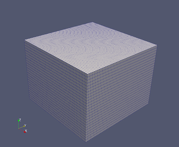| | 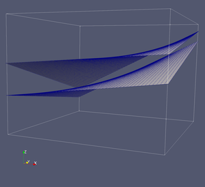 | 
|  **03\_hex\_01\_2surfs\_b** |  **03\_hex\_01\_set\_imt\_itetclr** |  **03\_hex\_01\_set\_imt\_itetclr\_threshold\_remove\_material3**  | 
| 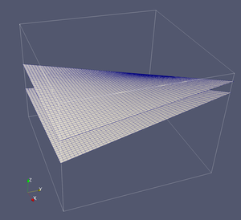| 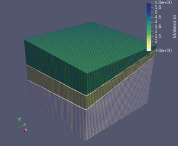|  | 
|  **05\_hex\_01\_fault\_imt\_itetclr** |  **06\_boundary\_truncate** |  **07\_boundary\_truncate\_fence**  | 
| 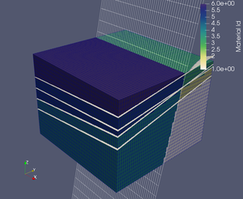| 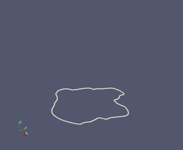| 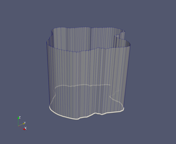 | 
|  **08\_truncate\_set\_id** |  **09\_truncate\_set\_id\_close\_up** |  **10\_hex\_01\_truncate\_close\_up**  | 
| | 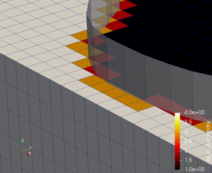| 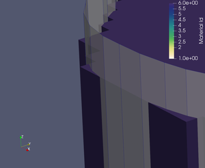 | 
|  **11\_hex\_01\_truncate** |  **12\_hex\_01\_truncate\_w\_grid** |  **13\_hex\_01\_fault\_refine**  | 
| 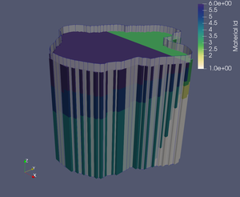| | 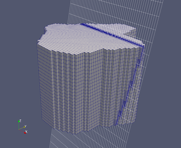 | 
|  **14\_hex\_01\_fault\_refine\_close\_up** |  **15\_hex\_01\_insert\_wells** |  **16\_hex\_01\_insert\_wells\_close\_up**  | 
| 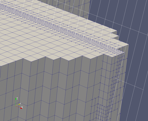| | 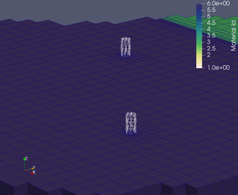 | 
|  **17\_hex\_01\_insert\_wells\_outline** |  **18\_hex\_01\_insert\_wells\_dfield\_wells** |  **19\_hex\_01\_to\_tet**  | 
| | 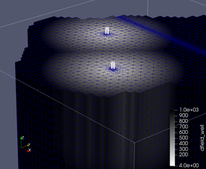| 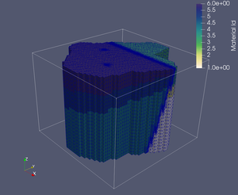 | 
|  **21\_tet\_01\_exo\_blocks** |  **21\_tet\_01\_exo\_blocks\_ex** |  **21\_tet\_01\_exo\_bndry\_faces**  | 
| 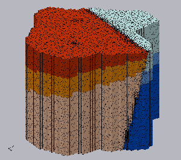| 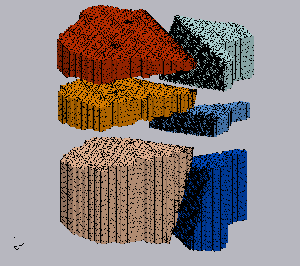| 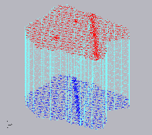 | 
|  **21\_tet\_01\_fehm\_node\_zone\_rad16** |  **21\_tet\_01\_fehm\_node\_zone\_top** |  **21\_tet\_01\_fehm\_nodes**  | 
| 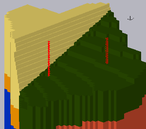| 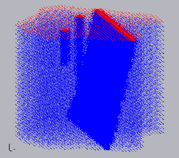| 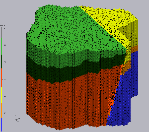 | 
|  **21\_tet\_01\_fehm\_tet\_a** |  **21\_tet\_01\_fehm\_vor\_a** |  **21\_tet\_01\_fehm\_vor\_tet\_a**  | 
| 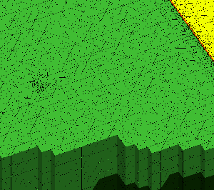| 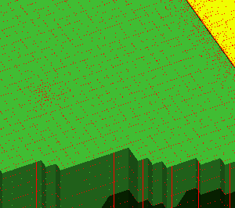| 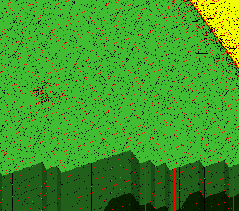 | 
|  **21\_tet\_01\_fehm\_voronoi** |  **21\_tet\_01\_fehm\_voronoi\_a**  | 
| 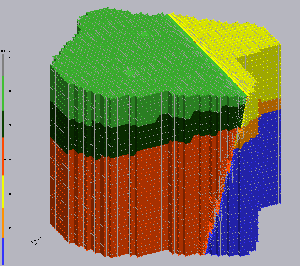| 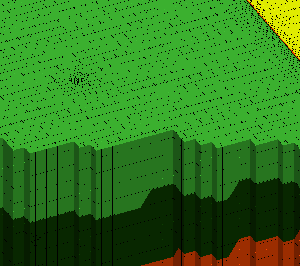 | 

End Gallery
