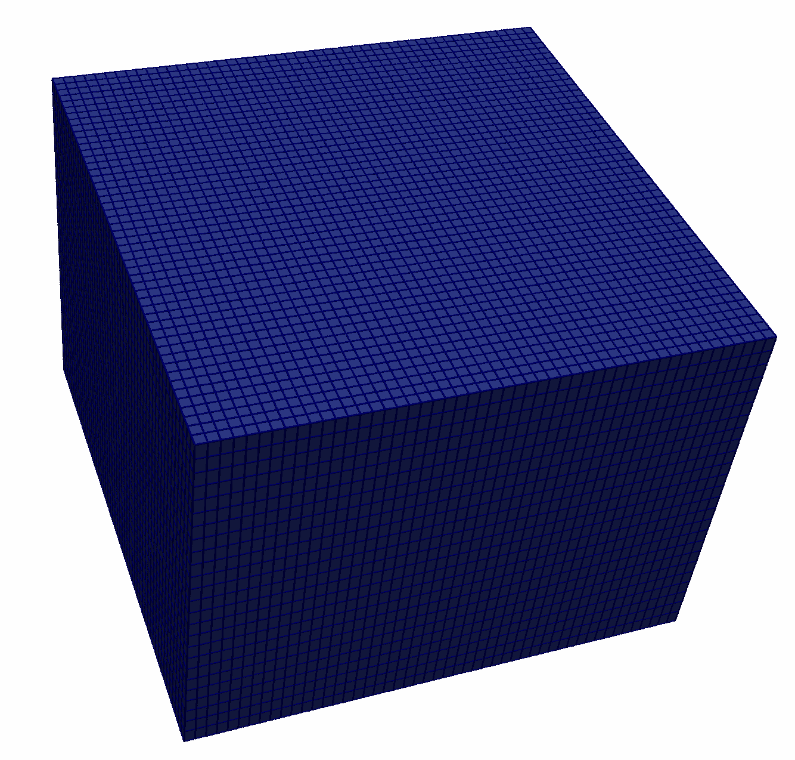
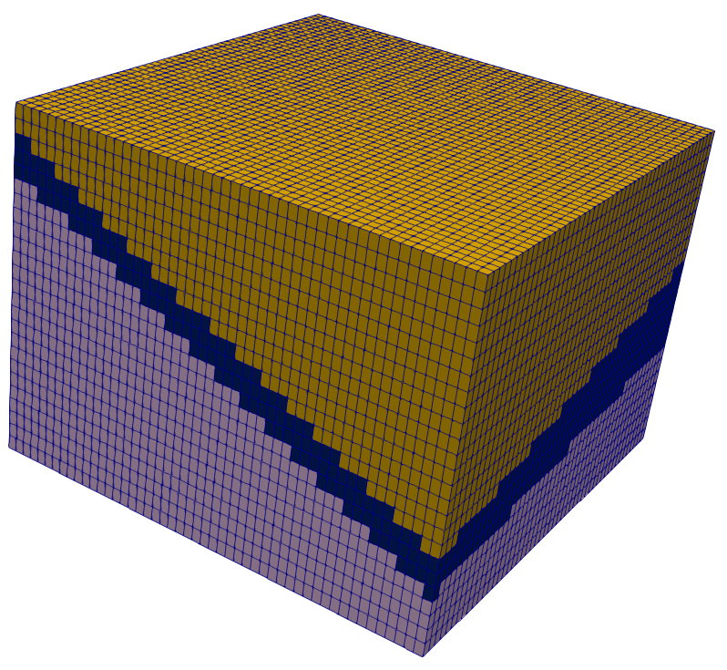

# Image Gallery 

Gallery written: Fri Aug  9 10:30:10 2019

Image Directory: /LaGriT/docs/pages/tutorial/stratigraphy/images

|  |  |  |   | 
| :---: | :---: | :---: | :---:  | 
|  |  |  |   | 
|  **01\_hex\_01** |  **02\_hex\_01\_top\_region** |  **03\_hex\_01\_2surfs** |  **03\_hex\_01\_2surfs\_b**  | 
|  |  |  |   | 
|  **03\_hex\_01\_set\_imt\_itetclr** |  **03\_hex\_01\_set\_imt\_itetclr\_threshold\_remove\_material3** |  **05\_fault\_objects** |  **05\_hex\_01\_fault\_imt\_itetclr**  | 
|  |  |  |   | 
|  **06\_boundary\_truncate** |  **06\_boundary\_truncate\_fence** |  **06\_hex\_01\_truncate** |  **06\_hex\_01\_truncate\_close\_up**  | 
|  |  |  |   | 
|  **06\_hex\_01\_truncate\_w\_grid** |  **06\_truncate\_set\_id** |  **06\_truncate\_set\_id\_close\_up** |  **07\_hex\_01\_fault\_refine**  | 
|  |  |  |   | 
|  **07\_hex\_01\_fault\_refine\_close\_up** |  **08\_hex\_01\_insert\_wells** |  **08\_hex\_01\_insert\_wells\_close\_up** |  **08\_hex\_01\_insert\_wells\_dfield\_wells**  | 
|  |  |  |   | 
|  **08\_hex\_01\_insert\_wells\_outline** |  **19\_hex\_01\_to\_tet** |  **ch1** |  **ch2\_transparent\_cbar**  | 
|  |  |  |   | 
|  **ch4** |  **ch5**  | 
|  |   | 

End Gallery
