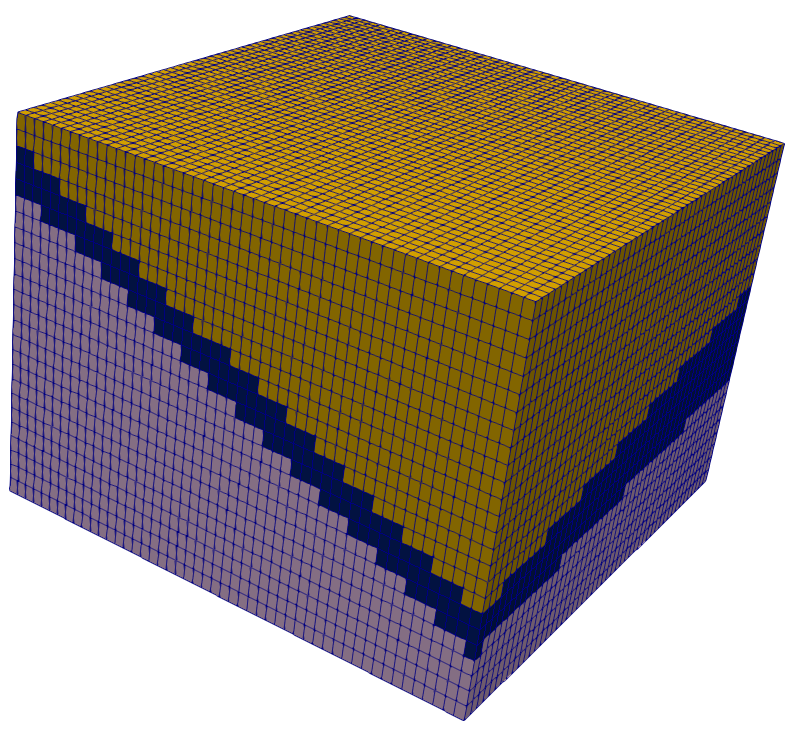

## 4. Map Surfaces to Mesh

Now that the straitipgrahy has been modeled and we are comfortable with our
results, we will map their spanning domain to the parent mesh. As done with the
psets above, this process will be driven via attributes.

We now have two planes spanning the X,Y domain of the mesh. These planes can be
leveraged to create different material IDs at different regions of the
subsurface.

For example,

* For all nodes/cells above plane 1, set their material ID to 1
* For all nodes/cells between plane 1 and plane 2, set their material ID to 2
* For all nodes/cells below plane 2, set their material ID to 3

This process can be accomplished by:

1. Defining the above regions using the `region` keyword
2. Capturing the relevant nodes and elements that fall within the defined regions
3. Setting the node and element material IDs based on the `psets` and `eltsets`

### 4.1 Defining Regions

The syntax for `region` is:

     region / region_name / region_definition

where `region_definition` is a string composed of boolean operators and 
instantiated `surface` objects.

Recall that we have defined two planes, `mosurf1` and `mosurf2`. We would like
to generate the `region` objects from these planes, but the arguments for
`region` require `surface` objects.

Fortunately, we can map the planes to a `surface` very easily. The syntax for
generating a `surface` object from a quad or triangle mesh is:

     surface / surface_name / reflect / sheet / input_mesh

The two planes can then be mapped to surface objects:

```
surface / s_1 / reflect / sheet / mosurf1
surface / s_2 / reflect / sheet / mosurf2
```

And finally, we can remove the plane meshes and define regions:

```
cmo / delete / mosurf1
cmo / delete / mosurf2
cmo / select / MONAME

region / r_1 / le s_1
region / r_2 / gt s_1 and le s_2
region / r_3 / gt s_2
```

### 4.2 Creating Eltsets and PSets from Regions

Point sets and element sets can easily be created through region objects.
The syntax is:

     pset / pset_name / region / region_object / 1,0,0
     eltset / eltset_name / region / region_object

Applying this to our `region` objects yields:

```
pset   / p_r_1 / region / r_1 / 1 0 0
pset   / p_r_2 / region / r_2 / 1 0 0
pset   / p_r_3 / region / r_3 / 1 0 0

eltset / e_r_1 / region / r_1
eltset / e_r_2 / region / r_2
eltset / e_r_3 / region / r_3
```

### 4.3 Setting Attributes from Eltsets and PSets

Recall that the node attribute `imt` holds the 'node colors' of the mesh, and
cell attribute `itetclr` stores the 'cell colors' (or material ID).

Let's use the defined `pset`s and `eltset`s to change these:

```
cmo / setatt / MONAME / imt     / pset   get p_r_1 / 1
cmo / setatt / MONAME / imt     / pset   get p_r_2 / 2
cmo / setatt / MONAME / imt     / pset   get p_r_3 / 3

cmo / setatt / MONAME / itetclr / eltset get e_r_1 / 1
cmo / setatt / MONAME / itetclr / eltset get e_r_2 / 2
cmo / setatt / MONAME / itetclr / eltset get e_r_3 / 3
```

Our mesh's cells and nodes now store information about their intersections
with the cut-planes. Visualizing `itetclr`, we can see that this has behaved
as expected:




<ul class="uk-pagination">
    <li><a href="{{ "/pages/tutorial/stratigraphy/step_02.html" | relative_url }}"><span class="uk-margin-small-right" uk-pagination-previous></span> Previous</a></li>
    <li class="uk-margin-auto-left"><a href="{{ "/pages/tutorial/stratigraphy/step_04.html" | relative_url }}">Next <span class="uk-margin-small-left" uk-pagination-next></span></a></li>
</ul>


<!-- Sidebar -->
<div class="tm-sidebar-right uk-visible@l">
    <div uk-sticky="offset: 160" class="uk-sticky uk-active uk-sticky-fixed" style="position: fixed; top: 160px; width: 200px;">
        <ul uk-scrollspy-nav="closest: li; scroll: true; offset: 100" class="uk-nav uk-nav-default tm-nav uk-nav-parent-icon">
            <li class=""><a href="{{ "/pages/tutorial/stratigraphy/index.html" | relative_url }}">Index</a></li>
            <li class=""><a href="{{ "/pages/tutorial/stratigraphy/step_01.html" | relative_url }}">Building a Hex Mesh</a></li>
            <li class=""><a href="{{ "/pages/tutorial/stratigraphy/step_02.html" | relative_url }}">Define Boundaries Using Point Sets</a></li>
            <li class="uk-active"><a href="#const-stratigraphy">Constructing Stratigraphy</a></li>
            <li class="uk-nav-divider"></li>
            <!---->
            <li><a href="https://github.com/lanl/LaGriT/issues" target="_blank"><span uk-icon="icon: warning" class="uk-margin-small-right uk-icon"><svg width="20" height="20" viewBox="0 0 20 20" xmlns="http://www.w3.org/2000/svg" data-svg="warning"><circle cx="10" cy="14" r="1"></circle><circle fill="none" stroke="#000" stroke-width="1.1" cx="10" cy="10" r="9"></circle><path d="M10.97,7.72 C10.85,9.54 10.56,11.29 10.56,11.29 C10.51,11.87 10.27,12 9.99,12 C9.69,12 9.49,11.87 9.43,11.29 C9.43,11.29 9.16,9.54 9.03,7.72 C8.96,6.54 9.03,6 9.03,6 C9.03,5.45 9.46,5.02 9.99,5 C10.53,5.01 10.97,5.44 10.97,6 C10.97,6 11.04,6.54 10.97,7.72 L10.97,7.72 Z"></path></svg></span> <span class="uk-text-middle">Report issue</span></a></li>
            <li><a href="mailto:lagrit-dev@lanl.gov" target="_blank"><span uk-icon="icon: commenting" class="uk-margin-small-right uk-icon"><svg width="20" height="20" viewBox="0 0 20 20" xmlns="http://www.w3.org/2000/svg" data-svg="commenting"><polygon fill="none" stroke="#000" points="1.5,1.5 18.5,1.5 18.5,13.5 10.5,13.5 6.5,17.5 6.5,13.5 1.5,13.5"></polygon><circle cx="10" cy="8" r="1"></circle><circle cx="6" cy="8" r="1"></circle><circle cx="14" cy="8" r="1"></circle></svg></span> <span class="uk-text-middle">Get help</span></a></li>
        </ul>
    </div>
</div>