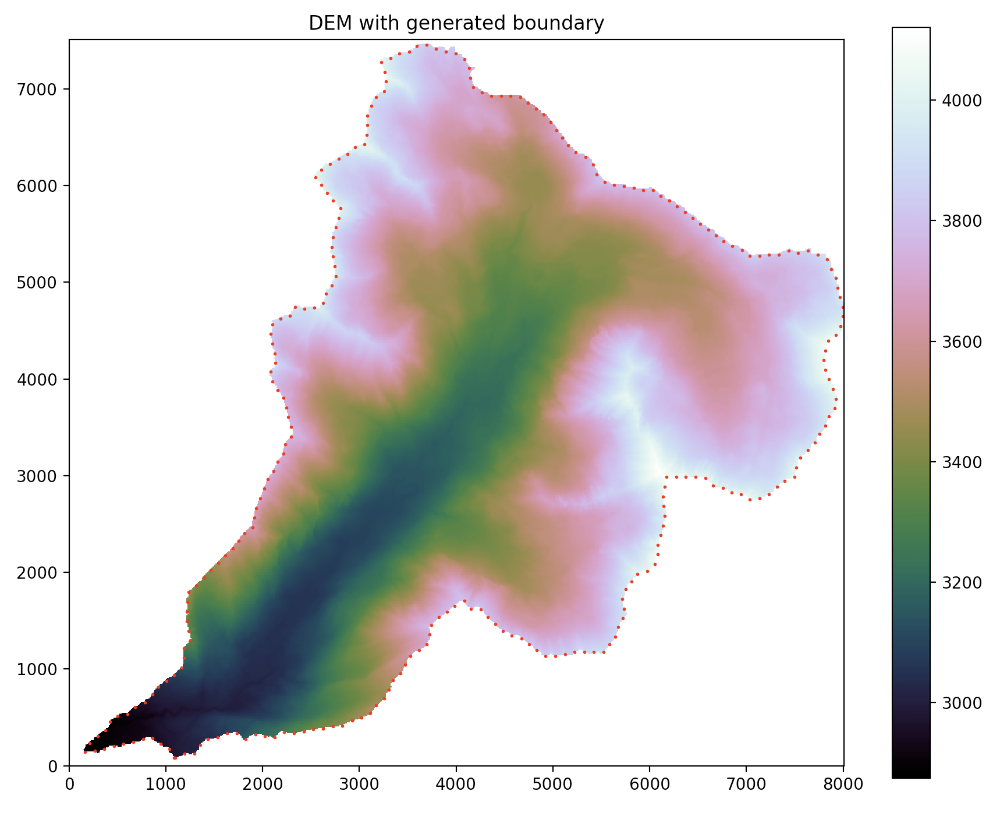

# Preparing the DEM

One of the most powerful features of TINerator is the ability to create meshes
which are variably refined around some DEM feature, such as a river or stream network.

To prepare the DEM for mesh generation, a feature needs to be (optionally) defined,
and a boundary generated. Note that an option in TINerator exists to generate
a mesh *without* feature refinement - see the [mesh generation section](meshing.md) for more information.

## Watershed Delineation

Defining a river or stream network ('feature') in the DEM is done through the command:

```python
my_dem.watershedDelineation(threshold=4500.,plot=False,spacing=30.)
```

Performing a watershed delineation is a multi-step process:

1. Depressions ('pits') are filled
2. Flats are resolved
3. Flow accumulation is performed

### Resolving Depressions and Flats


*<b>Source:</b> Lindsay, John. (2015). Efficient hybrid breaching-filling
sink removal methods for flow path enforcement in digital elevation models.
Hydrological Processes. 30. 846–857.
doi: [10.1002/hyp.10648](https://www.researchgate.net/publication/281067177_Efficient_hybrid_breaching-filling_sink_removal_methods_for_flow_path_enforcement_in_digital_elevation_models).*

Flow accumulation algorithms are
[numerous](https://www.sciencedirect.com/science/article/pii/S1364815214002497),
but they all tend to operate relative to elevation deltas between adjacent
DEM cells.

Consequently, flats and pits can disrupt accumulation algorithms, causing
premature termination of the flow patterns. It is therefore, in general, best
to preprocess a DEM to remove depressions and flats.


*Depressions and flats identified and removed on a standard DEM*

Flat and pit resolution is the default behavior of the `watershedDelineation` 
function. For more information on better controlling these steps,
refer to the [API Documentation](null.md).

The DEM feature will be found in the class variable `tinerator.DEM.feature`, and
is an N-by-2 `np.ndarray` defining a polyline.

### Flow accumulation

A critical step in determining river networks is through flow accumulation
algorithms. These algorithms generate a raster of accumulated flow by
accumulating the weight of all cells that flow into adjacent cells with a negative
elevation data ('downslope cells').


*<b>Source:</b> ArcGis Pro, [How Flow Accumulation works](http://pro.arcgis.com/en/pro-app/tool-reference/spatial-analyst/how-flow-accumulation-works.htm)*

TINerator supports a number of popular flow accumulation algorithms:

* D8
* D4
* D-Infinity
* Rho8
* Rho4
* Quinn
* Freeman
* Holmgren

By default, D8 is used. For more information on these different algorithms,
visit the RichDEM [Flow Metrics page](https://richdem.readthedocs.io/en/latest/flow_metrics.html).

After flow accumulation is performed, the feature can be extracted by
setting an accumulation threshold and defining all cells above that threshold
to be a part of the feature.

As an example, see the below figure:


*<b>Left:</b> Flow accumulation intensity.
<b>Right:</b> Feature pulled by thresholding the flow accumulation matrix.*

On the left, the raster generated by the flow accumulation algorithm is displayed.
Note that effectively all non-masked cells in the DEM have some non-zero amount
of accumulation. By settings `threshold = 0.`, effectively the entire DEM would
be 'captured' as a feature. Note that, if you only consider cells with more
than $10^4$ accumulations, a river network becomes visible. 

Consequently, the threshold should be set to reflect that.
Here, `threshold = 4.5E10`, and the feature derived from setting that threshold
value is shown on the right of the figure.

!!! note
    The optimal threshold value will change for each distinct DEM.
    Pay careful attention to set a value relative to your workflow goals.

## Boundary Generation

Boundary generation is done using a [Square Tracing Algorithm](http://www.imageprocessingplace.com/downloads_V3/root_downloads/tutorials/contour_tracing_Abeer_George_Ghuneim/square.html)
to quickly capture the perimeter of the DEM. The boundary is defined as the interface
between cells with NoDataValue entries ($z_{i,j} = NDV$) and cells with
data ($z_{i,j} \ne NDV$).

For DEMs that do not have cells with NoDataValue elements 
($z(i,j) \cap NDV = \emptyset$), a rectangular boundary spanning the domain
of the DEM is generated instead.

The boundary is generated with the method

```python
tinerator.DEM.generateBoundary(delta:float)
```

where `delta` is the spacing between adjacent boundary nodes. The units of
`delta` will be the same as the units of the parent DEM.

!!! warning
    Boundary generation **must** be done before proceeding to mesh generation.

As an example, 

```python
my_dem.generateBoundary(100.)
my_dem.plotBoundary()
```

will generate (and plot) a boundary with 100 meter spacing.



The boundary array is mutable and can be found in the class
variable `tinerator.DEM.boundary`.